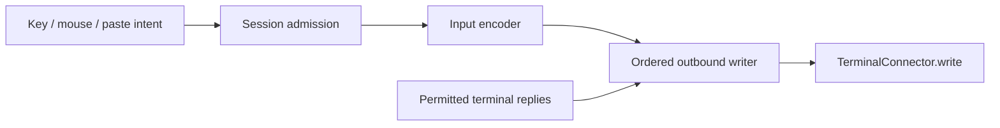

# KetraTerm Terminal Pipeline Architecture

KetraTerm separates terminal parsing, state mutation, input encoding, transport,
and presentation into JVM modules. `TerminalSession` coordinates the running
pipeline; applications choose the transport, host services, optional shell
producer, and presentation.

This guide describes the module boundaries and runtime ownership. Detailed
terminal behavior and deferred scope belong to the [feature map](docs/terminal-feature-map.md)
and [gap map](docs/terminal-feature-gap-map.md).

## Data flow

```mermaid
flowchart LR
    connector[TerminalConnector] -->|ordered output bytes| parser[Parser]
    parser -->|semantic commands| host[HostCommandAdapter]
    host -->|mutations| core[Core grid]
    core -->|Render API reads| publication[Session frame publication]
    publication -->|leased copied frame| cache[Renderer-owned cache]
    cache -->|prepared cells| view[Swing painting]
```

The session serializes inbound parser/core work. The parser recognizes byte
sequences and assembles text; the host adapter maps commands; core owns cell
width, cursor movement, margins, buffer storage, and reflow. Transport implementations
supply ordered bytes without interpreting terminal protocols.

Outbound intent enters the session before encoding:

The input encoder reads stable mode state and produces host-bound bytes. The
session admits input and terminal replies to the same ordered writer.
`submitInput` and `submitBytes` report admission, not completed transport output.
Transport failures are reflected in session lifecycle state.

## Modules

### Published libraries

| Module | Responsibility |
| --- | --- |
| [protocol](ketraterm-protocol/README.md) | Dependency-free protocol constants and shared vocabulary. |
| [parser](ketraterm-parser/README.md) | Streaming bytes, UTF-8, escape sequences, charsets, and grapheme assembly. |
| [core](ketraterm-core/README.md) | Headless grid, scrollback, modes, width policy, and resize/reflow. |
| [host](ketraterm-host/README.md) | Parser-command mapping, host effects, and hyperlink registration. |
| [input](ketraterm-input/README.md) | Keyboard, paste, focus, mouse, and host-output encoding. |
| [render-api](ketraterm-render-api/README.md) | Dependency-free primitive rendering contracts and attributes. |
| [render-cache](ketraterm-render-cache/README.md) | Copied render storage and leased frame publication. |
| [transport-api](ketraterm-transport-api/README.md) | Ordered raw-byte connector and lifecycle contracts. |
| [session](ketraterm-session/README.md) | Runtime synchronization, outbound ordering, lifecycle, and neutral shell contracts. |
| [shell-integration](ketraterm-shell-integration/README.md) | Optional OSC metadata interpretation and bounded command extraction. |
| [pty](ketraterm-pty/README.md) | Local process/connector lifecycle and convenience session assembly. |
| [ui-swing](ketraterm-ui-swing/README.md) | Reusable Java2D rendering and Swing interaction. |
| [completion](ketraterm-completion/README.md) | Completion context, source evaluation, ranking, and bounded learning. |
| [completion-host](ketraterm-completion-host/README.md) | Host-neutral directory/path access for completion. |
| [ui-swing-host](ketraterm-ui-swing-host/README.md) | Host actions, popup presentation, and completion adapters. |

[ketraterm-headless](ketraterm-headless/README.md) exposes session dependencies;
[ketraterm-swing](ketraterm-swing/README.md) exposes Swing
dependencies. Both publish dependency metadata without adding runtime code.
[ketraterm-bom](ketraterm-bom/README.md) supplies version constraints for the published dependency set.
See [library compatibility](docs/library-compatibility.md#supported-boundary)
for the publication boundary.

### Products and development modules

| Module | Responsibility |
| --- | --- |
| [completion-persistence](ketraterm-completion-persistence/README.md) | Product-owned sanitized, versioned learning persistence. |
| [workspace](ketraterm-workspace/README.md) | Profiles, local sessions, tabs, and workspace lifecycle. |
| [app](ketraterm-app/README.md) | Standalone desktop product, configuration, and window wiring. |
| [intellij-plugin](ketraterm-intellij-plugin/README.md) | IntelliJ-specific product integration in a separate build. |
| [testkit](ketraterm-testkit/README.md) | Reusable connector fakes, test fixtures, and verification campaigns. |
| [benchmarks](ketraterm-benchmarks/README.md) | JMH measurements for terminal hot paths. |

## Concurrency

Core, parser, and standalone encoders require caller serialization. A session
provides the synchronization boundary for its assembled pipeline:

- Parser execution, core mutation, resizing, and borrowed render reads are
  serialized so readers cannot observe partially mutated state.
- Outbound admission protects mode/policy capture, encoder scratch, and the
  bounded writer queue. One I/O worker writes admitted input and replies in order.
  Native writes and bulk encoding do not hold the admission monitor.
- A conflated render worker extracts copied frames under the mutation boundary
  and publishes them through `TerminalRenderPublisher`. Generation notifications
  signal available work; they are not a log of every intermediate frame.
- Swing owns its presentation state on the EDT. It consumes published frames
  into reusable local storage, prepares rendering data, and paints that storage.

Direct render frames and their backing arrays are borrowed. Keep them inside
their documented callback or lease; copy data that must outlive that scope.
No UI code should retain live core lines or mutate session-owned core state
outside the session boundary.

See [session concurrency](ketraterm-session/docs/session-concurrency-locks.md),
[render-frame lifecycle](ketraterm-render-api/docs/render-frame-lifecycle.md), and
[publication buffering](ketraterm-render-cache/docs/triple-buffering-concurrency.md).

## Storage and rendering

Cells use parallel primitive arrays and a shared cluster arena. Scrollback rows
are allocated incrementally and recycled at capacity. Core owns width, wrapping,
and resize/reflow; renderers consume its public frame projection.

The Swing renderer reuses copied cell planes and layout caches. Font selection
and Java2D painting stay in the UI layer. See the
[storage layout](ketraterm-core/docs/grid-storage-layout.md) and
[Swing rendering guide](ketraterm-ui-swing/docs/bifurcated-text-rendering.md).

## Lifecycle and Host Ownership

The caller owns a created session and must close it even if startup fails or it
is never started. Register host state before starting output delivery when
callbacks can observe that state. Disposing a Swing view releases the view's
resources and binding; it does not close the shared session.

Hosts own clipboard access, terminal-initiated action policy, settings and theme
resolution, completion I/O, and shell-hook installation. Session shell contracts
allow host-owned metadata producers; the optional OSC producer is one implementation.
PTY assembly does not automatically install a shell integration producer.

## Testing

Tests assert terminal state and exact outbound bytes. Controlled schedulers and
explicit handshakes cover concurrency and lifecycle; connector fakes exercise
complete sessions without a local shell. Native PTY tests and external differential
campaigns have their own opt-in requirements.

See [testkit](ketraterm-testkit/README.md),
[conformance testing](docs/terminal-conformance-testing.md), and
[Contributing](CONTRIBUTING.md) for the relevant commands and validation boundaries.
