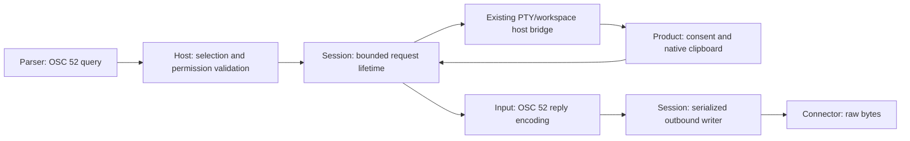

# OSC 52 Clipboard Reads: Research and Implementation Plan

Research date: 2026-09-26. Code baseline: `dcb4c12e`.
Implementation is authorized in independently reviewed checkpoints. Each
checkpoint stops for user verification and commit before the next one begins.

The canonical capability records remain [the feature map](terminal-feature-map.md)
and [the gap map](terminal-feature-gap-map.md). This document records evidence,
proposed decisions, implementation order, and verification gates. It does not
declare the read/query gap complete.

## 1. The actual problem

The read setting already reaches `HostPolicy`. Parsing and permission selection
also work. Execution stops after the permission audit:

1. `OscDispatcher.dispatchClipboard` recognizes the selection and `?` payload.
2. `HostCommandAdapter.requestClipboard` classifies a `READ_QUERY`, evaluates
   `readPermission`, and emits `terminalClipboardRequest`.
3. Only the write branch produces decoded text. The subsequent null check
   returns for every read query, including `ALLOW` and `PROMPT`.
4. `SessionHostEventSink` forwards the audit, but `SessionHostEventBridge` does
   not forward that callback into the shipped PTY/workspace/product path.
5. Both product hosts implement writes and write prompts. Neither implements
   read consent, selection lookup, or a read reply.

The existing host test named `OSC 52 prompt and read query policies do not emit
decoded clipboard writes` confirms that an allowed read produces an audit and
no write/prompt. It does not prove a working read response.

Useful existing building blocks:

- `TerminalClipboardPolicy`: independent read/write permissions, a decoded-byte
  limit, and content-free audit vocabulary.
- `TerminalClipboardHandler`: system clipboard access; the IntelliJ
  implementation uses `CopyPasteManager`.
- `TerminalSession`: owned coroutine scope, injected dispatchers, cancellation,
  current policy updates, and outbound serialization.
- Existing PTY/workspace event bridges, tab identity, product disposal paths,
  settings persistence, and testkit connectors.

The initial investigation identified two outbound problems, addressed for existing
synchronous input APIs by checkpoint 2a:

- `drainResponses` previously took the outbound lock separately for each 1,024-byte
  scratch-buffer write. Feeding a large reply through that path would have permitted
  input to appear inside the OSC sequence.
- `PtyConnector.write` writes and flushes synchronously. Input encoding previously held
  the same session outbound lock while writing. Holding it around a large
  clipboard reply would prevent interleaving, but a subsequent EDT input event
  could block behind the slow write. A coroutine around clipboard access alone
  does not solve this.

These findings come from source tracing and existing test coverage. No live
cross-platform clipboard interoperability test was performed during research.
Graphify located the session relationships; targeted source reads established
the callback path where the graph had no directed host-to-product path.

## 2. External evidence

| Source | Relevant behavior | Consequence for this design |
| --- | --- | --- |
| [xterm control sequences](https://invisible-island.net/xterm/ctlseqs/ctlseqs.html) | OSC 52 accepts selection lists, queries with `?`, and returns Base64 data from the first available requested selection. Its empty selector means `s0`. | Specify ordering, aliases, unavailable selections, and reply bytes explicitly. |
| [xterm implementation](https://github.com/ThomasDickey/xterm-snapshots/blob/master/misc.c) | `ManipulateSelectionData` deduplicates selectors, echoes that selector list, preserves the terminator, and suppresses reads when its permission is disabled. | Distinguish xterm behavior from deliberate KetraTerm choices. |
| [Kitty configuration](https://sw.kovidgoyal.net/kitty/conf/#opt-kitty.clipboard_control) | Default permissions ask before reading the clipboard or primary selection and allow writes. | Ask is an established product default. |
| [Kitty implementation](https://github.com/kovidgoyal/kitty/blob/master/kitty/clipboard.py) | Legacy read denial produces an empty OSC 52 response. Pending consent is bounded; another request is rejected while asking. `c`/`s` and `p` are mapped separately. | Empty denial and bounded consent have existing interoperability precedent. |
| [Ghostty configuration](https://ghostty.org/docs/config/reference#clipboard-read) and [OSC 52 documentation](https://ghostty.org/docs/vt/osc/52) | Ask/Allow/Deny are supported. Its documented selector behavior differs from xterm, including a current single-selector limitation. | Modern terminals have explicit compatibility policies; copying all historical xterm behavior is unnecessary. |
| [Java 25 Toolkit](https://docs.oracle.com/en/java/javase/25/docs/api/java.desktop/java/awt/Toolkit.html#getSystemSelection()) | Native primary selection access can return null when unavailable. | Detect runtime capabilities; never substitute clipboard contents for an unavailable primary selection. |
| [IntelliJ CopyPasteManager](https://github.com/JetBrains/intellij-community/blob/master/platform/editor-ui-api/src/com/intellij/openapi/ide/CopyPasteManager.java) | Public APIs expose system clipboard and system selection access. | Keep IntelliJ clipboard integration inside the plugin. These methods were also confirmed in the configured 262.8665.258 SDK using `javap`. |
| [IntelliJ ClipboardSynchronizer](https://github.com/JetBrains/intellij-community/blob/master/platform/platform-impl/src/com/intellij/ide/ClipboardSynchronizer.java) | Platform code explicitly handles slow/unavailable native clipboard owners. | Clipboard access is potentially blocking; cancellation cannot be assumed to interrupt native work. |
| [Neovim OSC 52 provider](https://github.com/neovim/neovim/blob/master/runtime/lua/vim/ui/clipboard/osc52.lua) | Uses `c` and `p`, with a staged wait totaling ten seconds. | Consent must expire; indefinitely delayed replies are unsafe for client interoperability. |

OSC 52 defines no distinct error/status envelope. An empty denial is a chosen
compatibility convention, indistinguishable on the wire from empty text. Kitty's
OSC 5522 status codes do not apply to OSC 52.

## 3. Proposed observable contract

### Selections and bytes

- Support `c` through the system clipboard on both products.
- Support `p` through the native primary selection when the current runtime
  exposes it. Windows/macOS and Linux runtime behavior must be tested rather
  than inferred solely from an OS name.
- Resolve `s` to the system clipboard; resolve an omitted selector to `c`.
  These are explicit product choices rather than xterm's configurable `s0`.
- Accept ordered lists, deduplicate while retaining order, and use the first
  available text value. An available empty string is a successful value;
  unavailable/non-text data permits trying the next target.
- Recognize `q` and `0`–`7` as protocol selectors but report them unavailable
  with the present platform adapters. They must never alias to `c`. Native X11
  secondary/cut-buffer implementations remain in their existing separate gap.
- Unknown selector characters reject the read without platform access or a
  reply. Bound and validate selectors before retaining request state. Do not
  echo unchecked terminal text into the response.
- Emit one response using the validated, deduplicated requested selector list
  (empty input becomes `c`), Base64 of strict UTF-8, and seven-bit ST (`0x1B 0x5C`).
  Accept both BEL and ST requests. Always replying with ST is deliberate; it
  avoids extending parser callbacks merely to reproduce xterm's terminator.
- Preserve clipboard text exactly: no trimming, newline rewriting, bracketed
  paste framing, paste filtering, or Unicode normalization. Reject unpaired
  UTF-16 surrogates instead of silently repairing clipboard data.

### Permissions and results

| Condition | Read/prompt behavior | Wire result |
| --- | --- | --- |
| Terminal-response family denied | Neither native access nor consent UI | Silence, including failures |
| Read denied, response family allowed | No native access or prompt | Empty OSC 52 response |
| Ask | One explicit consent for this request; read after consent | Data on approval; empty on rejection |
| Allow | Read through the owning product adapter | Data, including valid empty text |
| No available text target, unsupported host, platform failure, oversized/invalid text | No fallback to an unrelated selection and no truncated data | Empty response |
| Session/tab/project closed, request superseded by lifecycle invalidation | Cancel/retire request and discard late completion | Silence |
| Valid request arrives while this session already has an active read | No additional coroutine, native read, or prompt | Silence; content-free busy audit |
| Read deadline expires while session/replies remain eligible | Dismiss prompt and retire native result | Empty response only through an idle writer that commits within the bounded timeout window; discard later success |

Silencing excess concurrent requests avoids replying to a later query ahead of
the pending one. OSC 52 has no request ID. Do not coalesce several reads into one
permission grant, queue an unbounded series of prompts, or retry automatically.

Use both `clipboardPolicy.readPermission` and `terminalResponsePolicy`. Extend
the explicit query/selection allowlist at the host boundary; do not invent an
XTGETTCAP advertisement for this capability.

### Consent and lifecycle

- Bind every request to the actual session instance. A tab label or selected
  tab is presentation context, not the routing key.
- Cover queries emitted immediately at process startup, before the pane is
  attached. Await that session's host readiness within the original deadline;
  never lose the callback through a nullable tab lookup. A genuinely absent
  clipboard provider completes as unavailable.
- Present a cancellable prompt associated with its terminal, identifying an
  application in that terminal without claiming a verified process or SSH
  origin. Show no clipboard preview. Offer Allow once and Deny; Escape/close
  denies. A nonmodal prompt should not steal keyboard focus from another tab.
- Bound visible prompts per product window, and provide a session-level way
  to block repeated requests. A terminal cannot create a stack of dialogs.
  Share lifecycle mechanics where both products use the same Swing behavior;
  keep product wording, settings, and IDE modality ownership in the products.
- End-to-end deadline: **eight seconds from query admission**,
  leaving margin under Neovim's observed ten-second wait. Use a monotonic clock
  and an injectable scheduler. Show expiry in the prompt. This is an internal
  policy constant, not another user setting. An empty timeout reply has a
  100 ms scheduling window after that deadline and must commit before 8.1 seconds
  from admission. Check this at writer commitment; delayed timer execution or
  queue admission cannot restart the window.
- Recheck current permissions before native access and at the outbound commit
  point. Revoking permission, lowering the byte limit, disposing the owner, or
  closing/replacing the session invalidates pending work. A later Allow must
  not revive it. An Allow-to-Ask change cannot reuse automatic approval.
- Once a reply starts writing, finish its framing or fail/close the transport;
  never splice a denial into a partially written reply. Permission changes
  cannot retract bytes already committed. Define this linearization point in
  KDoc and test both sides of the race.
- Read the clipboard after approval, not when the query first arrived. Preserve
  causality for an allowed OSC 52 write followed by a read in the same inbound
  chunk: a read must not overtake an earlier posted, allowed write callback.
  A write still awaiting separate consent has not committed a new value.

### Resource and data handling

- Extend the existing `maxDecodedBytes` meaning to the raw UTF-8 byte ceiling
  for reads as well as writes; default remains **1 MiB**. Document the change
  explicitly and avoid adding an independent limit without a concrete need.
- Count/validate UTF-8 with checked arithmetic before allocating the encoded
  payload. Base64 size is `4 * ceil(byteCount / 3)`. Reject overflow and excess
  before writing any header. Test zero, exact boundary, and one byte over.
- Prepare bounded data outside parser, render, and outbound critical sections.
  Prefer JDK Base64 and existing encoding primitives over a new custom codec.
  Avoid a large Base64 String plus several equivalent byte-array copies.
- A native clipboard provider may materialize a large String before our code
  sees it. The feature can bound its own copies, pending requests, and replies;
  it cannot honestly promise a bound on allocations inside arbitrary native
  providers. Prefer bounded text streaming where the platform provides it.
- Bound actual native I/O, including after logical cancellation. A timed-out
  non-interruptible call must retain its worker slot until it returns; repeated
  queries must not spawn replacement blocked workers. Use a lifecycle-owned
  bounded worker, preserve the IntelliJ client context, and discard late data.
- Audit admission and execution outcomes without clipboard text, Base64,
  clipboard previews, or throwable messages containing provider data. Release
  references promptly and clear owned reusable payload buffers when applicable.
  Do not claim secure erasure of JVM Strings or platform-owned data.
- This adds work on clipboard events, not each render frame. No clipboard
  polling, new frame objects, or per-frame coroutine/Flow collection is needed.

## 4. Implementation boundaries

| Owner | Required responsibility |
| --- | --- |
| Protocol | Only vocabulary genuinely shared across modules, such as the supported logical clipboard targets. No coroutine or UI dependencies. |
| Parser | Keep existing bounded OSC envelopes, exact query recognition, cancellation, and recovery. Add byte-stream tests; change parsing only if they reveal a missing contract. |
| Host | Validate the selector allowlist, evaluate current policy, emit semantic read admission, and maintain content-free audit semantics. No clipboard I/O or waiting. |
| Session | Own request admission/cancellation, asynchronous host invocation, permission revalidation, deadlines, and outbound ordering. Reuse its scope and injected dispatchers. |
| Input | Encode one validated clipboard response through `TerminalHostOutput`. Keep this separate from paste transformation. Do not put protocol construction in a product callback. |
| PTY/workspace | Extend the existing host bridge with the narrow asynchronous operation and preserve session/tab association. No new parallel event bus. |
| Swing clipboard boundary | Extend the current clipboard abstraction for explicit targets and unavailable/error outcomes; reuse the system clipboard implementation. |
| Swing host helpers | Share actual reusable consent/lifecycle behavior between the two products where appropriate. Do not make `SwingTerminal` choose security policy. |
| App/plugin | Select defaults, supply their platform clipboard service, own prompt placement and disposal, preserve IDE client context, and apply live settings. |

Prefer one suspending product operation returning a small explicit result.
The synchronous parser callback should only admit a request; the session invokes
the suspending operation after leaving parser mutation. Use the existing bridge
to carry this result path. Do not expose a public raw-byte completion method,
global request registry, per-request Flow, or a general host-RPC framework.

Clipboard contents do not belong in the grid or the core response queue. A
narrow input encoding entry point is justified by the existing module boundary;
its exact signature should be reviewed with the first implementation part.

### Required outbound prerequisite

Introduce one bounded serial writer at the existing session outbound boundary.
Encoding/admission uses short serialization; blocking connector writes execute
on the injected I/O dispatcher outside locks needed by parser or EDT producers.
All existing input and terminal replies use that same ordering boundary.

The implementation must:

1. Preserve complete logical-write ordering, including bracketed paste and a
   clipboard response spanning multiple byte buffers.
2. Consume/copy producer scratch before producers reuse it, as required by the
   existing connector contract. Prefer reusable primitive storage for ordinary
   input; transfer bounded owned clipboard buffers without repeated copies.
3. Bound queued bytes and work, not just request count. Reserve a complete
   clipboard reply before admission; inability to reserve it is a read failure.
4. Define normal input/paste saturation explicitly. No silent byte loss,
   partially admitted escape sequence, unbounded queue, or EDT wait for native
   output is acceptable. Use background backpressure for bulk work; if a
   non-suspending producer cannot be accepted within the hard bound, report a
   session write failure through the existing failure path.
5. Revalidate clipboard eligibility immediately before its queued frame starts.
   Remove cancelled/expired frames before that point. Keep unrelated terminal
   responses and input moving while consent is pending.
6. Fail the session on a partial transport write error, cancel remaining work,
   and release payloads once. Shutdown must not wait behind the blocked writer
   before it can close the connector.

Queue capacity and bulk-input reservation must be fixed using the existing
paste/transport contract and slow-connector tests before this part is accepted.
This is a concrete design/measurement gate, not an invitation to add configurable
queue strategies or a transport framework. Document any change from synchronous
write completion to queued acceptance and update callers/tests intentionally.

## 5. Delivery sequence and verification gates

Work on the feature branch in focused, reviewable parts. Each part is a candidate
commit boundary; commits are made only after the user verifies and commits.

### Part 1 — Contract and platform feasibility

- Checkpoint 1 implements read-query admission: the selector allowlist, terminal
  response permission, read permission, and a coherent policy snapshot for the
  audit. Tests use real OSC byte streams, including split commands and live
  policy updates. This checkpoint introduces no unused read-provider or encoder
  APIs; those will be added together with their execution callers.
- Review the decisions in section 3, especially selection mapping, empty
  denial, deadline, and default migration.
- Verify the configured IntelliJ/JBR threading/client-context requirements and
  native selection behavior. Public primary-selection API availability has
  already been checked; platform execution has not.
- Establish the narrow read/result/encoding contracts here, then introduce their
  APIs with the consuming implementation in Part 3. Prefer existing abstractions
  and remove unused alternatives.

Gate: exact-byte examples and a platform capability matrix are agreed; no
public API exists solely for a possible later protocol.

### Part 2 — Ordered output under backpressure

- Checkpoint 2a implements bounded atomic admission for existing synchronous
  input APIs, one I/O writer, coherent core-response draining, and failure/close
  handling. Admission replaces synchronous write completion. This is a review
  boundary within Part 2; it does not complete the outbound prerequisite.
- Checkpoint 2b implements background encoding and native-write backpressure for
  paste and text replacement. Admission captures modes/policy and retains source
  text under a shared 16-operation / 16,777,216 UTF-16-and-deletion-unit budget,
  including active work. The existing encoder streams through reusable scratch;
  byte transactions remain ordered around each complete bulk operation. Exceeding
  either budget still fails the session without admitting that operation.
- Clipboard-owned payload reservation and cancellation/revalidation at write
  start belong with their first consuming read implementation in Part 3.
- Implementation details and acceptance semantics are in the
  [session concurrency contract](../ketraterm-session/docs/session-concurrency-locks.md).
- Keep connector ownership, parser/core mutation ownership, and module
  dependencies unchanged.
- Cover input, paste, core replies, large logical frames, scratch reuse,
  saturation, write failure, and close while output is blocked.
- Compare existing input/session allocation and throughput benchmarks with the
  baseline. Checkpoint measurements, including dispatch overhead and their
  limitations, are recorded in the [benchmark notes](../ketraterm-session/docs/outbound-writer-benchmarks.md).
  Settle byte budgets and acceptance/completion semantics here.

Gate: a blocked connector cannot block the EDT/parser or interleave bytes;
memory is bounded and ordinary input does not gain avoidable allocation.

### Part 3 — Headless read execution

Checkpoint 3 implements the provider contract, session lifetime, strict reply
preparation, and a single owned reply reservation (at most 8 MiB on the wire).
The existing raw UTF-8 policy limit defaults to 1 MiB for both reads and writes.
Provider access is optional; shipped products currently receive empty responses
for denied/unavailable reads, without native read access or read consent.

- Wire host admission into one active read per session, current-policy checks,
  a suspending host operation, deadline/cancellation, and the input reply encoder.
- Implement empty denial, unavailable-host behavior, strict size/Unicode
  validation, busy handling, and execution audit outcomes.
- Exercise the whole byte path through a real parser/host/session and testkit
  connector with a controllable fake clipboard host.

Gate: both successful and failed requests have exact observable behavior with
no OS clipboard or GUI dependency. Late results cannot reach a replacement
session, and revocation cannot release an uncommitted successful response.

### Part 4 — Shared platform mechanics and both products

- Checkpoint 4a connects the existing PTY/workspace listeners to the session's
  suspending provider. Reads retain their requesting session/tab identity;
  removed tabs cannot receive reads. Tests cover fake-PTY streams, selected-tab
  changes, cancellation, and provider failure isolation.
- Checkpoint 4b fixes startup write/read ordering. PTY creation can return an
  unstarted session; the workspace registers the tab and completes `tabOpened`
  before starting output delivery. This replaces the read-only publication
  wait from 4a and prevents an early allowed write from being dropped before a
  following read. Publication/startup failure closes the prepared session and
  removes the tab. Tests cover exact startup bytes, unstarted-session disposal,
  startup failure, and workspace rollback.
- Native access and product consent remain next. Asynchronous pane readiness
  and earlier posted writes must still be awaited by those product providers.
  In particular, IntelliJ creates the workspace tab on a pooled thread and
  publishes its pane later on the EDT. Its existing clipboard-write callback
  drops writes when that pane lookup is still null; product wiring must retain
  write/read ordering across this remaining attachment boundary.
- Implement selection-aware AWT and IntelliJ adapters using the existing
  clipboard boundary and the bounded native-I/O lifecycle.
- Add cancellable consent with bounded presentation and tab/session identity.
- Wire both product providers and their existing settings choices into the
  completed PTY/workspace bridge.
- Preserve write behavior and prove write-then-read ordering; share actual
  repeated behavior rather than adding forwarding helper classes.

Gate: Allow, Ask, Deny, close, disposal, expiry, and policy changes work in both
products. A pending request never reads another session's or IDE client's
clipboard by falling back to whichever context happens to be current.

### Part 5 — Defaults and migration

- New installations and explicit Reset to Defaults use Ask for reads. Keep
  library defaults Deny and product write defaults unchanged.
- Preserve existing explicit Allow/Ask/Deny values. Treat invalid values
  conservatively, with explicit migration tests.
- Preserve legacy Deny when an existing config omits the read field. IntelliJ
  may omit fields equal to old defaults: changing the state initializer alone
  is insufficient. Distinguish a fresh service from loading legacy state; add
  a persisted migration marker only if that distinction cannot be preserved
  reliably by the current serializer/lifecycle.
- Verify live settings changes on existing sessions and cancellation of
  pending reads; unrelated Apply must preserve the user's permission.

Gate: old saved settings and absent/default-valued fields cannot silently
weaken a previous denial.

### Part 6 — Integration, documentation, and final cleanup

- Run formatting, owner-module tests, broader session/transport regression
  tests, and the independent IntelliJ plugin build/tests.
- Run controlled native and client smoke tests as listed below. Record actual
  platform evidence; unavailable platforms remain explicit release checks.
- Update both canonical maps. Close the read/query entry only after both
  products pass. Keep historical unsupported selection targets accurately
  tracked in their separate entry.
- Update all three changelogs: root technical details; standalone and plugin
  concise user-facing clipboard-read behavior, permissions, and defaults.
  Maintain one evolving entry for the feature in each changelog. Checkpoint
  progress belongs in this plan and the feature/gap maps, not separate release
  notes. Product entries must describe only behavior already available.
- Update input/host/session contracts affected by encoding or asynchronous
  acceptance. Remove stale read no-op comments and obsolete test expectations.
- Audit new APIs/helpers for unused members and duplicate policy state. Run
  `graphify update .` after the structural implementation changes.

Gate: the user can verify a documented complete behavior in both products;
there are no settings choices that only alter an audit classification.

## 6. Required test matrix

| Area | Cases |
| --- | --- |
| Protocol | BEL/ST input, all chunk splits of representative queries, incomplete envelope, extra separators, exact `?`, non-ASCII/unknown selectors, duplicates/order/defaults, overflow, CAN/SUB, EOF, recovery into a following command |
| Selection | `c`, `p`, `s`, empty, `pc`/`cp`, unavailable primary, non-text then text, empty text then nonempty text, historical targets, mixed supported/unsupported targets |
| Permission | Read permission × response permission; no clipboard access before consent; denial sends no content; response DENY suppresses empty replies; Allow-to-Ask, revoke/reallow, and limit reduction during every async stage |
| Text/bounds | ASCII, combining sequences, supplementary scalars, NUL/control text preserved through Base64, CR/LF preservation, invalid surrogates, exact raw UTF-8 limit, one byte over, arithmetic overflow |
| Lifecycle | Query before pane attachment; close/remote exit/restart during prompt, native access, encoding, queue wait, and write; duplicate UI completion; stale callbacks; expired consent; rapid tab switching; IDE/project/client disposal |
| Concurrency | Flood while pending, multiple tabs/windows, hung native owner, timed-out native call returning late, write followed by read in one parser chunk, two requests with different selection lists |
| Outbound | Keyboard/paste/focus/mouse/core responses concurrent with a large read response, reusable scratch mutation, slow/blocked connector, queue saturation, cancellation before commit, partial write failure, close unblocking output |
| Settings | New install, existing missing field, explicit values, invalid/legacy values, omitted IntelliJ XML defaults, Reset, Apply, reload, and unrelated edits |
| Performance | Idle/frame allocation unchanged; ordinary input allocation/throughput comparison; bounded retained memory after a maximum-size read, repeated denial, cancellation, and provider failure |

Use `runTest` with shared injected test schedulers for coroutine deadlines.
Use explicit entered/release/completed handshakes for actual EDT/thread/transport
races. Do not use sleep or absence after a timeout as evidence of correct
ordering. Native clipboard tests must remain separate from deterministic unit
tests and must restore clipboard contents after the user-facing smoke exercise.

Native/client acceptance includes standalone and IntelliJ on Windows, macOS,
and Linux with the actual supported runtime backends. Check primary selection
where advertised; test a small raw OSC query harness and Neovim clipboard reads,
including UTF-8 and empty/denied results. Test direct local sessions and SSH
output. For tmux, record the tested version and configuration: multiplexer
filtering/passthrough can prevent the request reaching KetraTerm and is not a
reason to weaken permission or framing checks.

## 7. Known limits to keep honest

OSC 52 has no request identity, cancellation message, or standardized NACK.
The eight-second deadline reduces late-reply risk but cannot match every
client's private timeout. Native clipboard calls may outlive logical
cancellation, and external providers can allocate before returning data.

The proposed design explicitly bounds KetraTerm's work and controls whether
data can be committed to a live session. Those guarantees must be tested;
claims of universal xterm parity, zero allocation during native clipboard
access, or interruptible native I/O would be incorrect.
