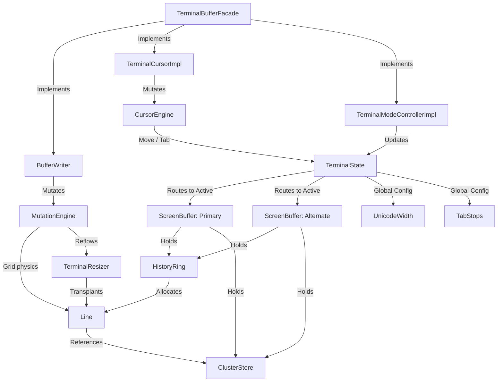

# JvTerm Core (`:jvterm-core`)

The `jvterm-core` module is a high-performance, strictly bounded, and allocation-conscious terminal grid engine. It implements the headless screen-state engine, coordinates all spatial grid mutations, manages cursor physics, scrollback margins, and controls alternate/primary screen switches.

Designed under strict **Single Responsibility Principles (SRP)**, this module owns coordinates, margins, cell styling attributes, tab stops, and cluster-aware storage. It possesses no awareness of escape-sequence parsing, byte stream UTF-8 decoding, input event encoding, mouse tracking, or windowing/painting lifecycles.

---

## Upstream Dependencies
* **`:jvterm-protocol`** (for shared control codes, modes, and primitive constants).
* **`:jvterm-render-api`** (for visual frames, color palette, and cell flags).

---

## Architectural Role & Grid Storage

The core operates as a headless coordinate and physics processor. Mutations are triggered via dedicated, role-specific public APIs, orchestrated by a thin facade, and translated into parallel primitive array mutations inside circular history rings.



---

## Key Architectural Components

### 1. Global State ([`TerminalState`](./src/main/kotlin/core/state/TerminalState.kt))
Tracks global hardware switches and routes all active mutations to the correct `ScreenBuffer` via the `activeBuffer` hot-swap pointer.
* **Double Buffering:** Manages the separate memory arenas of `primaryBuffer` (with active history scrollback) and `altBuffer` (with zero scrollback) to prevent mutations in one buffer from corrupting the other.
* **Visual Generation Flags:** Exposes generational counters (`frameGeneration`, `structureGeneration`, `cursorGeneration`) allowing external rendering loops to detect precise content changes and skip redraws when no visual mutations occur.

### 2. Array-Packed Cell Storage ([`Line`](./src/main/kotlin/core/model/Line.kt))
To eliminate object-per-cell overhead and guarantee memory locality on the JVM, each physical line stores its column data in three parallel primitive arrays:
* `codepoints` (`IntArray`): Stores raw scalar values (e.g. `0` for empty cells, `> 0` for Unicode scalars, `-1` for wide-character continuation spacers, and `<= -2` for grapheme cluster handles).
* `attrs` (`LongArray`): Primary packed cell styling attributes (colors, bold, italic).
* `extendedAttrs` (`LongArray`): Extended packed cell styling attributes (underlines, conceal, hyperlinks).

### 3. Lock-Free Grapheme Allocator ([`ClusterStore`](./src/main/kotlin/core/store/ClusterStore.kt))
Manages multi-codepoint grapheme clusters (combining marks, variation selectors, ZWJ sequences) in a flat, buffer-scoped memory arena. Reclaims space in $O(1)$ by pushing freed slot indices onto a head-popping singly-linked freelist.

### 4. Spatial Grid Physics ([`MutationEngine`](./src/main/kotlin/core/engine/MutationEngine.kt))
Calculates and executes all spatial grid transformations.
* **Wide-Character Annihilation Invariant:**
  Overwriting any part of a wide character or cluster (either the leader or its spacer) automatically erases the *entire* visual occupant to prevent orphaned spacers from corrupting the grid.
* **Margins Constraints:** Restricts character insert/delete (`ICH`/`DCH`) and line insert/delete (`IL`/`DL`) within active vertical and horizontal margins.

### 5. East Asian Width Engine ([`UnicodeWidth`](./src/main/kotlin/core/util/UnicodeWidth.kt))
Determines grid cell occupancy (0, 1, or 2) for any Unicode scalar using standard ASCII fast paths, BMP/SMP `BitSet` lookups, and range binary searches.

---

## 🔗 How to Use

The following example shows how to create a `TerminalBuffer`, write text, move the cursor, and read cell content.

```kotlin
import io.github.jvterm.core.TerminalBuffers
import io.github.jvterm.core.api.TerminalBuffer
import io.github.jvterm.core.codec.AttributeCodec

fun main() {
    // 1. Create a terminal buffer of size 80x24 with 1000 lines of scrollback history
    val buffer: TerminalBuffer = TerminalBuffers.create(width = 80, height = 24, maxHistory = 1000)

    // 2. Write simple text using current pen attributes
    buffer.writeText("Hello, JvTerm Core!")

    // 3. Mutate pen attributes and write styled text
    val styledPen = AttributeCodec.pack(
        fgKind = AttributeCodec.COLOR_INDEXED, fgVal = 2, // ANSI Green
        bgKind = AttributeCodec.COLOR_DEFAULT, bgVal = 0,
        bold = true
    )
    buffer.setPenAttributes(styledPen)
    buffer.writeText("\nThis is green bold text.")

    // 4. Move the cursor relatively or absolutely
    buffer.cursorPosition(column = 10, row = 5)

    // 5. Read back cell content
    val line = buffer.getLine(row = 5)
    val codepoint = line.getCodepoint(column = 10)
    val attrs = line.getAttributes(column = 10)
    
    println("Read back codepoint: ${codepoint.toChar()} with attributes: $attrs")
}
```

---

## 🔗 How to Extend: Custom Response Channel

To handle terminal queries (such as Device Status Report `DSR` or Device Attributes `DA`) generated by the parser and needing to be piped back to the host, implement the [`TerminalResponseChannel`](./src/main/kotlin/io/github/jvterm/core/api/TerminalResponseChannel.kt) interface:

```kotlin
import io.github.jvterm.core.api.TerminalResponseChannel

class ConsoleResponseChannel : TerminalResponseChannel {
    override fun writeResponseBytes(bytes: ByteArray, offset: Int, length: Int) {
        // Pipe bytes directly back into PTY stdout or socket streams
        System.out.write(bytes, offset, length)
        System.out.flush()
    }

    override fun writeResponseString(response: String) {
        val bytes = response.toByteArray(Charsets.US_ASCII)
        writeResponseBytes(bytes, 0, bytes.size)
    }
}
```

---

## Engineering & Performance Rules

1. **No Allocations in Mutation Hot Paths:** Hot paths (e.g., `printCodepoint`, `scrollUp`, attribute packing, cluster query) must not trigger garbage collection. Data structures use primitive indices, flat primitive arrays, and reusable scratch buffers.
2. **Strict SRP Boundaries:** The core never parses incoming escape bytes, nor does it encode outgoing keystrokes. It only mutates headless buffers.
3. **Truthful Representation:** Do not let host layers fake unsupported cell attributes. If an attribute or color format is unsupported, it must be documented as a core gap in `docs/terminal-feature-gap-map.md`.

---

## Testing & Verification

The core test suite verifies strict terminal invariants across complex state changes:
* **`MutationEngineTest`**: Validates wrapping mechanics, spatial erases, and protected cells.
* **`TerminalResizerTest`**: Ensures logical line re-wrapping and cluster deep-copies during window resizes.
* **`TerminalInvariantPropertyTest`**: Property-based tests verifying structural invariants over random writes.

To run the core checks:
```bash
./gradlew :jvterm-core:test
```
