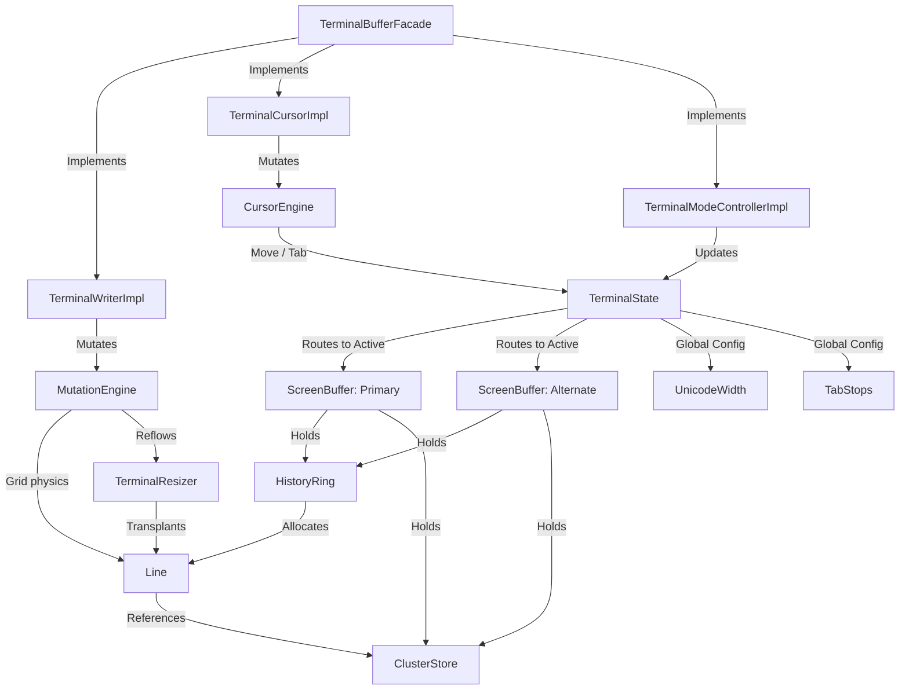

# Terminal Core (`:terminal-core`)

The `terminal-core` module is a high-performance, strictly bounded, and allocation-conscious terminal grid engine. It implements the headless screen-state engine, coordinates all spatial grid mutations, manages cursor physics, scrollback margins, and controls alternate/primary screen switches.

Designed under strict **Single Responsibility Principles (SRP)**, this module owns coordinates, margins, cell styling attributes, tab stops, and cluster-aware storage. It possesses **no** awareness of escape-sequence parsing, byte stream UTF-8 decoding, input event encoding, mouse tracking, or Swing UI rendering.

---

## Architectural Overview & Data Flow

The core operates as a headless coordinate and physics processor. Mutations are triggered via dedicated, role-specific public APIs, orchestrated by a thin facade, and translated into parallel primitive array mutations inside circular history rings.



---

## Key Architectural Components

### 1. Global Hardware Context ([TerminalState](./src/main/kotlin/core/state/TerminalState.kt))
Tracks global hardware switches and routes all active mutations to the correct [ScreenBuffer](./src/main/kotlin/core/state/ScreenBuffer.kt) via the `activeBuffer` hot-swap pointer.
* **Double Buffering:** Manages the separate memory arenas of `primaryBuffer` (with active history scrollback) and `altBuffer` (with zero scrollback) to prevent mutations in one buffer from corrupting the other.
* **Visual Generation Flags:** Exposes generational counters (`frameGeneration`, `structureGeneration`, `cursorGeneration`) allowing external rendering loops to detect precise content changes and skip redraws when no visual mutations occur.

### 2. Screen Arenas ([ScreenBuffer](./src/main/kotlin/core/state/ScreenBuffer.kt))
Encapsulates a single coordinate universe.
* **Margins:** Implements vertical scroll margins (`DECSTBM`) and horizontal left/right margins (`DECLRMM`).
* **Co-owned Storage Rule:** The [HistoryRing](./src/main/kotlin/core/buffer/HistoryRing.kt) and [ClusterStore](./src/main/kotlin/core/store/ClusterStore.kt) are co-owned. They are always replaced atomically via `replaceStorage` to prevent any stale cell indices from referencing orphaned memory pools.

### 3. Array-Packed Cell Storage ([Line](./src/main/kotlin/core/model/Line.kt))
To eliminate object-per-cell overhead and guarantee memory locality on the JVM, each physical line stores its column data in three parallel primitive arrays:
* `codepoints` (`IntArray`): Stores raw scalar values:
  * `0`: Empty cell sentinel.
  * `> 0`: Unicode scalar codepoints.
  * `-1`: Wide-character spacer sentinel.
  * `<= -2`: Bounded cluster handles pointing into the [ClusterStore](./src/main/kotlin/core/store/ClusterStore.kt).
* `attrs` (`LongArray`): Primary packed cell styling attributes (colors, bold, italic).
* `extendedAttrs` (`LongArray`): Extended packed cell styling attributes (underlines, conceal, hyperlinks).
* `wrapped`: Soft-wrap flag set when the cursor overflows the active right margin, designating a physical line as a visual continuation of the previous line.

### 4. Attribute Bit-Packing ([AttributeCodec](./src/main/kotlin/core/codec/AttributeCodec.kt))
Styling properties are stored inside two 64-bit `Long` values.

| Target Word | Bits | Attribute | Purpose |
| :--- | :--- | :--- | :--- |
| **Primary Word** | `0..25` | Foreground Color | Packed default/indexed/RGB color |
| | `26..51` | Background Color | Packed default/indexed/RGB color |
| | `52` | Bold | Text thickness flag |
| | `53` | Italic | Slanted text style |
| | `54` | Inverse | Invert foreground and background |
| | `55` | Blink | Blinking text flag |
| | `56` | Faint | Dimmed color presentation |
| | `57` | Selective-Erase Protection | Cells skipped by DECSEL/DECSED |
| **Extended Word** | `0..25` | Underline Color | Underline-specific tagged color |
| | `26..28` | Underline Style | None, Single, Double, Curly, Dotted, Dashed |
| | `29` | Strikethrough | Horizontal line through text |
| | `30` | Overline | Horizontal line above text |
| | `31` | Conceal | Hidden character flag |
| | `32..63` | Hyperlink ID | Clickable URI mapping |

### 5. Lock-Free Grapheme Allocator ([ClusterStore](./src/main/kotlin/core/store/ClusterStore.kt))
Manages multi-codepoint grapheme clusters (combining marks, variation selectors, ZWJ sequences) in a flat, buffer-scoped memory arena.
* **Layout:** Employs parallel primitive arrays (`slotStarts`, `slotLengths`, `nextFree`, `isLive`) indexing into a flat contiguous codepoints pool `clusterData`.
* **Singly-Linked Freelist:** Reclaims space in $O(1)$ by pushing freed slot indices onto a head-popping singly-linked freelist. It immediately catches double-free anomalies, throwing explicit exceptions to safeguard allocator indices.
* **Zero-Allocation Handoff:** Provides `readInto` for simple, zero-allocation copies directly into rendering buffers.

### 6. Spatial Grid Physics ([MutationEngine](./src/main/kotlin/core/engine/MutationEngine.kt))
Calculates and executes all spatial grid transformations.
* **Wide-Character Annihilation Invariant:**
  > [!IMPORTANT]
  > Overwriting any part of a wide character or cluster (either the leader or its spacer) automatically erases the *entire* visual occupant. This prevents orphaned spacers or split leader cells from corrupting the grid.
* **Margins Constraints:** Restricts character insert/delete (`ICH`/`DCH`) and line insert/delete (`IL`/`DL`) within active vertical and horizontal margins.
* **Selective Erase (DECSEL/DECSED):** Evaluates selective-erase protection bit flags, skipping protected cells during selective erases while allowing normal prints to overwrite them.
* **Interactive Continuation:** Implements `appendToPreviousCluster` to support live rendering on chunk boundaries by appending combiners to the preceding grid coordinate.

### 7. Reflow & Wrap Resizer ([TerminalResizer](./src/main/kotlin/core/engine/TerminalResizer.kt))
Handles terminal resizing with a three-phase reflow strategy:
1. **Logical-Line Reconstruction:** Reconstructs full logical lines by joining physical rows that carry the `wrapped` flag.
2. **Re-wrapping:** Re-wraps cells into the new physical width.
3. **Cursor Relocation:** Relocates and bounds the cursor into the reflowed coordinates.
Surviving clusters are deep-copied into a fresh, resized buffer arena, ensuring no memory references leak between old and new state stores.

### 8. East Asian Width Engine ([UnicodeWidth](./src/main/kotlin/core/util/UnicodeWidth.kt))
Determines grid cell occupancy (0, 1, or 2) for any Unicode scalar:
* **Double-Fast Path:** Employs standard ASCII printable fast checks, followed by triple `BitSet` lookups (`zero`, `wide`, `ambiguous`) for $O(1)$ BMP and SMP lookups.
* **Astral Binary Search:** Uses binary search ranges for $O(\log N)$ astral wide and zero-width calculations.
* **Ambiguous Width Support:** Respects Ambiguous East Asian Width settings, switching cells dynamically between narrow and wide layouts.

### 9. VT Tab Stops ([TabStops](./src/main/kotlin/core/model/TabStops.kt))
Tracks VT100-style tab stops inside a dense `BooleanArray`.
* **Dynamic Expansion:** Non-destructively grows or shrinks tab stops during resizes. Newly exposed columns are automatically seeded with the standard VT100 8-column rhythm.

---

## Engineering & Performance Rules

1. **No Allocations in Mutation Hot Paths:** Hot paths (e.g., `printCodepoint`, `scrollUp`, attribute packing, cluster query) must not trigger garbage collection. Data structures use primitive indices, flat primitive arrays, and reusable scratch buffers.
2. **Strict SRP Boundaries:** The core never parses incoming escape bytes, nor does it encode outgoing keystrokes. It only mutates headless buffers.
3. **Truthful Representation:** Do not let integration layers fake unsupported cell attributes. If an attribute or color format is unsupported, it must be documented as a core gap in `docs/terminal-feature-gap-map.md`.

---

## Testing Doctrine

The tests inside `src/test/kotlin` verify strict terminal invariants across complex state changes:
* **`MutationEngineTest` / `MutationEngineProtectionTest`**: Validate wrapping mechanics, spatial erases, and selective-erase protect behavior.
* **`TerminalResizerTest` / `TerminalResizerLongClusterTest`**: Ensure logical line re-wrapping and cluster deep-copies never lose content or corrupt cursors during rapid window resizes.
* **`UnicodeWidthTest` / `TabStopsTest`**: Prove complete compliance with East Asian Width policies and VT100 horizontal tabs.
* **`TerminalInvariantPropertyTest`**: Property-based tests verifying structural invariants (no orphaned wide spacers, correct history sizes) over thousands of random grid writes.

---

## Developer Guides & References

* **Detailed Public Contract:** Read [docs/terminal-core-contract.md](docs/terminal-core-contract.md) to understand the formal public APIs (`TerminalWriter`, `TerminalCursor`, `TerminalReader`, etc.).
* **Testing Command:** Run the core test suite locally via:
  ```bash
  ./gradlew :terminal-core:test
  ```
