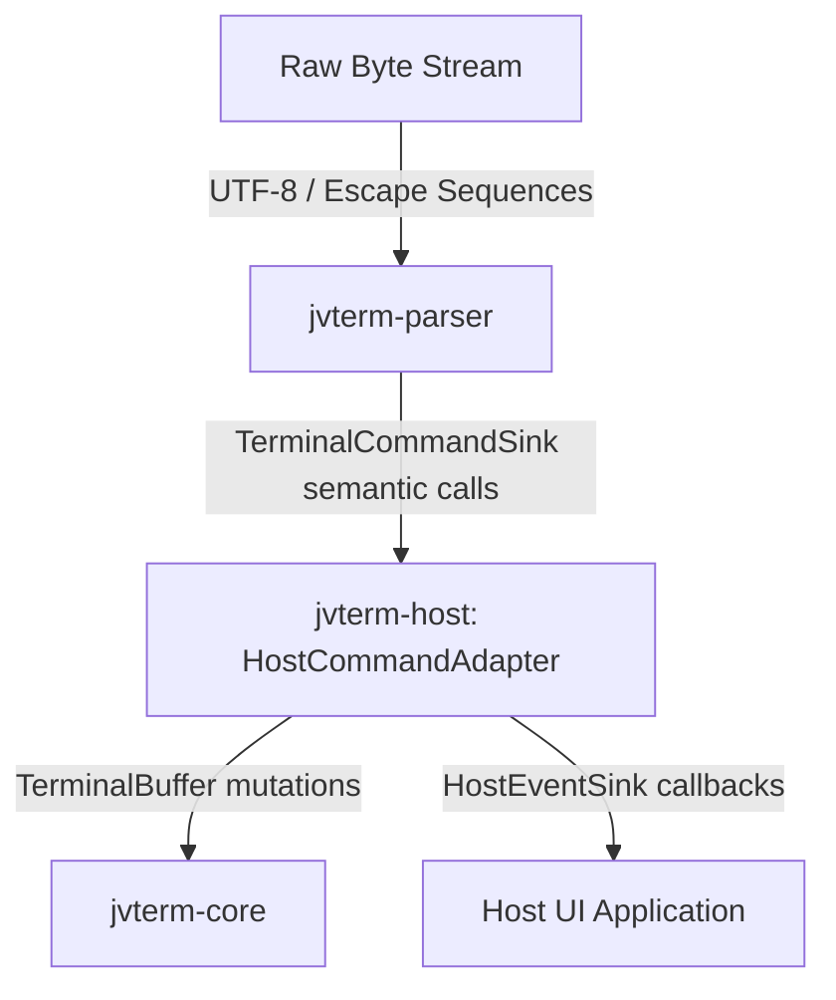

# Module jvterm-host

## JvTerm Host (`:jvterm-host`)

The `jvterm-host` module serves as the production bridge and adapter layer between the byte-stream parser (`jvterm-parser`) and the headless state machine/grid engine (`jvterm-core`).

It acts as the single, thin, and explicit translation point where abstract semantic ANSI/DEC protocols become concrete terminal grid mutations, mode changes, and host-facing events.

---

## Upstream Dependencies
- **`:jvterm-protocol`** (vocabulary, mode IDs, enums)
- **`:jvterm-parser`** (FSM, UTF-8, semantic command sinks)
- **`:jvterm-core`** (grid representation, text buffer, cell attributes, modes)

---

## Architectural Role & Pipeline Flow

The terminal pipeline operates in strict, unidirectional layers to preserve a Strong Single Responsibility Principle (SRP). `jvterm-host` sits at the center of this pipeline:



### What the Host Adapter Owns:
1. **Semantic Translation**: Mapping high-level `TerminalCommandSink` callbacks into atomic `TerminalBuffer` calls.
2. **Coordinate Normalization**: Converting zero-based parser indices into DEC-compatible, one-based inclusive coordinates expected by core APIs.
3. **Safety Policies**: Intercepting and clamping unbound protocol payloads (like OSC 8 hyperlink URLs) to prevent memory exhaustion.
4. **Host Metadata Event Forwarding**: Dispatching non-grid events (like the terminal bell or window/icon title changes) to the host environment.

---

## Sub-Documentation

For details on the hyperlink registry and mapping rules:
* [hyperlink-registry.md](file:///c:/Users/gagik/IdeaProjects/terminal-buffer/jvterm-host/docs/hyperlink-registry.md) - OSC 8 URI mapping, numeric cell keys, and LRU eviction thresholds.
* [command-adapter-mapping.md](file:///c:/Users/gagik/IdeaProjects/terminal-buffer/jvterm-host/docs/command-adapter-mapping.md) - Coordinate systems, screen buffer swapping logic, and soft/hard resets.

---

## How to Use

The following example shows how to instantiate the adapter and wire the parser to the core buffer:

```kotlin
import io.github.jvterm.core.TerminalBuffers
import io.github.jvterm.core.api.TerminalBuffer
import io.github.jvterm.parser.TerminalParser
import io.github.jvterm.host.HostCommandAdapter
import io.github.jvterm.host.HostEventSink
import io.github.jvterm.host.HostPolicy

fun main() {
    // 1. Create the backend core buffer
    val buffer: TerminalBuffer = TerminalBuffers.create(width = 80, height = 24)

    // 2. Create a host event sink to handle non-grid metadata events (e.g. system bell)
    val eventSink = object : HostEventSink {
        override fun bell() {
            println("[Visual Bell Triggered]")
        }
        override fun iconTitleChanged(title: String) {}
        override fun windowTitleChanged(title: String) {}
    }

    // 3. Instantiate the adapter, wiring it to the buffer and event sink
    val adapter = HostCommandAdapter(
        terminal = buffer,
        hostEvents = eventSink,
        hostPolicy = HostPolicy()
    )

    // 4. Wire the parser to use this adapter as its Command Sink
    val parser = TerminalParser(sink = adapter)

    // 5. Feed raw bytes (e.g., cursor up sequence "CSI A")
    val data = "\u001B[A".toByteArray(Charsets.US_ASCII)
    parser.accept(data, 0, data.size)
}
```

---

## How to Extend: Custom Event Sinks

To react to non-grid events in a custom application UI (for example, to display window titles in an OS frame header), implement the [HostEventSink](file:///c:/Users/gagik/IdeaProjects/terminal-buffer/jvterm-host/src/main/kotlin/io/github/jvterm/host/HostEventSink.kt) interface and pass it to the `HostCommandAdapter` constructor during startup.
