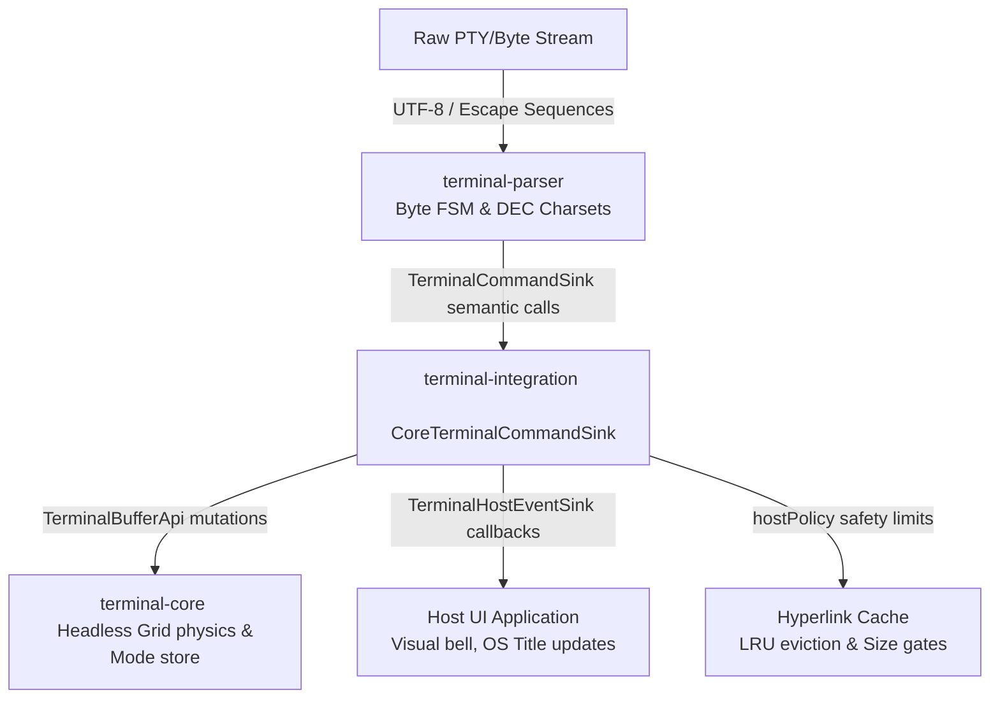

# Terminal Integration

The `terminal-integration` module serves as the production bridge and adapter layer between the byte-stream parser (`terminal-parser`) and the headless state machine/grid engine (`terminal-core`). 

It acts as the single, thin, and explicit translation point where abstract semantic ANSI/DEC protocols become concrete terminal grid mutations, mode changes, and host-facing events.

---

## Architectural Role & Pipeline Flow

The terminal pipeline operates in strict, unidirectional layers to preserve a Strong Single Responsibility Principle (SRP). `terminal-integration` sits at the center of this pipeline:



### Module Dependencies
As defined in [build.gradle.kts](build.gradle.kts), `terminal-integration` maintains clean boundaries by depending only on the lower abstraction layers and exposing no UI or platform-specific bindings:
- `:terminal-protocol` (Vocabulary, mode IDs, enums)
- `:terminal-parser` (FSM, UTF-8, semantic command sinks)
- `:terminal-core` (Grid representation, text buffer, cell attributes, modes)

---

## Integration Boundaries & Invariants

To keep the pipeline secure, maintainable, and highly performant, `terminal-integration` adheres to strict operational boundaries:

### What Integration Owns:
1. **Semantic Translation**: Mapping high-level `TerminalCommandSink` callbacks into atomic `TerminalBufferApi` calls.
2. **Coordinate Normalization**: Converting zero-based parser indices into DEC-compatible, one-based inclusive coordinates expected by core APIs.
3. **Safety Policies**: Intercepting and clamping unbound protocol payloads (like OSC 8 hyperlink URLs) to prevent memory exhaustion.
4. **Host Metadata Event Forwarding**: Dispatching non-grid events (like the terminal bell or window/icon title changes) to the host environment.

### What Integration MUST NOT Do:
* **No Byte Parsing**: It never inspects raw ANSI escapes, DCS parameters, or UTF-8 byte slices. That belongs strictly in `terminal-parser`.
* **No State Duplication**: It does not keep a parallel copy of the cursor row/column or terminal modes. It queries the core's single source of truth.
* **No Internal Core Mutation**: It only interacts with the core through the public `TerminalBufferApi` facade.
* **No Silent Clamping of Rich Data**: If the parser emits a richer color or style (e.g. RGB TrueColor) and the core cannot yet represent it, the adapter must not clamp it to standard ANSI-16. It must preserve it or explicitly mark it with a `TODO` instead of pretending degraded behavior is correct.

---

## Core Components

The module is composed of three lightweight, high-performance classes/interfaces:

### 1. `CoreTerminalCommandSink`
The concrete implementation of `TerminalCommandSink` that routes parsed semantic commands directly to the `TerminalBufferApi`. 
* **State Management**: It maintains an active mirror of local SGR pen attributes (`bold`, `italic`, `foreground`, etc.) to build and apply atomic compound changes using `terminal.setPenColors(...)`.
* **Title Stacking**: Implements xterm title stacking for window and icon titles using `ArrayDeque<String>` with a hard limit of `16` frames to prevent unbounded memory growth by rogue processes.

### 2. `TerminalHostEventSink`
A host-facing callback interface allowing host applications (such as Swing UI wrappers or shell integrations) to intercept non-grid, metadata-driven terminal events:
```kotlin
interface TerminalHostEventSink {
    fun bell()
    fun iconTitleChanged(title: String)
    fun windowTitleChanged(title: String)
}
```
* Employs a pre-allocated, no-op `TerminalHostEventSink.NONE` implementation for headless/testing environments to avoid unnecessary allocations.

### 3. `TerminalHostPolicy`
An immutable configuration data class that defines security gates and memory boundaries for metadata retention. 
* Prevents untrusted terminal streams from exfiltrating memory or overflowing memory limits via high-volume OSC sequences.
* Default limits are fine-tuned for modern shell and TUI workloads:
  * `maxHyperlinkEntries: Int = 4096`
  * `maxHyperlinkUriLength: Int = 4096`
  * `maxHyperlinkIdLength: Int = 256`

---

## Coordinate & Command Mappings

### 1. Coordinates and Margins
The parser SPI uses **zero-based** coordinate conventions. The core, mirroring standard DEC/ANSI specifications (`DECSTBM` and `DECSLRM`), uses **one-based inclusive** margins. 

`CoreTerminalCommandSink` translates these boundaries cleanly:
```kotlin
override fun setScrollRegion(top: Int, bottom: Int) {
    terminal.setScrollRegion(
        top = top + 1,
        bottom = if (bottom < 0) terminal.height else bottom + 1,
    )
}
```

### 2. Cursor Styling (`DECSCUSR`)
Maps `CSI Ps SP q` styles to dynamic cursor shapes and blinking behaviors defined in `terminal-render-api`:
* `0`, `1` $\rightarrow$ Blinking Block
* `2` $\rightarrow$ Steady Block
* `3` $\rightarrow$ Blinking Underline
* `4` $\rightarrow$ Steady Underline
* `5` $\rightarrow$ Blinking Bar
* `6` $\rightarrow$ Steady Bar

### 3. Screen Buffer Switching (Alternate Screen Modes)
Distinguishes between standard alternate buffer modes to ensure precise terminal emulation compatibility:
* **DEC Mode 47**: Switches between primary and alternate buffers without clearing alt content or saving/restoring the cursor.
* **DEC Mode 1047**: Switches buffers and clears the alternate screen content on entry, without saving/restoring the cursor.
* **DEC Mode 1048**: Saves the cursor position on enable, restores it on disable. No buffer switch.
* **DEC Mode 1049**: Combines saving/restoring the cursor with a clearing alternate-screen switch.

### 4. Hard vs. Soft Reset
* **RIS (`ESC c`)**: Hard-resets the terminal core state (`terminal.reset()`), clears local pen mirrors, active hyperlinks, and resets the hyperlink ID registry.
* **DECSTR (`CSI ! p`)**: Soft-resets the core state (`terminal.softReset()`), local pen attributes, active hyperlinks, and margins, but preserves active screen buffers, scrollback history, and visible text contents.

---

## High-Performance OSC 8 Hyperlink Security

Modern terminals support embedding hyperlinks (`OSC 8 ; [params] ; [URI] \`) directly in written text cells. Storing raw URI strings inside every grid cell is highly inefficient and creates significant memory overhead.

`CoreTerminalCommandSink` solves this through a high-performance, secure ID pool:

1. **Numeric ID Mapping**: The adapter retains a registry of active hyperlinks (`LinkedHashMap<HyperlinkKey, Int>`) mapping each distinct `(id, URI)` combination to a sequential, packed integer ID (`nextHyperlinkNumericId`).
2. **Registry Boundaries**: The registry behaves as a bounded **Least Recently Used (LRU) Cache**. When entries exceed `maxHyperlinkEntries` (default `4096`), the oldest, least recently used hyperlink mapping is safely evicted.
3. **Payload Clamping**: Any incoming URI or ID exceeding the character lengths defined in `TerminalHostPolicy` is immediately dropped and mapped to `NO_HYPERLINK_ID` (0).
4. **Grid Storage**: The adapter writes the sequential, packed integer ID into the core pen (`terminal.setHyperlinkId(...)`). The cell stores only this compact integer, keeping grid allocations extremely light.

---

## TODO Discipline

Unwired or partially implemented protocols must never be hidden behind silent, incomplete no-ops. When a gap is identified, developers must apply one of the following documented classifications to the code:

* `TODO(core-gap)`: The core storage, API, or state representation does not exist yet (e.g., synchronized output rendering).
* `TODO(parser-gap)`: The parser FSM does not yet recognize or dispatch the required protocol bytes.
* `TODO(integration)`: Both parser and core have the necessary APIs, but the adapter mapping has not been wired.
* `TODO(policy)`: The protocol requires an explicit security, permission, or host compatibility design (e.g., OSC 52 clipboard writes).

Always keep the project-wide feature matrix at [docs/terminal-feature-gap-map.md](../docs/terminal-feature-gap-map.md) updated when gaps are discovered, closed, or reclassified.

---

## Testing Doctrine

We believe that tests should assert real terminal semantics rather than mock calls. As such, the test suite in [CoreTerminalCommandSinkTest.kt](src/test/kotlin/integration/CoreTerminalCommandSinkTest.kt) follows a strict end-to-end strategy:

* **Real Byte Flows**: Tests construct a comprehensive `Fixture` that feeds real raw byte sequences through a live `TerminalOutputParser`, routes them into `CoreTerminalCommandSink`, and verifies the final state of the `TerminalBufferApi` grid.
* **Hermetic Assertions**: Assertions are made directly against public core state reader surfaces, such as checking grid lines (`getLineAsString`), specific cell coordinates (`getCodepointAt`), modes (`getModeSnapshot`), or packed rendering cursor frames.

### Test Categories Covered:
1. **Printable and Cursor Pipeline**: Combining marks, coordinate mappings, insert mode shifts, auto-wrap constraints, newline expansion, and full/soft resets.
2. **Mode Policy**: ANSI/DEC private mode snapshots, alternate screen buffer state, mouse tracking modes, encoding types (UTF8 vs SGR vs URXVT), safe window dimension reports, and cursor styles.
3. **SGR & OSC Policy**: 256-color/RGB truecolor attributes, SGR styles, underline colors (`SGR 58/59`), selective-erase protection (`DECSCA`/`DECSEL`/`DECSED`), title stack push/pop, DECALN test fills, and OSC 8 hyperlink boundaries (length limits, LRU eviction, ID reuse).
