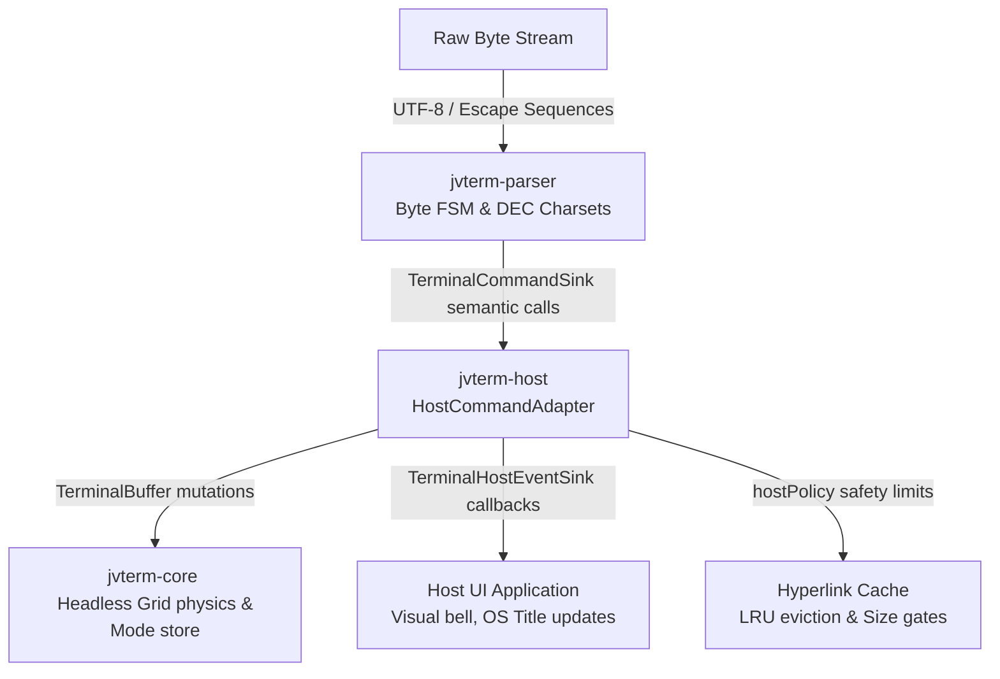

# JvTerm Host (`:jvterm-host`)

The `jvterm-host` module serves as the production bridge and adapter layer between the byte-stream parser (`jvterm-parser`) and the headless state machine/grid engine (`jvterm-core`).

It acts as the single, thin, and explicit translation point where abstract semantic ANSI/DEC protocols become concrete terminal grid mutations, mode changes, and host-facing events.

---

## Upstream Dependencies
- **`:jvterm-protocol`** (vocabulary, mode IDs, enums)
- **`:jvterm-parser`** (FSM, UTF-8, semantic command sinks)
- **`:jvterm-core`** (grid representation, text buffer, cell attributes, modes)

---

## Architectural Role & Pipeline Flow

The terminal pipeline operates in strict, unidirectional layers to preserve a Strong Single Responsibility Principle (SRP). `jvterm-host` sits at the center of this pipeline:



---

## Integration Boundaries & Invariants

To keep the pipeline secure, maintainable, and highly performant, `jvterm-host` adheres to strict operational boundaries:

### What the Host Adapter Owns:
1. **Semantic Translation**: Mapping high-level `TerminalCommandSink` callbacks into atomic `TerminalBuffer` calls.
2. **Coordinate Normalization**: Converting zero-based parser indices into DEC-compatible, one-based inclusive coordinates expected by core APIs.
3. **Safety Policies**: Intercepting and clamping unbound protocol payloads (like OSC 8 hyperlink URLs) to prevent memory exhaustion.
4. **Host Metadata Event Forwarding**: Dispatching non-grid events (like the terminal bell or window/icon title changes) to the host environment.

### What the Host Adapter Does NOT Own:
* **No Byte Parsing**: It never inspects raw ANSI escapes, DCS parameters, or UTF-8 byte slices. That belongs strictly in `jvterm-parser`.
* **No State Duplication**: It does not keep a parallel copy of the cursor row/column or terminal modes. It queries the core's single source of truth.

---

## Core Components

The module is composed of three lightweight, high-performance classes/interfaces:

### 1. [`HostCommandAdapter`](./src/main/kotlin/io/github/jvterm/host/HostCommandAdapter.kt)
The concrete implementation of `TerminalCommandSink` that routes parsed semantic commands directly to the `TerminalBuffer`. It maintains an active mirror of local SGR pen attributes and implements xterm title stacking (capped at 16 frames to prevent memory abuse).

### 2. [`TerminalHostEventSink`](./src/main/kotlin/io/github/jvterm/host/TerminalHostEventSink.kt)
A host-facing callback interface allowing host applications to intercept non-grid, metadata-driven terminal events:
```kotlin
interface TerminalHostEventSink {
    fun bell()
    fun iconTitleChanged(title: String)
    fun windowTitleChanged(title: String)
}
```

### 3. [`TerminalHostPolicy`](./src/main/kotlin/io/github/jvterm/host/TerminalHostPolicy.kt)
An configuration data class that defines security gates and memory boundaries for metadata retention:
* `maxHyperlinkEntries: Int = 4096`
* `maxHyperlinkUriLength: Int = 4096`
* `maxHyperlinkIdLength: Int = 256`

---

## 🔗 How to Use

The following example shows how to instantiate the adapter and wire the parser to the core buffer:

```kotlin
import io.github.jvterm.core.TerminalBuffers
import io.github.jvterm.core.api.TerminalBuffer
import io.github.jvterm.parser.TerminalParser
import io.github.jvterm.host.HostCommandAdapter
import io.github.jvterm.host.TerminalHostEventSink
import io.github.jvterm.host.TerminalHostPolicy

fun main() {
    // 1. Create the backend core buffer
    val buffer: TerminalBuffer = TerminalBuffers.create(width = 80, height = 24)

    // 2. Create a host event sink to handle non-grid metadata events (e.g. system bell)
    val eventSink = object : TerminalHostEventSink {
        override fun bell() {
            println("[Visual Bell Triggered]")
        }
        override fun iconTitleChanged(title: String) {
            println("Icon title: $title")
        }
        override fun windowTitleChanged(title: String) {
            println("Window title: $title")
        }
    }

    // 3. Instantiate the adapter, wiring it to the buffer and event sink
    val adapter = HostCommandAdapter(
        terminal = buffer,
        eventSink = eventSink,
        policy = TerminalHostPolicy()
    )

    // 4. Wire the parser to use this adapter as its Command Sink
    val parser = TerminalParser(sink = adapter)

    // 5. Feed raw bytes (e.g., cursor up sequence "CSI A")
    val data = "\u001B[A".toByteArray(Charsets.US_ASCII)
    parser.accept(data, 0, data.size)
}
```

---

## 🔗 How to Extend: Custom Event Sinks

To react to non-grid events in a custom application UI (for example, to display window titles in an OS frame header), implement the `TerminalHostEventSink` interface and pass it to the `HostCommandAdapter` constructor during startup.

---

## Testing & Verification

The tests in this module check translation logic by feeding byte streams into the parser and asserting the resulting state of the buffer:
* **[`HostCommandAdapterTest`](./src/test/kotlin/io/github/jvterm/host/HostCommandAdapterTest.kt)**:
  - Verifies printable sequences and cursor coordinate mappings.
  - Tests SGR attribute sets, direct colors, and underline styling.
  - Validates title stack push/pop flows and DEC mode resets.
  - Assures OSC 8 hyperlink boundaries (length constraints, LRU cache eviction).

To run checks for this module:
```bash
./gradlew :jvterm-host:test
```
