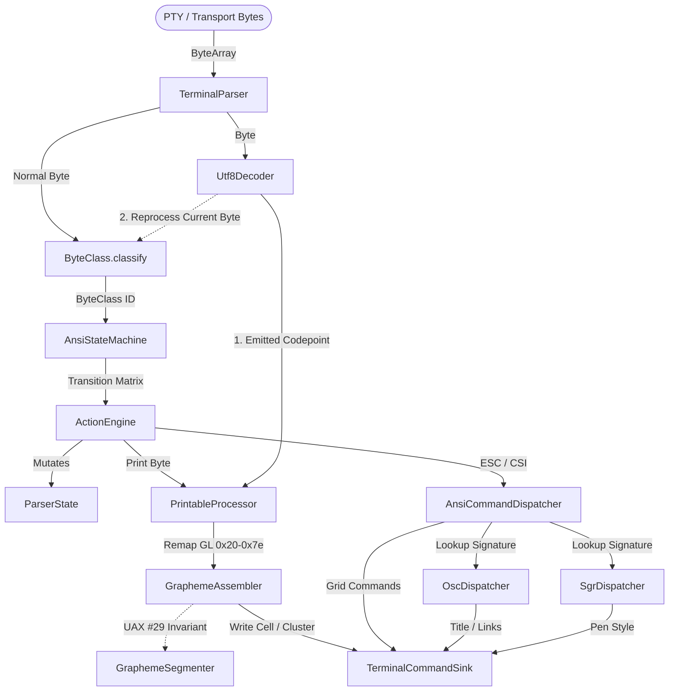

# Terminal Parser (`:terminal-parser`)

The `terminal-parser` module is a high-performance, strictly bounded, and allocation-conscious parser that transforms raw terminal host byte streams (from a PTY, SSH, or process output) into semantic terminal command invocations. 

It is designed with strict **Single Responsibility Principles (SRP)**: it owns byte parsing, UTF-8 streaming, ANSI finite-state transitions, string-command extraction, and Unicode grapheme cluster segmentation. It has **no** knowledge of grid physics, cursor clamping, terminal widths, viewport scrollbacks, rendering fonts, or host-specific PTY lifecycles.

---

## Architectural Overview & Data Flow

The parser operates as an asynchronous, chunk-safe pipeline. Raw packets of bytes of arbitrary size can be fed into the parser. The parser handles fragmented UTF-8 scalars, split control sequences, and multi-byte graphemes gracefully across boundary edges.

---

## Key Architectural Components

### 1. Streaming UTF-8 Decoder (`Utf8Decoder`)
The `Utf8Decoder` is an allocation-free, streaming, byte-at-a-time decoder designed to handle hostile and malformed input robustly.
* **Strict Validation:** It immediately rejects overlong encodings, UTF-16 surrogates (`U+D800..U+DFFF`), and codepoints exceeding `U+10FFFF`, replacing them with the standard Unicode replacement character `U+FFFD`.
* **Reprocess Current Byte Invariant:** When a pending multi-byte UTF-8 sequence receives an invalid or non-continuation byte (e.g., an ASCII control byte or `ESC` sequence mid-scalar), the decoder:
  1. Resets itself to the accept state.
  2. Emits `U+FFFD` to terminate the malformed sequence.
  3. Returns a `REPROCESS_CURRENT_BYTE` signal, forcing the `TerminalParser` to route the current byte back through the normal ANSI state machine rather than dropping it. This guarantees that sequences like `\xC3\x1B[A` (broken UTF-8 lead byte followed by a cursor-up escape sequence) are parsed safely and the escape sequence is preserved.

### 2. Flat ANSI Finite-State Machine (`AnsiState`, `AnsiStateMachine`, `ByteClass`)
* **`ByteClass`**: Maps raw bytes `0x00..0xFF` into 16 lexical categories (`EXECUTE`, `INTERMEDIATE`, `PARAM_DIGIT`, `CSI_INTRO`, `UTF8_PAYLOAD`, etc.). Bytes `0x80..0xFF` are routed as `UTF8_PAYLOAD` in the default state to avoid colliding with UTF-8 streams.
* **`AnsiState`**: Flat integer definitions representing 16 FSM router states (e.g., `GROUND`, `ESCAPE`, `CSI_ENTRY`, `OSC_STRING`, `DCS_PASSTHROUGH`, `SOS_PM_APC_STRING`).
* **`AnsiStateMachine`**: A table-driven, enum-free transition matrix stored inside a flat `IntArray`. Transitions are resolved in $O(1)$ time with no allocations. The 16-bit transition values are packed:
  $$\text{NextState} = \text{transition} \gg 8$$
  $$\text{ActionID} = \text{transition} \& \text{ 0xFF}$$

### 3. Action Execution & Command Dispatching
* **`ActionEngine`**: Translates the active `FsmAction` (one of 23 actions) into parser-state mutations.
  > [!IMPORTANT]
  > **Pre-Dispatch Flushing:** Before executing any structural control byte (such as `LF`, `CR`, `HT`) or dispatching an `ESC` / `CSI` command, the `ActionEngine` forces a flush of all pending printable text. This prevents control sequences or grid updates from executing before printing the preceding characters, maintaining strict visual sequencing.
* **`CsiSignature`**: Packs the structural characteristics of a CSI command into a single 64-bit `Long` key:
  * Final byte (bits 0..7)
  * Private marker, e.g., `?`, `>`, `=`, `!` (bits 8..15)
  * Intermediate bytes packed low-to-high (bits 16..47)
  * Intermediate byte count (bits 48..51)
* **`GeneratedCsiDispatchTable`**: Performs an $O(\log N)$ binary search lookup over strictly sorted signatures, resolving CSI command IDs (e.g., `CUU`, `DECSTBM`, `SGR`) without dynamic dynamic lookup maps or `Pair` object allocations.

### 4. Select Graphic Rendition (`SgrDispatcher`)
* **Styling Attributes:** Maps text formatting codes (bold, faint, italic, underlines, blink, inverse, conceal, strikethrough, overline, and selective erase protection).
* **Extended Colors:** Supports standard 16-color palettes, 256-color (indexed) lookup tables, and 24-bit direct color (RGB) sequences for **foreground**, **background**, and **underline** colors.
* **Subparameter Support:** Fully parses colon-separated subparameters (e.g., `CSI 4:3 m` for a curly underline). It correctly tracks parameter boundaries using the subparameter bitmask.

### 5. Grapheme Assembly & Segmentation (`GraphemeAssembler`, `GraphemeSegmenter`)
Graphemes are assembled in a flat buffer in `ParserState` and segmented according to the **Unicode Standard Annex #29 (UAX #29)**.
* **Robust Emoji and Script Support:** Handles Hangul syllables, regional indicator emoji pairs (flag emojis), Zero Width Joiners (ZWJ sequences), spacing marks, prepends, and combining marks.
* **Range Search:** Uses binary search lookup over strictly sorted range arrays in `GeneratedGraphemeBreakTable` for $O(\log N)$ range-based codepoint classification.
* **Live Interactive Echo (`flushForRender` & `appendToPreviousCluster`):**
  > [!TIP]
  > To solve terminal echo latency, the parser publishes partial graphemes immediately for rendering after a packet is processed (`flushForRender`). If subsequent bytes on a new PTY read extend the current grapheme (e.g., a combining accent or ZWJ member arrives), the assembler emits `appendToPreviousCluster` to extend the cell in the terminal core without resetting cursor coordinates.

### 6. Charset Mapping & Designations (`CharsetMapper`)
* Remaps GL-range characters (`0x20..0x7e`) when an alternate charset is designated.
* Supports **locking shifts** (shifting active GL to G0 or G1 slots via `SO`/`SI`) and **single shifts** (shifting only the very next character to G2 or G3 slots via `ESC N` / `ESC O`).
* Remaps characters to **DEC Special Graphics** (such as box-drawing characters: `q` $\to$ `─`, `x` $\to$ `│`) when `CHARSET_DEC_SPECIAL_GRAPHICS` is selected.

---

## Parser State Partitioning (`ParserState`)

To maximize data locality and JIT-friendly memory access on the JVM, `ParserState` is implemented as a flat, single-object state container. It uses only primitive fields and primitive arrays, partitioned logically:

| Partition | State Elements | Purpose |
| :--- | :--- | :--- |
| **ANSI FSM** | `fsmState` | Track current FSM state index |
| **Sequence Accumulator** | `params`, `paramCount`, `intermediates`, `privateMarker`, `subParameterMask` | Collect digits, semicolons, colons, and modifiers for CSI/ESC commands |
| **Grapheme Assembly** | `clusterBuffer`, `clusterLength`, `clusterEmittedLength`, `regionalIndicatorParity`, etc. | Accumulate UAX #29 graphemes; track RIs and emoji ZWJ contexts |
| **Charsets** | `charsets` (slots G0-G3), `glSlot`, `grSlot`, `singleShiftSlot` | Manage active character set designations and shift slots (with save/restore) |
| **OSC / DCS Payload** | `payloadBuffer`, `payloadLength`, `payloadOverflowed` | Safe scratch buffer (default 4KB) for text accumulation (titles, hyperlinks) |

---

## Engineering & Performance Rules

1. **No Dynamic Allocations in Hot Paths:** There must be zero allocations inside `TerminalParser.accept()`. Lookups use packed primitives (`Long`/`Int`), flat arrays, and binary searches.
2. **Strict Payload Bounds:** OSC/DCS payload buffers are strictly bounded (default 4096 bytes). Incoming bytes beyond this limit set the `payloadOverflowed` flag and are safely discarded to prevent memory exhaustion attacks.
3. **No Regex or ICU Heavyweights:** The parser does not use `java.util.regex`, `java.text.BreakIterator`, or ICU classes. All classification is table-driven and binary-search-driven.
4. **Strong Parser Boundaries:** The parser emits commands through the `TerminalCommandSink` interface and must never inspect grid coordinate states or manage screen coordinates directly.

---

## Testing Doctrine

The tests inside `src/test/kotlin` verify real terminal behavior and test for hostile, edge-case byte streams:
* **`AnsiStateMachineTest` / `ActionEngineTest`**: Cover FSM routing and recovery behavior.
* **`CsiCommandTest` / `CsiSignatureTest`**: Validate CSI metadata encoding and structural signature routing.
* **`SgrDispatcherTest`**: Thoroughly test RGB/indexed color parsing, subparameter parsing, and underline styles.
* **`GraphemeSegmenterTest` / `Utf8DecoderTest`**: Validate full compliance with UAX #29 and streaming UTF-8 malformed recoveries (including byte replay).
* **`AnsiIntegrationHarnessTest`**: Ensures split-chunk boundaries at every structural byte index do not corrupt sequence accumulation.
