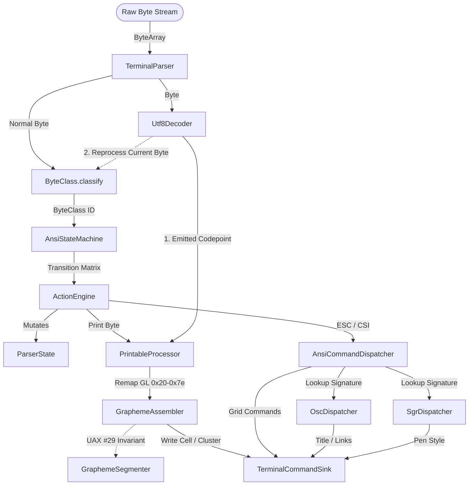

# JvTerm Parser (`:jvterm-parser`)

The `jvterm-parser` module is a high-performance, strictly bounded, and allocation-conscious parser that transforms raw terminal host byte streams (from a PTY, SSH, or network socket) into semantic terminal command invocations.

It is designed with strict **Single Responsibility Principles (SRP)**: it owns byte parsing, UTF-8 streaming, ANSI finite-state transitions, string-command extraction, and Unicode grapheme cluster segmentation. It has no knowledge of grid physics, cursor clamping, terminal widths, viewport scrollbacks, or rendering fonts.

---

## Upstream Dependencies
* **`:jvterm-protocol`** (for shared control codes, modes, and primitive constants).

---

## Architectural Role & Pipeline Flow

The parser operates as an asynchronous, chunk-safe pipeline. Raw packets of bytes of arbitrary size can be fed into the parser. The parser handles fragmented UTF-8 scalars, split control sequences, and multi-byte graphemes gracefully across boundary edges.



---

## Key Architectural Components

### 1. Streaming UTF-8 Decoder (`Utf8Decoder`)
The `Utf8Decoder` is an allocation-free, streaming, byte-at-a-time decoder designed to handle hostile and malformed input robustly.
* **Strict Validation:** It immediately rejects overlong encodings, UTF-16 surrogates (`U+D800..U+DFFF`), and codepoints exceeding `U+10FFFF`, replacing them with the standard Unicode replacement character `U+FFFD`.
* **Reprocess Current Byte Invariant:** When a pending multi-byte UTF-8 sequence receives an invalid or non-continuation byte, the decoder resets itself, emits `U+FFFD` to terminate the malformed sequence, and returns a `REPROCESS_CURRENT_BYTE` signal, forcing the `TerminalParser` to route the current byte back through the normal ANSI state machine rather than dropping it.

### 2. Flat ANSI Finite-State Machine (`AnsiStateMachine`)
* **`ByteClass`**: Maps raw bytes `0x00..0xFF` into 16 lexical categories. Bytes `0x80..0xFF` are routed as `UTF8_PAYLOAD` in the default state to avoid colliding with UTF-8 streams.
* **`AnsiStateMachine`**: A table-driven, transition matrix stored inside a flat `IntArray`. Transitions are resolved in $O(1)$ time with no allocations.

### 3. Action Execution & Command Dispatching
* **`ActionEngine`**: Translates the active FSM actions into parser-state mutations.
  > [!IMPORTANT]
  > **Pre-Dispatch Flushing:** Before executing any structural control byte (such as `LF`, `CR`, `HT`) or dispatching an `ESC` / `CSI` command, the `ActionEngine` forces a flush of all pending printable text to preserve strict visual sequencing.
* **`CsiSignature`**: Packs the structural characteristics of a CSI command into a single 64-bit `Long` key.
* **`GeneratedCsiDispatchTable`**: Performs an $O(\log N)$ binary search lookup over strictly sorted signatures, resolving CSI command IDs without dynamic lookup maps.

### 4. Select Graphic Rendition (`SgrDispatcher`)
* **Styling Attributes:** Maps text formatting codes (bold, faint, italic, underlines, blink, inverse, conceal, strikethrough, overline, and selective erase protection).
* **Extended Colors:** Supports standard 16-color palettes, 256-color (indexed) lookup tables, and 24-bit direct color (RGB) sequences.
* **Subparameter Support:** Fully parses colon-separated subparameters (e.g., `CSI 4:3 m` for a curly underline).

### 5. Grapheme Assembly & Segmentation (`GraphemeAssembler`)
Graphemes are assembled in a flat buffer in `ParserState` and segmented according to the **Unicode Standard Annex #29 (UAX #29)**.
* **Live Interactive Echo (`flushForRender` & `appendToPreviousCluster`):**
  To solve terminal echo latency, the parser publishes partial graphemes immediately for rendering after a packet is processed (`flushForRender`). If subsequent bytes on a new read extend the current grapheme (e.g., a combining accent), the assembler emits `appendToPreviousCluster` to extend the cell in the terminal core without resetting coordinates.

---

## 🔗 How to Use

The following example shows how to instantiate a `TerminalParser` and feed raw bytes to it:

```kotlin
import io.github.jvterm.parser.TerminalParser
import io.github.jvterm.parser.spi.TerminalCommandSink

class ParserConsumer(sink: TerminalCommandSink) {
    // 1. Instantiate the parser with a command sink
    private val parser = TerminalParser(sink)

    // 2. Feed raw byte buffers (from PTY or network sockets) as they arrive
    fun onDataReceived(buffer: ByteArray, bytesRead: Int) {
        // The parser maintains state across chunk boundaries
        parser.accept(buffer, 0, bytesRead)
    }
}
```

---

## 🔗 How to Implement: Custom Command Sink

To handle the semantic commands generated by the parser (such as writing text, moving the cursor, or resetting the screen), implement the [`TerminalCommandSink`](./src/main/kotlin/io/github/jvterm/parser/spi/TerminalCommandSink.kt) interface:

```kotlin
import io.github.jvterm.parser.spi.TerminalCommandSink
import io.github.jvterm.protocol.AnsiMode
import io.github.jvterm.protocol.DecPrivateMode

class PrintCommandSink : TerminalCommandSink {
    override fun writeCell(codepoint: Int, attrs: Long) {
        println("Print single codepoint: ${codepoint.toChar()} with attrs: $attrs")
    }

    override fun writeCluster(codepoints: IntArray, offset: Int, length: Int, attrs: Long) {
        val grapheme = String(codepoints, offset, length)
        println("Print complex grapheme cluster: $grapheme with attrs: $attrs")
    }

    override fun appendToPreviousCluster(codepoint: Int) {
        println("Extend previous grapheme with codepoint: ${codepoint.toChar()}")
    }

    override fun cursorUp(count: Int) {
        println("Move cursor up by $count")
    }

    override fun carriageReturn() {
        println("Carriage return")
    }

    override fun setAnsiMode(mode: AnsiMode, enabled: Boolean) {
        println("Set ANSI Mode $mode to $enabled")
    }

    override fun setDecPrivateMode(mode: DecPrivateMode, enabled: Boolean) {
        println("Set DEC Private Mode $mode to $enabled")
    }

    // ... Implement remaining protocol callbacks (SGR, OSC, screen control, etc.)
}
```

---

## Engineering & Performance Rules

1. **No Dynamic Allocations in Hot Paths:** There must be zero allocations inside `TerminalParser.accept()`. Lookups use packed primitives (`Long`/`Int`), flat arrays, and binary searches.
2. **Strict Payload Bounds:** OSC/DCS payload buffers are strictly bounded (default 4096 bytes). Incoming bytes beyond this limit set the `payloadOverflowed` flag and are safely discarded to prevent memory exhaustion attacks.
3. **No Regex or ICU Heavyweights:** The parser does not use `java.util.regex`, `java.text.BreakIterator`, or ICU classes. All classification is table-driven and binary-search-driven.

---

## Testing & Verification

The parser test suite verifies standard compliance, recovery behaviors, and split-packet edge cases:
* **`AnsiStateMachineTest`**: Covers state-machine transitions and error recoveries.
* **`SgrDispatcherTest`**: Asserts 24-bit direct color, indexed color, and curly underlines.
* **`GraphemeSegmenterTest` / `Utf8DecoderTest`**: Tests UTF-8 parsing, replacement codes, and UAX #29 segmentation rules.

To run checks for this module:
```bash
./gradlew :jvterm-parser:test
```
