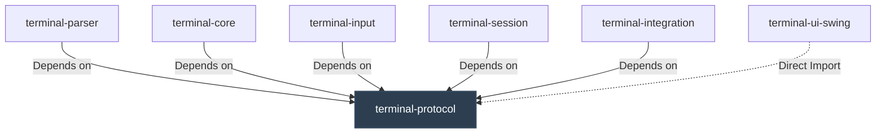

# Terminal Protocol (`:terminal-protocol`)

The `terminal-protocol` module represents the zero-dependency, immutable core vocabulary of **Lattice Terminal**. It defines the fundamental, standard-aligned constants, enumerations, and interfaces shared by the parser, headless core, integration layers, input encoders, and host-bound transports. 

By centralizing ANSI/DEC protocol keys, mode identifiers, and low-level byte sinks, the module ensures strict consistency across the entire terminal pipeline while maintaining a lightweight, JIT-friendly, and allocation-conscious footprint.

---

## Architectural Boundaries & Scope

To maintain a strict separation of concerns, `terminal-protocol` operates under clear architectural rules and limits. It contains **no execution logic**.



### What the Module Owns
* **ANSI & ECMA-48 C0/C1 Byte Constants**: Raw numerical mappings for physical ASCII controls and 8-bit terminal state transitions.
* **Standard ANSI & DEC Private Modes**: Integer mappings for CSI SM/RM (Set/Reset Mode) and DECSET/DECRST parameters.
* **State & Tracking Enums**: High-level semantic enums representing mouse tracking and encoding policies for the core state engine.
* **Performance-Optimized Primitive Mappings**: Zero-overhead integer constants for fast keyboard encoders, preventing object allocations during intensive key and mouse event dispatches.
* **Outbound Host Communication Interface**: A clean, unified, platform-neutral byte sink (`TerminalHostOutput`) that acts as the final target for all encoded host communication (PTY stdin, SSH buffers, etc.).

### What the Module Does NOT Own
* **No Byte-Stream Parsing**: It does not parse escape sequences, decode UTF-8 streams, or analyze CSI/OSC/DCS structures. That is the sole domain of [`:terminal-parser`](../terminal-parser/README.md).
* **No State Mutation**: It contains no terminal grids, scrollback history, or margin clamping logic. Screen mutations are managed exclusively by [`:terminal-core`](../terminal-core/README.md).
* **No Input Event Encoding**: It does not translate UI actions or keys into ANSI strings. Mappings are performed by [`:terminal-input`](../terminal-input/README.md).
* **No External Dependencies**: It has **zero runtime dependencies**. It compiles against the bare-metal Kotlin Standard Library, keeping it exceptionally lightweight and portable across platforms.

---

## 🗛 Architectural Vocabularies & Components

The module's source directory is organized into concise files, each mapping a specific area of the terminal wire protocols:

### 1. ASCII C0, DEL & C1 Controls ([`ControlCode`](./src/main/kotlin/protocol/ControlCode.kt))
Provides standard ANSI/ECMA-48 constants for single-byte control codes. 
* **C0 Controls (`0x00..0x1F`)**: Mapped to classic codes like `NUL`, `BEL`, `BS` (Backspace), `HT` (Tab), `LF` (Line Feed), `CR` (Carriage Return), `ESC` (Escape), `CAN` (Cancel), and `SUB` (Substitute).
* **DEL Code (`0x7F`)**: Mapped to standard delete character semantics.
* **C1 Controls (`0x80..0x9F`)**: Mapped to 8-bit controls such as `IND` (Index), `NEL` (Next Line), `RI` (Reverse Index), `DCS` (Device Control String), `CSI` (Control Sequence Introducer), `ST` (String Terminator), and `OSC` (Operating System Command).

> [!NOTE]
> C1 byte values are provided for completeness. In the default configuration of `:terminal-parser`, bytes above `0x7F` are treated as UTF-8 multibyte payloads rather than 8-bit controls, avoiding collisions with normal multibyte UTF-8 characters.

---

### 2. Standard ANSI Modes ([`AnsiMode`](./src/main/kotlin/protocol/AnsiMode.kt))
Houses mode identifiers toggled via CSI `SM` (Set Mode) and `RM` (Reset Mode) sequences.
* `INSERT` (`4`): Controls character insertion behavior in the active grid.
* `NEW_LINE` (`20`): Determines whether `LF`, `VT`, or `FF` cause the cursor to go to the first column of the next line, or just perform a vertical transition.

---

### 3. DEC Private Modes ([`DecPrivateMode`](./src/main/kotlin/protocol/DecPrivateMode.kt))
Tracks common DEC private mode parameters toggled via `DECSET` (`CSI ? Pn h`) and `DECRST` (`CSI ? Pn l`) sequences. This includes:
* **Cursor & Viewport Behavior**: `APPLICATION_CURSOR_KEYS` (`1`), `CURSOR_BLINK` (`12`), `CURSOR_VISIBLE` (`25`), `AUTO_WRAP` (`7`), and `ORIGIN` (`6`).
* **Sizing & Margins**: `DECCOLM` (`3`) (column modes) and `LEFT_RIGHT_MARGIN` (`69`).
* **Screen Buffers**: `ALT_SCREEN` (`47`), `ALT_SCREEN_BUFFER` (`1047`), and `ALT_SCREEN_SAVE_CURSOR` (`1049`).
* **Mouse Tracking**: `MOUSE_X10` (`9`), `MOUSE_NORMAL` (`1000`), `MOUSE_BUTTON_EVENT` (`1002`), and `MOUSE_ANY_EVENT` (`1003`).
* **Mouse Encodings**: `MOUSE_UTF8` (`1005`), `MOUSE_SGR` (`1006`), and `MOUSE_URXVT` (`1015`).
* **Modern Shell Enhancements**: `FOCUS_REPORTING` (`1004`), `BRACKETED_PASTE` (`2004`), and `SYNCHRONIZED_OUTPUT` (`2026`).

---

### 4. High-Level Core Enums ([`MouseModes.kt (High-Level)`](./src/main/kotlin/protocol/MouseModes.kt))
Exposes semantic `enum class` definitions in package `com.gagik.terminal.protocol` to represent core state configurations.
* **`MouseTrackingMode`**: Represents high-level mouse reporting state:
  * `OFF`: Mouse reporting disabled.
  * `X10`: Report button presses only.
  * `NORMAL`: Report presses, releases, and scroll-wheel movements.
  * `BUTTON_EVENT`: Report presses, releases, scroll wheel, and active drags (motion while mouse button is held).
  * `ANY_EVENT`: Report all mouse movements regardless of button state.
* **`MouseEncodingMode`**: Defines the encoding protocol used to serialize mouse coordinates:
  * `DEFAULT`: Classic legacy `ESC [ M` byte-packed encoding (limited to column/row $\le 223$).
  * `UTF8`: Extends coordinate limits via multi-byte UTF-8 sequences.
  * `SGR`: Modern, unlimited decimal protocol (`CSI < button ; column ; row M/m`).
  * `URXVT`: Extends coordinate limits via decimal-packed `CSI <button> ; <column> ; <row> M`.

---

### 5. Low-Level Performance Constants
Designed for JIT-friendly performance in hot paths (like input event loops). These constants map high-level core states directly to packed integer bits without producing garbage allocations.

Mouse reporting constants live under package `com.gagik.terminal.protocol.mouse`:

* **`com.gagik.terminal.protocol.mouse.MouseTrackingMode`**: Defines integer constants (`NONE = 0`, `X10 = 1`, `NORMAL = 2`, `BUTTON_EVENT = 3`, `ANY_EVENT = 4`) matching the packed ordinals in the core decoder.
* **`com.gagik.terminal.protocol.mouse.MouseEncodingMode`**: Defines integer constants (`DEFAULT = 0`, `UTF8 = 1`, `SGR = 2`, `URXVT = 3`).

Keyboard protocol constants live under package `com.gagik.terminal.protocol.keyboard`:

* **`ModifyOtherKeysMode`** ([source](./src/main/kotlin/protocol/keyboard/ModifyOtherKeysMode.kt)): Mapped to `DISABLED = 0`, `MODE_1 = 1` (encode legacy-ambiguous modified keys), `MODE_2 = 2` (encode all modified ordinary keys), and `MODE_3 = 3` (encode ordinary keys even without modifiers), matching xterm's modifyOtherKeys states.
* **`FormatOtherKeysMode`** ([source](./src/main/kotlin/protocol/keyboard/FormatOtherKeysMode.kt)): Mapped to `DEFAULT = 0` for `CSI 27 ; modifier ; codepoint ~` and `CSI_U = 1` for `CSI codepoint ; modifier u`.
* **`XtermKeyModifierResource`** and **`XtermKeyFormatResource`** ([source](./src/main/kotlin/protocol/keyboard/XtermKeyModifierResource.kt), [source](./src/main/kotlin/protocol/keyboard/XtermKeyFormatResource.kt)): Resource ids for xterm key modifier and key format option controls.
* **Kitty keyboard constants** ([flags](./src/main/kotlin/protocol/keyboard/KittyKeyboardProgressiveFlag.kt), [application modes](./src/main/kotlin/protocol/keyboard/KittyKeyboardFlagApplicationMode.kt), [event types](./src/main/kotlin/protocol/keyboard/KittyKeyboardEventType.kt), [functional key codes](./src/main/kotlin/protocol/keyboard/KittyKeyboardFunctionalKeyCode.kt)): Primitive vocabulary for the planned Kitty keyboard protocol path.

---

### 6. Outbound Host Communication Sink ([`TerminalHostOutput`](./src/main/kotlin/protocol/host/TerminalHostOutput.kt))
Acts as the central interface for all host-bound byte traffic generated by the emulator (like keyboard sequences, mouse coordinate reports, focus events, or DSR query responses).

```kotlin
interface TerminalHostOutput {
    fun writeByte(byte: Int)
    fun writeBytes(bytes: ByteArray, offset: Int, length: Int)
    fun writeAscii(text: String)
    fun writeUtf8(text: String)
}
```

> [!IMPORTANT]
> **Thread Synchronization Boundary:**
> `TerminalHostOutput` implementations are typically mapped directly to PTY or SSH standard input streams. Callers must guarantee that operations from independent threads are properly serialized.
> 
> A terminal integration should coordinate UI inputs and internal response streams through a single actor event loop, writing to this sink sequentially to prevent overlapping or corrupted packet sequences.

---

## 🔗 Code Integration Examples

Here are concrete demonstrations of how the `terminal-protocol` vocabulary is imported and utilized across different modules:

### A. Parser Byte Classification (used in `:terminal-parser`)
In [`ByteClass.kt`](../terminal-parser/src/main/kotlin/parser/ansi/ByteClass.kt), the parser state machine relies on `ControlCode` to map inbound bytes to execution classes:

```kotlin
import com.gagik.terminal.protocol.ControlCode

// Build ASCII class map
for (b in ControlCode.NUL..ControlCode.ETB) {
    map[b] = EXECUTE_CLASS
}
map[ControlCode.CAN] = CANCEL_CLASS
map[ControlCode.ESC] = ESCAPE_CLASS
```

### B. Core State Representation (used in `:terminal-core`)
In [`TerminalModes.kt`](../terminal-core/src/main/kotlin/core/model/TerminalModes.kt), the core state engine tracks the active mouse configuration via the protocol's high-level enums:

```kotlin
import com.gagik.terminal.protocol.MouseEncodingMode
import com.gagik.terminal.protocol.MouseTrackingMode

class TerminalModes {
    var mouseTracking: MouseTrackingMode = MouseTrackingMode.OFF
    var mouseEncoding: MouseEncodingMode = MouseEncodingMode.DEFAULT
}
```

### C. Low-Allocation Event Encoding (used in `:terminal-input`)
In [`MouseEncoder.kt`](../terminal-input/src/main/kotlin/input/impl/MouseEncoder.kt), coordinates are encoded efficiently without allocating object instances by importing performance-optimized primitive modes:

```kotlin
import com.gagik.terminal.protocol.mouse.MouseEncodingMode
import com.gagik.terminal.protocol.mouse.MouseTrackingMode

fun encode(event: TerminalMouseEvent, tracking: Int, encoding: Int) {
    if (tracking == MouseTrackingMode.NONE) return
    
    if (encoding == MouseEncodingMode.SGR) {
        // Encode SGR decimal bytes directly into the reusable scratch buffer
    }
}
```

Keyboard input protocol constants follow the same primitive-vocabulary model:

```kotlin
import com.gagik.terminal.protocol.keyboard.KittyKeyboardProgressiveFlag
import com.gagik.terminal.protocol.keyboard.ModifyOtherKeysMode

val xtermMode = ModifyOtherKeysMode.MODE_3
val kittyFlags = KittyKeyboardProgressiveFlag.DISAMBIGUATE_ESCAPE_CODES
```

---

## Performance & Engineering Discipline

To satisfy the high-performance targets of the Lattice Terminal stack, the `terminal-protocol` module enforces these coding rules:
1. **Zero External Dependencies**: Must never import external or third-party libraries.
2. **Compile-Time Constant Propagation**: All constant values (CSI parameters, ASCII ranges, mode flags) are declared as `const val` compile-time constants, enabling the Kotlin and Java compilers to inline these values directly. This avoids lookup overheads and field resolution instructions during execution.
3. **No Garbage Allocation**: The primitives and enums inside this module must not prompt dynamic heap allocations. Memory-sensitive layers use flat `Int` mappings, keeping garbage collector pressure at zero on execution hot paths.
4. **Strong Types for Public APIs**: High-level core interfaces expose type-safe enums (`MouseTrackingMode`, `MouseEncodingMode`) to promote developer safety, while low-level input encoders translate these into fast primitive bits internally.

---

## Testing & Validation

Although `terminal-protocol` is largely composed of constants, it includes standard unit tests to verify that values adhere to standard terminal protocols and specifications.

* **Mode and Code Validation ([`TerminalProtocolModesTest`](./src/test/kotlin/protocol/TerminalProtocolModesTest.kt))**: Asserts that every control code matches its exact wire-byte value (e.g. `BEL` = `0x07`, `CSI` = `0x9B`), that ANSI modes match CSI SM/RM standard targets, and that DEC private modes align with correct specification values.
* **Keyboard Vocabulary Validation ([`TerminalKeyboardProtocolTest`](./src/test/kotlin/protocol/keyboard/TerminalKeyboardProtocolTest.kt))**: Asserts that xterm modified-key constants and Kitty keyboard protocol constants match their documented wire values.

To run the protocol module checks:
```bash
./gradlew :terminal-protocol:test
```
