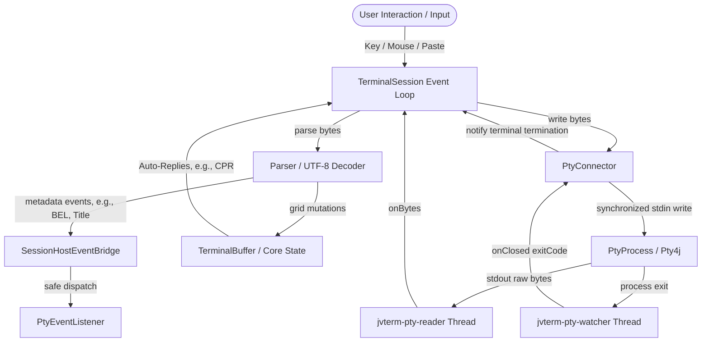

# JvTerm PTY (`:jvterm-pty`)

The `jvterm-pty` module owns the lifecycle management, process stream pumping, and terminal size synchronizations of local, host-backed pseudo-terminal (PTY) processes.

Using JetBrains [Pty4J](https://github.com/JetBrains/pty4j) as the underlying native transport layer, this module exposes system-bound shells (such as `cmd.exe` on Windows or `bash`/`zsh` on macOS/Linux) through standard `jvterm-transport-api` abstractions. It also provides factory entry points to wire process byte-streams directly into the synchronized terminal session runtime (`jvterm-session`).

---

## Upstream Dependencies
- **`:jvterm-protocol`** (vocabulary, mode IDs, enums)
- **`:jvterm-transport-api`** (duplex connector contracts)
- **`:jvterm-core`** (headless terminal grid)
- **`:jvterm-host`** (command mapping and security policies)
- **`:jvterm-input`** (keyboard/mouse encoding and policies)
- **`:jvterm-session`** (session orchestration and lock loops)

---

## Architectural Role & Data Flow

The PTY transport orchestrates three asynchronous boundaries:
1. **The Reader Thread** (`jvterm-pty-reader`): Blocks on the native PTY process `InputStream`, pumping raw byte packets to the parser.
2. **The Watcher Thread** (`jvterm-pty-watcher`): Blocks on process termination (`Process.waitFor()`) to capture the native exit code.
3. **The Outbound Writer**: Processes writes synchronously from the terminal event loop or core replies, protected by an internal serialization write lock.



---

## Key Architectural Components

### 1. The PTY Transport Connector ([`PtyConnector`](./src/main/kotlin/pty/PtyConnector.kt))
Exposes the native PTY process streams to the session listener:
- **Pumping Daemon Threads**: Launches two independent daemon threads (`jvterm-pty-reader` and `jvterm-pty-watcher`) upon calling `start()`.
- **Eof and Watcher Coordination**: When `jvterm-pty-reader` hits EOF, it blocks and waits for `jvterm-pty-watcher` to capture the true native exit code, avoiding prematurely emitting a `null` exit code to the session listener.

### 2. PTY Options Configuration ([`PtyOptions`](./src/main/kotlin/pty/PtyOptions.kt))
Encapsulates all initialization parameters:
- **Platform-Default Shell Detection**: Automatically determines the native shell (`%COMSPEC%` on Windows, `$SHELL` on macOS/Linux).
- **Environment Context**: Inherits all current JVM environment variables, explicitly appending `TERM=xterm-256color` to request standard 256-color support.

---

## 🔗 How to Use

The following example shows how to launch a local shell session (e.g. `/bin/bash` or `cmd.exe`) using the `TerminalSessions` factory:

```kotlin
import io.github.jvterm.pty.TerminalSessions
import io.github.jvterm.pty.PtyOptions
import io.github.jvterm.pty.PtyEventListener
import io.github.jvterm.session.TerminalSession

fun main() {
    // 1. Define custom event listeners for terminal title changes or bells
    val listener = object : PtyEventListener {
        override fun bell(session: TerminalSession) {
            println("OS Bell Triggered!")
        }

        override fun windowTitleChanged(session: TerminalSession, title: String) {
            println("New window title: $title")
        }

        override fun iconTitleChanged(session: TerminalSession, title: String) {}

        override fun listenerFailed(session: TerminalSession, exception: Throwable) {
            System.err.println("Listener callback failed: ${exception.message}")
        }
    }

    // 2. Configure PTY Options
    val options = PtyOptions(
        command = emptyList(), // Automatically resolves platform default shell
        columns = 80,
        rows = 24,
        maxHistory = 1000,
        eventListener = listener
    )

    // 3. Start the local PTY session
    val session: TerminalSession = TerminalSessions.localPty(options)

    // 4. Send typing events
    session.pasteText("echo 'Hello JvTerm'\n")

    // ... During shutdown, closing the session will destroy the PTY process
    // session.close()
}
```

---

## 🔗 How to Extend: Custom Key Mappings or Shells

You can customize the command array, working directory, and custom environment variables directly via `PtyOptions`:

```kotlin
import io.github.jvterm.pty.PtyOptions
import io.github.jvterm.pty.TerminalSessions
import java.nio.file.Path

val options = PtyOptions(
    command = listOf("/usr/bin/git", "status"),
    workingDirectory = Path.of("/my/repo/path"),
    environment = mapOf("GIT_EDITOR" to "vim")
)
val gitSession = TerminalSessions.localPty(options)
```

---

## Testing & Verification

The PTY module contains both mock-backed unit tests and native smoke tests:
* **`PtyConnectorTest`**: Exercises stream chunking, process destruction, and thread termination using simulated streams.
* **`PtySessionTest`**: Asserts the host of the full session pipeline.
* **`PtyRealProcessTest`**: Validates actual native shell execution (e.g. `cmd.exe`, `bash`), verifying that process output reaches the terminal grid and exits cleanly.

To run tests:
```bash
./gradlew :jvterm-pty:test
```
