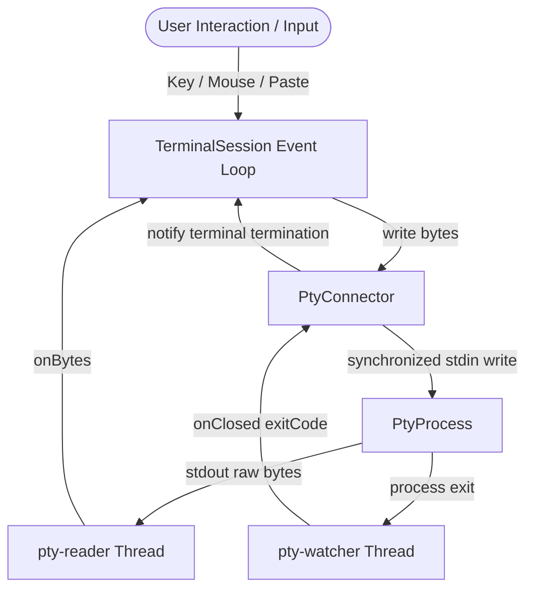

# JvTerm PTY (`:jvterm-pty`)

The `jvterm-pty` module owns the lifecycle management, process stream pumping, and terminal size synchronizations of local, host-backed pseudo-terminal (PTY) processes.

Using JetBrains [Pty4J](https://github.com/JetBrains/pty4j) as the underlying native transport layer, this module exposes system-bound shells (such as `cmd.exe` on Windows or `bash`/`zsh` on macOS/Linux) through standard `jvterm-transport-api` abstractions. It also provides factory entry points to wire process byte-streams directly into the synchronized terminal session runtime (`jvterm-session`).

---

## 🔌 Upstream Dependencies
- **`:jvterm-protocol`** (vocabulary, mode IDs, enums)
- **`:jvterm-transport-api`** (duplex connector contracts)
- **`:jvterm-core`** (headless terminal grid)
- **`:jvterm-host`** (command mapping and security policies)
- **`:jvterm-input`** (keyboard/mouse encoding and policies)
- **`:jvterm-session`** (session orchestration and lock loops)

---

## 🏛️ Architectural Role & Data Flow

The PTY transport orchestrates three asynchronous boundaries:
1. **The Reader Thread** (`pty-reader`): Blocks on the native PTY process `InputStream`, pumping raw byte packets to the parser.
2. **The Watcher Thread** (`pty-watcher`): Blocks on process termination (`Process.waitFor()`) to capture the native exit code.
3. **The Outbound Writer**: Processes writes synchronously from the terminal event loop or core replies, protected by an internal serialization write lock.



---

## 📖 Sub-Documentation

For deep-dive details on daemon threading and ConPTY integration:
* [pty4j-process-lifecycle.md](file:///c:/Users/gagik/IdeaProjects/terminal-buffer/jvterm-pty/docs/pty4j-process-lifecycle.md) - PTY reader and watcher loops, exit-code capture, and Windows sizing adjustments.

---

## 🔗 How to Use

The following example shows how to launch a local shell session (e.g. `/bin/bash` or `cmd.exe`) using the `TerminalSessions` factory:

```kotlin
import io.github.jvterm.pty.TerminalSessions
import io.github.jvterm.pty.PtyOptions
import io.github.jvterm.pty.PtyEventListener
import io.github.jvterm.session.TerminalSession

fun main() {
    // 1. Define custom event listeners for terminal title changes or bells
    val listener = object : PtyEventListener {
        override fun bell(session: TerminalSession) {
            println("OS Bell Triggered!")
        }
        override fun windowTitleChanged(session: TerminalSession, title: String) {}
        override fun iconTitleChanged(session: TerminalSession, title: String) {}
        override fun listenerFailed(session: TerminalSession, exception: Throwable) {}
    }

    // 2. Configure PTY Options
    val options = PtyOptions(
        command = emptyList(), // Automatically resolves platform default shell
        columns = 80,
        rows = 24,
        maxHistory = 1000,
        eventListener = listener
    )

    // 3. Start the local PTY session
    val session: TerminalSession = TerminalSessions.localPty(options)

    // 4. Send typing events
    session.pasteText("echo 'Hello JvTerm'\n")
}
```

---

## 🔗 How to Extend: Custom Key Mappings or Shells

You can customize the command array, working directory, and custom environment variables directly via `PtyOptions`:

```kotlin
import io.github.jvterm.pty.PtyOptions
import io.github.jvterm.pty.TerminalSessions
import java.nio.file.Path

val options = PtyOptions(
    command = listOf("/usr/bin/git", "status"),
    workingDirectory = Path.of("/my/repo/path"),
    environment = mapOf("GIT_EDITOR" to "vim")
)
val gitSession = TerminalSessions.localPty(options)
```
