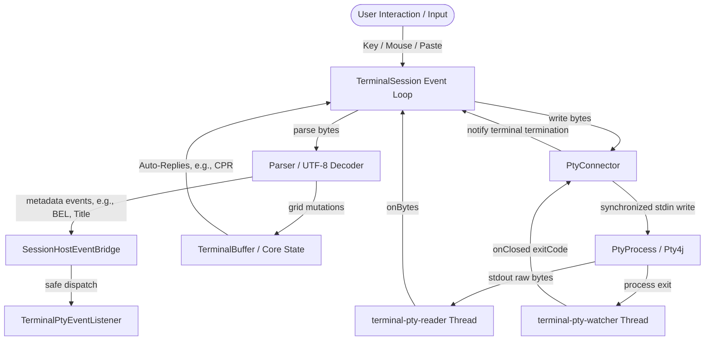

# Local PTY Process Host (`:terminal-pty`)

The **terminal-pty** module owns the lifecycle management, process stream pumping, and terminal size synchronizations of local, host-backed pseudo-terminal (PTY) processes. 

Using JetBrains [Pty4J](https://github.com/JetBrains/pty4j) as the underlying cross-platform native transport layer, this module exposes system-bound shells (such as `cmd.exe` on Windows or `bash`/`zsh` on macOS/Linux) through standard `terminal-transport-api` abstractions. It also provides clean factory entry points to wire process byte-streams directly into the synchronized terminal session runtime (`terminal-session`).

---

## Architectural Scope and Boundaries

To preserve strict **Single Responsibility Principles (SRP)** and keep module boundaries intact, **terminal-pty** operates as a thin, highly optimized I/O transport host:

### What the Module Owns
- **Lifecycle Control**: Spawning, watching, gracefully shutting down, and destroying local PTY-backed processes.
- **Stream Pumping**: Spawning dedicated JVM daemon threads to continuously read raw process output bytes (`stdout`) and feed them to listeners.
- **Concurrent Thread Synchronization**: Serializing all concurrent host-bound write commands (`stdin`) through an explicit write lock.
- **Window Resizing**: Notifying the underlying native OS kernel of terminal grid size changes (columns and rows) in sync with the internal grid.
- **Integration Callback Bridging**: Relaying parser-discovered terminal host events—such as bells (`BEL`) and OSC icon/window title changes—to external consumer listeners.

### What the Module Does NOT Own
- **Escape Sequence Parsing**: PTY does not inspect raw byte streams, identify SGR/CSI codes, or parse ANSI sequences.
- **Grid State Mutation**: It does not touch terminal cells, cursor coordinates, margins, scrollback history, or pen attributes.
- **Host Input Encoding**: It does not convert keyboard presses, clipboard pastes, or mouse clicks into ANSI bytes. 
- **Swing UI / Rendering**: It has no dependency on UI toolkits, rendering frameworks, or font systems.

### Serialization, Threading, and Data Flow Boundary

The PTY transport orchestrates three asynchronous boundaries:
1. **The Reader Thread** (`terminal-pty-reader`): Blocks on the native PTY process `InputStream`, pumping raw byte packets to the parser.
2. **The Watcher Thread** (`terminal-pty-watcher`): Blocks on process termination (`Process.waitFor()`) to capture the native exit code.
3. **The Outbound Writer**: Processes writes synchronously from the terminal event loop or core replies, protected by an internal serialization write lock.



---

## Key Architectural Components

### 1. The PTY Transport Connector ([PtyConnector](./src/main/kotlin/pty/PtyConnector.kt))
[PtyConnector](./src/main/kotlin/pty/PtyConnector.kt) is the module's core implementation of `TerminalConnector` (`terminal-transport-api`). It is responsible for bridging process streams with a `TerminalConnectorListener`:
- **Pumping Daemon Threads**: Launches two independent daemon threads (`terminal-pty-reader` and `terminal-pty-watcher`) upon calling `start()`.
- **Thread Safety**: Writes are synchronized via an internal `writeLock` block, ensuring that concurrent packet writes from terminal session loops or core auto-replies do not interleave raw bytes.
- **Idempotent Destruction**: Employs an `AtomicBoolean` guard (`localCloseRequested`) to guarantee process termination and stream closure are executed exactly once, safely avoiding thread leaks or double-close exceptions.
- **Eof and Watcher Coordination**: When `terminal-pty-reader` hits EOF (read returns `< 0`), it purposefully blocks and waits for `terminal-pty-watcher` to capture the true native exit code, rather than prematurely emitting a `null` exit code to the session listener.

### 2. Process Abstraction & PTY4J Factory ([TerminalProcess](./src/main/kotlin/pty/TerminalProcess.kt))
To facilitate deterministic testing without relying on the native host environment, the module abstracts the PTY process under the [TerminalProcess](./src/main/kotlin/pty/TerminalProcess.kt) interface:
- **[Pty4jTerminalProcess](./src/main/kotlin/pty/TerminalProcess.kt)**: The default production wrapper that adapts `com.pty4j.PtyProcess` to the [TerminalProcess](./src/main/kotlin/pty/TerminalProcess.kt) contract, implementing `resize` via `PtyProcess.setWinSize(WinSize(cols, rows))`.
- **[Pty4jTerminalProcessFactory](./src/main/kotlin/pty/TerminalProcess.kt)**: Initializes a `PtyProcessBuilder` using configured variables. Crucially, it sets `setUseWinConPty(true)` to ensure optimal compatibility with the Windows Pseudo Console (ConPTY) system on modern Windows 10/11 environments.

### 3. PTY Options Configuration ([TerminalPtyOptions](./src/main/kotlin/pty/TerminalPtyOptions.kt))
[TerminalPtyOptions](./src/main/kotlin/pty/TerminalPtyOptions.kt) is an immutable configuration dataclass that encapsulates all initialization parameters:
- **Platform-Default Shell Detection**: Automatically determines the native shell when none is specified:
  - **Windows**: Queries the `%COMSPEC%` environment variable, defaulting to `cmd.exe` if unresolved.
  - **macOS/Linux**: Queries the `$SHELL` environment variable, defaulting to `/bin/sh` with the `-l` (login shell) flag if unresolved.
- **Environment Context**: Inherits all current JVM environment variables via `System.getenv()`, while explicitly appending `TERM=xterm-256color` to request standard 256-color support from host shells and text-user interfaces (TUIs).
- **Core Parameters Integration**: Packs dimension bounds (`columns`, `rows`), history limits (`maxHistory`), East Asian ambiguous character policies (`treatAmbiguousAsWide`), thread naming preferences, and stream read buffer capacities.

### 4. PTY Callback Event Listener ([TerminalPtyEventListener](./src/main/kotlin/pty/TerminalPtyEventListener.kt))
To handle terminal events discovered during escape sequence parsing (like bells and window titles) in a transport-neutral project, this module exposes the [TerminalPtyEventListener](./src/main/kotlin/pty/TerminalPtyEventListener.kt) interface:
- **Available Callbacks**:
  - `bell(session)`: Fired when a `BEL` (`\u0007`) byte is parsed.
  - `iconTitleChanged(session, title)`: Fired after receiving OSC icon title sequences.
  - `windowTitleChanged(session, title)`: Fired after receiving OSC window title sequences.
  - `listenerFailed(session, exception)`: Fired if one of the custom consumer callbacks throws an exception, isolating execution from the pump thread.
- **Null Object Pattern**: Provides [TerminalPtyEventListener.NONE](./src/main/kotlin/pty/TerminalPtyEventListener.kt) as a default no-op listener to eliminate null checks.

### 5. Integration Host Event Bridge ([SessionHostEventBridge](./src/main/kotlin/pty/SessionHostEventBridge.kt))
[SessionHostEventBridge](./src/main/kotlin/pty/SessionHostEventBridge.kt) connects the `terminal-integration` layer with `terminal-pty`:
- Implements `TerminalHostEventSink` (from `:terminal-integration`).
- **Failure Isolation**: Safely dispatches callbacks on the pump thread. If a client callback throws an error, the bridge catches it, dispatches it to `listenerFailed(...)`, and isolates the execution to prevent crashing the critical reader pump thread.

---

## Glued Terminal Wiring & Initialization

Spawning a functional local PTY terminal involves coordinating multiple independent modules. **terminal-pty** automates this via [TerminalPtySessions](./src/main/kotlin/pty/TerminalPtySessions.kt):

```kotlin
val session = TerminalSessions.localPty(
    TerminalPtyOptions(
        command = listOf("bash"),
        columns = 80,
        rows = 24,
        maxHistory = 2000,
        eventListener = myEventListener
    )
)
```

Behind this simple call, the factory executes the following sequential wiring pipeline inside [TerminalPtySessions.start(...)](./src/main/kotlin/pty/TerminalPtySessions.kt):

1. **Connector Setup**: Spawns the native process via `PtyProcessBuilder` and instantiates the thread-controlled [PtyConnector](./src/main/kotlin/pty/PtyConnector.kt).
2. **Core Grid Creation**: Creates the headless terminal state [TerminalBuffer](../terminal-core/docs/terminal-core-contract.md) (`:terminal-core`) with the configured dimensions, history capacity, and East Asian Ambiguous width policy.
3. **Bridge Allocation**: Constructs a [SessionHostEventBridge](./src/main/kotlin/pty/SessionHostEventBridge.kt) using the caller's [TerminalPtyEventListener](./src/main/kotlin/pty/TerminalPtyEventListener.kt).
4. **Session Assembly**: Instantiates the standard, thread-synchronized `TerminalSession` (`:terminal-session`) wrapping the core buffer, the PTY connector, and the event bridge.
5. **Session Attaching**: Attaches the active `TerminalSession` instance to the bridge so that callbacks receive a valid handle to the session.
6. **Thread Launch**: Triggers `session.start(...)`, which spawns the reader/watcher daemon threads and registers the output write loop, starting the terminal runtime.

---

## Thread Safety and Concurrency Invariants

Operating a native process from the JVM involves complex multi-threaded scheduling. **terminal-pty** enforces strict concurrency invariants:
1. **No Shared Input State**: The `DefaultTerminalInputEncoder` (`:terminal-input`) is not thread-safe. PTY operations ensure that input encoding is fully completed within the serialized session actor context before passing the pre-encoded byte arrays to `PtyConnector.write()`.
2. **Synchronization of Stdin Writes**: Calling `PtyConnector.write(...)` locks against `writeLock` to guarantee that concurrent background background threads (e.g. cursor position reports from core) do not interleave their output bytes with user keyboard packets.
3. **Listener Call Isolation**: User listener callbacks are run on the reader daemon thread. They must be lightweight and non-blocking. If a user callback throws an exception, it is forwarded to `listenerFailed` and caught, preventing thread death in the `terminal-pty-reader` pump.
4. **Idempotence of Shutdown**: The `PtyConnector.close()` method terminates the process and closes stream handles safely inside a `synchronized` block, allowing multiple threads to call `close()` concurrently or repeatedly without side effects.

---

## Testing Doctrine

The test suite in `:terminal-pty` verifies both stream-level correctness and native OS integration:

### 1. Mock-Backed Unit Tests
To achieve 100% deterministic test coverage, unit tests utilize simulated streams and processes rather than spawning actual OS-level shells:
- **[PtyConnectorTest](./src/test/kotlin/pty/PtyConnectorTest.kt)**: Exercises stream chunking, write range offsets, process destruction, thread cleanup limits, EOF handling, and reader failure isolation using custom `TestProcess`, `RecordingOutputStream`, and `BlockingInputStream` fakes.
- **[TerminalPtySessionTest](./src/test/kotlin/pty/TerminalPtySessionTest.kt)**: Asserts the integration of the full session pipeline. It verifies that fake PTY stdout is correctly parsed into terminal core lines, core responses are pushed back to PTY stdin, key events are properly encoded and dispatched, and metadata event bridges successfully invoke listener callbacks.
- **[SessionHostEventBridgeTest](./src/test/kotlin/pty/SessionHostEventBridgeTest.kt)**: Asserts correct event routing and exception handling/isolation behaviors.

### 2. Native Smoke Tests
Actual OS pseudo-terminal execution is validated via **[TerminalPtyRealProcessTest](./src/test/kotlin/pty/TerminalPtyRealProcessTest.kt)**:
- Automatically detects the host operating system (Windows vs. UNIX) to issue platform-appropriate test commands (e.g., `cmd.exe /c echo` vs. `printf`, `powershell.exe` for high-throughput character repeat testing).
- Verifies that real PTY outputs reach the terminal core, resizes behave correctly without deadlocks, and native process exit codes are successfully captured.
- **Opt-In Guard**: Native PTY testing requires downloading system-dependent binaries via PTY4J. These tests are gated behind a system property assumption. To execute them locally, supply the opt-in flag:
  ```bash
  ./gradlew :terminal-pty:test --tests "com.gagik.terminal.pty.TerminalPtyRealProcessTest" "-Dterminal.pty.integration=true"
  ```

---

## Useful Commands

- **Run unit tests**:
  ```bash
  ./gradlew :terminal-pty:test
  ```
- **Run all native integration PTY tests**:
  ```bash
  ./gradlew :terminal-pty:test --tests "com.gagik.terminal.pty.TerminalPtyRealProcessTest" "-Dterminal.pty.integration=true"
  ```
