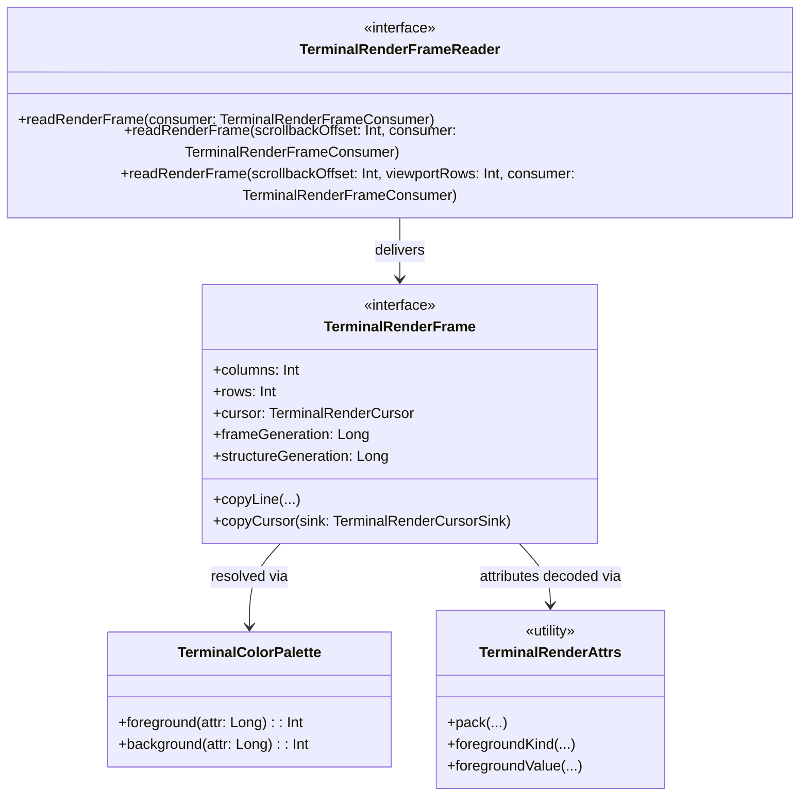

# JvTerm Render API (`:jvterm-render-api`)

The `jvterm-render-api` module defines the strictly bounded, dependency-free public render contract and vocabulary shared across the terminal pipeline. It acts as the immutable, allocation-conscious bridge between stateful terminal state providers, frame caches, and UI rendering modules.

This module is designed under a rigid **Single Responsibility Principle (SRP)**: it owns the stable representation of viewport frames, cursor states, cell flags, underline styles, color palettes, and attribute packing/decoding logic. It has no knowledge of grid physics, text input encoding, font selections, or specific platform painting lifecycles.

---

## Upstream Dependencies
* **None**. This is a standalone, zero-dependency module compiling against the bare-metal Kotlin Standard Library.

---

## Architectural Role



### What the Module Owns
- **Stable Primitives & Encodings**: Value objects and interfaces representing frames, cursors, buffer kinds, and cursor shapes.
- **Bitwise Layout Specifications**: High-performance, 64-bit packed attribute formats ([TerminalRenderAttrs](./src/main/kotlin/com/gagik/terminal/render/api/TerminalRenderAttrs.kt) and [TerminalRenderExtraAttrs](./src/main/kotlin/com/gagik/terminal/render/api/TerminalRenderExtraAttrs.kt)) and cell-level flags ([TerminalRenderCellFlags](./src/main/kotlin/com/gagik/terminal/render/api/TerminalRenderCellFlags.kt)).
- **Color Palettes**: An immutable palette model ([TerminalColorPalette](./src/main/kotlin/com/gagik/terminal/render/api/TerminalColorPalette.kt)) that converts abstract ANSI/direct colors into packed ARGB integers for fast paint loops.
- **Push-Based Sinks**: Allocation-free functional callbacks for retrieving multi-codepoint grapheme clusters and cursor states ([TerminalRenderClusterSink](./src/main/kotlin/com/gagik/terminal/render/api/TerminalRenderClusterSink.kt), [TerminalRenderClusterDataSink](./src/main/kotlin/com/gagik/terminal/render/api/TerminalRenderClusterSink.kt), and [TerminalRenderCursorSink](./src/main/kotlin/com/gagik/terminal/render/api/TerminalRenderCursorSink.kt)).

### What the Module Does NOT Own
- **Core Internal Storage**: It never exposes or holds references to mutable ring buffers, cell objects, cursor coordinates, or grid physics.
- **UI Platform Classes**: It does not depend on AWT, Swing, Compose, Skia, JavaFX, or any host windowing module.
- **Glyph Runs & Paint Caches**: It defines raw visual text data, but does not choose fonts, calculate pixel metrics, or cache platform drawing objects.

---

## 🗃️ Core Vocabulary & Primitive Structures

### 1. Stable Packed Attributes (`TerminalRenderAttrs`)
To minimize memory footprint and support rapid drawing, standard text formatting attributes (bold, faint, italic, underline, blink, inverse, strikethrough, and colors) are packed into a single 64-bit `Long` word.

| Bit Range | Size | Field Name | Description |
| :--- | :--- | :--- | :--- |
| **0..1** | 2 bits | **Foreground Color Kind** | Maps to [TerminalRenderColorKind](./src/main/kotlin/com/gagik/terminal/render/api/TerminalRenderColorKind.kt) (Default, Indexed, RGB) |
| **2..25** | 24 bits | **Foreground Color Value** | Direct `0xRRGGBB` RGB, indexed `0..255`, or `0` for default |
| **26..27** | 2 bits | **Background Color Kind** | Maps to [TerminalRenderColorKind](./src/main/kotlin/com/gagik/terminal/render/api/TerminalRenderColorKind.kt) |
| **28..51** | 24 bits | **Background Color Value** | Direct `0xRRGGBB` RGB, indexed `0..255`, or `0` for default |
| **52** | 1 bit | **Bold** | High intensity / bright ANSI rendering trigger |
| **53** | 1 bit | **Faint** | Low intensity / dim rendering trigger |
| **54** | 1 bit | **Italic** | Slanted text styling |
| **55..57** | 3 bits | **Underline Style** | Maps to [TerminalRenderUnderline](./src/main/kotlin/com/gagik/terminal/render/api/TerminalRenderUnderline.kt) (None, Single, Double, Curly, Dotted, Dashed) |
| **58** | 1 bit | **Blink** | Slow text blinking trigger |
| **59** | 1 bit | **Inverse** | Swap visual foreground and background colors |
| **60** | 1 bit | **Invisible** | Text is hidden but spacing is preserved |
| **61** | 1 bit | **Strikethrough** | Center-line deletion text decoration |
| **62..63** | 2 bits | **Reserved** | Must currently be zero |

### 2. Cell-Level State Flags (`TerminalRenderCellFlags`)
Every character cell on the screen is associated with a 32-bit `Int` flags mask describing its layout state and width metrics:
- **`EMPTY`** (`1 shl 0`): No glyph should be drawn (used for background fills and spacer margins).
- **`CODEPOINT`** (`1 shl 1`): Cell contains a single, direct Unicode scalar value.
- **`CLUSTER`** (`1 shl 2`): Cell contains a multi-codepoint Unicode grapheme cluster.
- **`WIDE_LEADING`** (`1 shl 3`): Cell is the visual anchor of a double-width character.
- **`WIDE_TRAILING`** (`1 shl 4`): Cell is the blank placeholder continuation cell of a double-width character.

---

## 🏎️ High-Performance Frame Handoff & Synchronization

Rendering terminals requires high-speed, thread-safe data transfer from the state provider to the drawing system. The API provides three core elements to facilitate this:

### 1. `TerminalRenderFrameReader`
This synchronization gateway controls access to the underlying screen buffer:
```kotlin
interface TerminalRenderFrameReader {
    fun readRenderFrame(consumer: TerminalRenderFrameConsumer)
    fun readRenderFrame(scrollbackOffset: Int, consumer: TerminalRenderFrameConsumer)
    fun readRenderFrame(scrollbackOffset: Int, viewportRows: Int, consumer: TerminalRenderFrameConsumer)
}
```

> [!IMPORTANT]
> **Short-Lived Frame Invariant:** The `TerminalRenderFrame` instance delivered to `TerminalRenderFrameConsumer` is **valid only for the duration of the callback**. State providers may hold internal write locks or reuse frame objects. Consumers **must never** retain references to the frame or its internal data beyond the lifecycle of the consumer callback.

### 2. `TerminalRenderFrame`
Represents the read-only, layout-decoupled view of the viewport. Rather than returning allocating arrays, it provides an optimized, push-based copying mechanism:
```kotlin
interface TerminalRenderFrame {
    val columns: Int
    val rows: Int
    val historySize: Int
    val scrollbackOffset: Int
    val discardedCount: Long
    val frameGeneration: Long
    val structureGeneration: Long
    val activeBuffer: TerminalRenderBufferKind
    val cursor: TerminalRenderCursor

    fun lineGeneration(row: Int): Long
    fun lineWrapped(row: Int): Boolean

    // The zero-allocation row copy contract
    fun copyLine(
        row: Int,
        codeWords: IntArray,
        codeOffset: Int = 0,
        attrWords: LongArray,
        attrOffset: Int = 0,
        flags: IntArray,
        flagOffset: Int = 0,
        extraAttrWords: LongArray? = null,
        extraAttrOffset: Int = 0,
        hyperlinkIds: IntArray? = null,
        hyperlinkOffset: Int = 0,
        clusterSink: TerminalRenderClusterSink? = null,
        clusterDataSink: TerminalRenderClusterDataSink? = null,
    )

    fun copyCursor(sink: TerminalRenderCursorSink)
}
```

---

## 🔗 How to Use

The following example shows how a custom drawing canvas consumes a `TerminalRenderFrame` to copy cell data and draw to a screen:

```kotlin
import io.github.jvterm.render.api.TerminalRenderFrame
import io.github.jvterm.render.api.TerminalRenderFrameConsumer
import io.github.jvterm.render.api.TerminalRenderFrameReader
import io.github.jvterm.render.api.TerminalColorPalette

class CanvasPainter(
    private val reader: TerminalRenderFrameReader,
    private val palette: TerminalColorPalette
) {
    fun repaint() {
        reader.readRenderFrame(object : TerminalRenderFrameConsumer {
            override fun accept(frame: TerminalRenderFrame) {
                val cols = frame.columns
                val rows = frame.rows
                
                // Reusable buffers to avoid dynamic allocation per-frame
                val codeWords = IntArray(cols)
                val attrWords = LongArray(cols)
                val flags = IntArray(cols)
                
                for (r in 0 until rows) {
                    frame.copyLine(r, codeWords, 0, attrWords, 0, flags, 0)
                    for (c in 0 until cols) {
                        val flag = flags[c]
                        val attr = attrWords[c]
                        
                        val fgColor = palette.foreground(attr)
                        val bgColor = palette.background(attr)
                        
                        // Render cell 'c' with resolved ARGB colors
                    }
                }
            }
        })
    }
}
```

---

## 🔗 How to Extend: Custom State Provider

To expose a custom data structure (such as a remote SSH buffer or custom grid implementation) for rendering, implement the `TerminalRenderFrame` and `TerminalRenderFrameReader` interfaces:

```kotlin
import io.github.jvterm.render.api.*

class CustomFrameReader : TerminalRenderFrameReader {
    private val frame = CustomFrame()

    override fun readRenderFrame(consumer: TerminalRenderFrameConsumer) {
        synchronized(this) {
            consumer.accept(frame)
        }
    }

    override fun readRenderFrame(scrollbackOffset: Int, consumer: TerminalRenderFrameConsumer) {
        readRenderFrame(consumer)
    }

    override fun readRenderFrame(scrollbackOffset: Int, viewportRows: Int, consumer: TerminalRenderFrameConsumer) {
        readRenderFrame(consumer)
    }
}

class CustomFrame : TerminalRenderFrame {
    override val columns: Int get() = 80
    override val rows: Int get() = 24
    override val historySize: Int get() = 0
    override val scrollbackOffset: Int get() = 0
    override val discardedCount: Long get() = 0L
    override val frameGeneration: Long get() = 1L
    override val structureGeneration: Long get() = 1L
    override val activeBuffer: TerminalRenderBufferKind get() = TerminalRenderBufferKind.MAIN
    override val cursor: TerminalRenderCursor = TerminalRenderCursor(0, 0, true, true, TerminalRenderCursorShape.BLOCK)

    override fun lineGeneration(row: Int): Long = 1L
    override fun lineWrapped(row: Int): Boolean = false

    override fun copyLine(
        row: Int,
        codeWords: IntArray,
        codeOffset: Int,
        attrWords: LongArray,
        attrOffset: Int,
        flags: IntArray,
        flagOffset: Int,
        extraAttrWords: LongArray?,
        extraAttrOffset: Int,
        hyperlinkIds: IntArray?,
        hyperlinkOffset: Int,
        clusterSink: TerminalRenderClusterSink?,
        clusterDataSink: TerminalRenderClusterDataSink?
    ) {
        // Copy cell data into target arrays
    }

    override fun copyCursor(sink: TerminalRenderCursorSink) {
        sink.accept(cursor.column, cursor.row, cursor.visible, cursor.blinking, cursor.shape, 1L)
    }
}
```

---

## Testing & Verification

The module has unit tests to guarantee that bitwise invariants and API boundaries are never broken:
* **`TerminalRenderAttrsTest`**: Validates standard attribute packing, bit layouts, range boundary checks, and underline styles.
* **`TerminalRenderExtraAttrsTest`**: Assures exact bit placements for overlines and custom underline colors.
* **`TerminalRenderCellFlagsTest`**: Enforces that only valid cell-state combinations can exist.
* **`TerminalColorPaletteTest`**: Tests ARGB mapping, index palettes, and `boldAsBright` resolution rules.

To run the render API module checks:
```bash
./gradlew :jvterm-render-api:test
```
