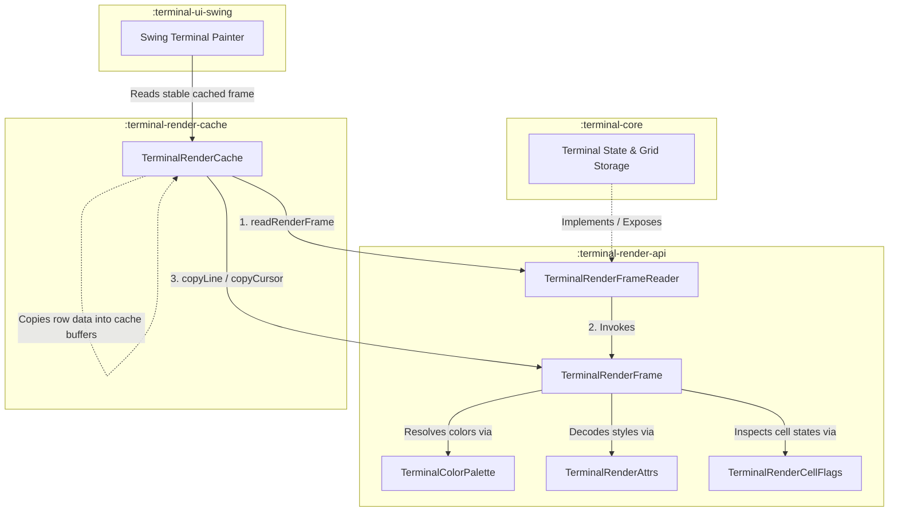

# Terminal Render API (`:terminal-render-api`)

**terminal-render-api** defines the strictly bounded, dependency-free public render contract and vocabulary shared across the terminal pipeline. It acts as the immutable, allocation-conscious bridge between the stateful terminal cores, synchronization sessions, rendering caches, and specific UI drawing modules (such as Swing).

This module is designed under a rigid **Single Responsibility Principle (SRP)**: it owns the stable representation of viewport frames, cursor states, cell flags, underline styles, color palettes, and attribute packing/decoding logic. It has **no** knowledge of grid physics, cursor clamping, terminal resize/reflow, text input encoding, font selections, or AWT/Swing/Compose painting lifecycles.

---

## Architectural Overview & Pipeline Flow

The rendering system decouples terminal state mutation from screen painting using a push-based row copying paradigm. Rather than exposing internal, mutable data grids, the terminal core delivers temporary, read-only snapshots to consumers through `TerminalRenderFrame`.



---

## Architectural Scope and Boundaries

To prevent dependency creep and maintain a lightweight rendering boundary, `:terminal-render-api` adheres to strict architectural constraints:

### What the Module Owns
- **Stable Primitives & Encodings**: Value objects and interfaces representing frames, cursors, buffer kinds, and cursor shapes.
- **Bitwise Layout Specifications**: High-performance, 64-bit packed attribute formats ([TerminalRenderAttrs](./src/main/kotlin/com/gagik/terminal/render/api/TerminalRenderAttrs.kt) and [TerminalRenderExtraAttrs](./src/main/kotlin/com/gagik/terminal/render/api/TerminalRenderExtraAttrs.kt)) and cell-level flags ([TerminalRenderCellFlags](./src/main/kotlin/com/gagik/terminal/render/api/TerminalRenderCellFlags.kt)).
- **Color Palettes**: An immutable palette model ([TerminalColorPalette](./src/main/kotlin/com/gagik/terminal/render/api/TerminalColorPalette.kt)) that converts abstract ANSI/direct colors into packed ARGB integers for fast paint loops.
- **Push-Based Sinks**: Allocation-free functional callbacks for retrieving multi-codepoint grapheme clusters and cursor states ([TerminalRenderClusterSink](./src/main/kotlin/com/gagik/terminal/render/api/TerminalRenderClusterSink.kt), [TerminalRenderClusterDataSink](./src/main/kotlin/com/gagik/terminal/render/api/TerminalRenderClusterSink.kt), and [TerminalRenderCursorSink](./src/main/kotlin/com/gagik/terminal/render/api/TerminalRenderCursorSink.kt)).

### What the Module Does NOT Own
- **Core Internal Storage**: It never exposes or holds references to mutable ring buffers, cell objects, cursor coordinates, or grid physics.
- **UI Platform Classes**: It does not depend on AWT, Swing, Compose, Skia, JavaFX, or any host windowing module.
- **Glyph Runs & Paint Caches**: It defines raw, visual text data, but does not choose fonts, calculate pixel metrics, or cache platform drawing objects.
- **State Mutation**: The API is strictly read-only for external consumers; all interfaces are built to pull data from state owners.

---

## 🗃️ Core Vocabulary & Primitive Structures

### 1. Stable Packed Attributes (`TerminalRenderAttrs`)
To minimize memory footprint and support rapid drawing, standard text formatting attributes (bold, faint, italic, underline, blink, inverse, strikethrough, and colors) are packed into a single 64-bit `Long` word. 

> [!NOTE]
> This stable public layout is strictly decoupled from the internal storage representation in `:terminal-core` to allow core optimization work without breaking the renderer contract.

| Bit Range | Size | Field Name | Description |
| :--- | :--- | :--- | :--- |
| **0..1** | 2 bits | **Foreground Color Kind** | Maps to [TerminalRenderColorKind](./src/main/kotlin/com/gagik/terminal/render/api/TerminalRenderColorKind.kt) (Default, Indexed, RGB) |
| **2..25** | 24 bits | **Foreground Color Value** | Direct `0xRRGGBB` RGB, indexed `0..255`, or `0` for default |
| **26..27** | 2 bits | **Background Color Kind** | Maps to [TerminalRenderColorKind](./src/main/kotlin/com/gagik/terminal/render/api/TerminalRenderColorKind.kt) (Default, Indexed, RGB) |
| **28..51** | 24 bits | **Background Color Value** | Direct `0xRRGGBB` RGB, indexed `0..255`, or `0` for default |
| **52** | 1 bit | **Bold** | High intensity / bright ANSI rendering trigger |
| **53** | 1 bit | **Faint** | Low intensity / dim rendering trigger |
| **54** | 1 bit | **Italic** | Slanted text styling |
| **55..57** | 3 bits | **Underline Style** | Maps to [TerminalRenderUnderline](./src/main/kotlin/com/gagik/terminal/render/api/TerminalRenderUnderline.kt) (None, Single, Double, Curly, Dotted, Dashed) |
| **58** | 1 bit | **Blink** | Slow text blinking trigger |
| **59** | 1 bit | **Inverse** | Swap visual foreground and background colors |
| **60** | 1 bit | **Invisible** | Text is hidden but spacing is preserved |
| **61** | 1 bit | **Strikethrough** | Center-line deletion text decoration |
| **62..63** | 2 bits | **Reserved** | Must be currently zero |

### 2. Extended Packed Attributes (`TerminalRenderExtraAttrs`)
A secondary 64-bit `Long` word carries less common visual properties (e.g., custom underline colors and overline decorations). 

> [!TIP]
> This split separation allows basic renderers to completely omit extra attributes by passing `null` arrays during viewport copies, eliminating unnecessary copy operations.

- **Bits 0..1**: Underline color kind (`TerminalRenderColorKind`).
- **Bits 2..25**: Underline color value (`0xRRGGBB` RGB or `0..255` indexed).
- **Bit 26**: Overline decoration flag.
- **Bits 27..63**: Reserved (must be zero).

### 3. Cell-Level State Flags (`TerminalRenderCellFlags`)
Every character cell on the screen is associated with a 32-bit `Int` flags mask describing its layout state and width metrics:
- **`EMPTY`** (`1 shl 0`): No glyph should be drawn (used for background fills and spacer margins).
- **`CODEPOINT`** (`1 shl 1`): Cell contains a single, direct Unicode scalar value.
- **`CLUSTER`** (`1 shl 2`): Cell contains a multi-codepoint Unicode grapheme cluster (e.g., complex emojis, combining accents) retrieved via a cluster sink.
- **`WIDE_LEADING`** (`1 shl 3`): Cell is the visual anchor of a double-width character.
- **`WIDE_TRAILING`** (`1 shl 4`): Cell is the blank placeholder continuation cell of a double-width character. Renderers must not draw text here.

*Valid combinations for cells are strictly verified:*
```kotlin
fun isValidCombination(flags: Int): Boolean = when (flags) {
    EMPTY,
    CODEPOINT,
    CODEPOINT or WIDE_LEADING,
    CLUSTER,
    CLUSTER or WIDE_LEADING,
    WIDE_TRAILING,
    -> true
    else -> false
}
```

---

## 🏎️ High-Performance Frame Handoff & Synchronization

Rendering terminals requires high-speed, thread-safe data transfer from the fast-mutating terminal event loop to the platform-bound drawing thread. The API provides three core elements to facilitate this:

### 1. `TerminalRenderFrameReader`
This synchronization gateway controls access to the underlying screen buffer. It defines a synchronous read callback that ensures consistent state access:
```kotlin
interface TerminalRenderFrameReader {
    // 1. Basic viewport read (bottom-pinned, live view)
    fun readRenderFrame(consumer: TerminalRenderFrameConsumer)

    // 2. Scrollback-offset viewport read
    fun readRenderFrame(scrollbackOffset: Int, consumer: TerminalRenderFrameConsumer)

    // 3. Overscan viewport read (provides extra rows for pixel-smooth scrolling)
    fun readRenderFrame(scrollbackOffset: Int, viewportRows: Int, consumer: TerminalRenderFrameConsumer)
}
```

> [!IMPORTANT]
> **Short-Lived Frame Invariant:** The `TerminalRenderFrame` instance delivered to `TerminalRenderFrameConsumer` is **valid only for the duration of the callback**. The state provider may hold a terminal mutation lock or reuse internal frame objects, meaning consumers **must never** retain references to the frame or its internal data beyond the lifecycle of the consumer callback.

### 2. `TerminalRenderFrame`
Represents the read-only, layout-decoupled view of the viewport. Rather than returning arrays, the interface provides an optimized, push-based copying mechanism:
```kotlin
interface TerminalRenderFrame {
    val columns: Int
    val rows: Int
    val historySize: Int
    val scrollbackOffset: Int
    val discardedCount: Long
    
    // Change detection keys
    val frameGeneration: Long       // Advances on any visual change (cursor, cells, styles)
    val structureGeneration: Long   // Advances on structural shifts (resize, reset, scrolling, reflow)

    val activeBuffer: TerminalRenderBufferKind
    val cursor: TerminalRenderCursor

    fun lineGeneration(row: Int): Long
    fun lineWrapped(row: Int): Boolean

    // The core zero-allocation row copy contract
    fun copyLine(
        row: Int,
        codeWords: IntArray,
        codeOffset: Int = 0,
        attrWords: LongArray,
        attrOffset: Int = 0,
        flags: IntArray,
        flagOffset: Int = 0,
        extraAttrWords: LongArray? = null,
        extraAttrOffset: Int = 0,
        hyperlinkIds: IntArray? = null,
        hyperlinkOffset: Int = 0,
        clusterSink: TerminalRenderClusterSink? = null,
        clusterDataSink: TerminalRenderClusterDataSink? = null,
    )

    fun copyCursor(sink: TerminalRenderCursorSink)
}
```

### 3. Allocation-Conscious Handoff Sinks
To avoid allocating strings and value objects for every rendering loop iteration, the copying mechanisms rely on functional interfaces:

- **[TerminalRenderCursorSink](./src/main/kotlin/com/gagik/terminal/render/api/TerminalRenderCursorSink.kt)**: Delivers all visual cursor properties (`column`, `row`, `visible`, `blinking`, `shape`, `generation`) as direct primitives without allocating a `TerminalRenderCursor` object.
- **[TerminalRenderClusterDataSink](./src/main/kotlin/com/gagik/terminal/render/api/TerminalRenderClusterSink.kt)**: Delivers multi-codepoint grapheme clusters as sliced primitive arrays (`codepoints: IntArray`, `offset: Int`, `length: Int`). Caches can copy these raw codepoints directly without allocating heap `String` objects, avoiding garbage collection overhead.

---

## 🎨 Fast Color Resolution (`TerminalColorPalette`)

The [TerminalColorPalette](./src/main/kotlin/com/gagik/terminal/render/api/TerminalColorPalette.kt) class is an immutable, optimized color mapping system. It stores the default, selection, cursor, and 256 indexed ANSI colors as packed ARGB `Int` values (`0xAARRGGBB`).

During drawing, the UI painter resolves cell colors by querying the palette with the packed 64-bit attribute word:
```kotlin
val fgColorArgb = palette.foreground(attrWord)
val bgColorArgb = palette.background(attrWord)
```

The color resolver handles advanced terminal color semantics automatically:
1. **Inverse Processing**: Merges standard color kinds with the `inverse` bitmask to swap active colors on-the-fly.
2. **Concealment (Invisible)**: Resolves the foreground color to match the background color so text matches the surrounding grid.
3. **Bold intensity**: Automatically maps index colors `0..7` to their bright equivalents `8..15` if `boldAsBright` is enabled.

---

## Testing and Verification

The module has full test coverage under `src/test/kotlin` to guarantee that bitwise invariants and API boundaries are never broken:

- **[TerminalRenderAttrsTest](./src/test/kotlin/com/gagik/terminal/render/api/TerminalRenderAttrsTest.kt)**: Validates standard attribute packing, bit layouts, range boundary checks, and underline styles.
- **[TerminalRenderExtraAttrsTest](./src/test/kotlin/com/gagik/terminal/render/api/TerminalRenderExtraAttrsTest.kt)**: Assures exact bit placements for overlines and custom underline colors.
- **[TerminalRenderCellFlagsTest](./src/test/kotlin/com/gagik/terminal/render/api/TerminalRenderCellFlagsTest.kt)**: Enforces that only valid cell-state combinations can exist.
- **[TerminalColorPaletteTest](./src/test/kotlin/com/gagik/terminal/render/api/TerminalColorPaletteTest.kt)**: Tests ARGB mapping, index palettes, and `boldAsBright` resolution rules.
- **[TerminalRenderFrameReaderTest](./src/test/kotlin/com/gagik/terminal/render/api/TerminalRenderFrameReaderTest.kt)**: Exercises frame-read closures and correct delegation of overscan/viewport functions.
