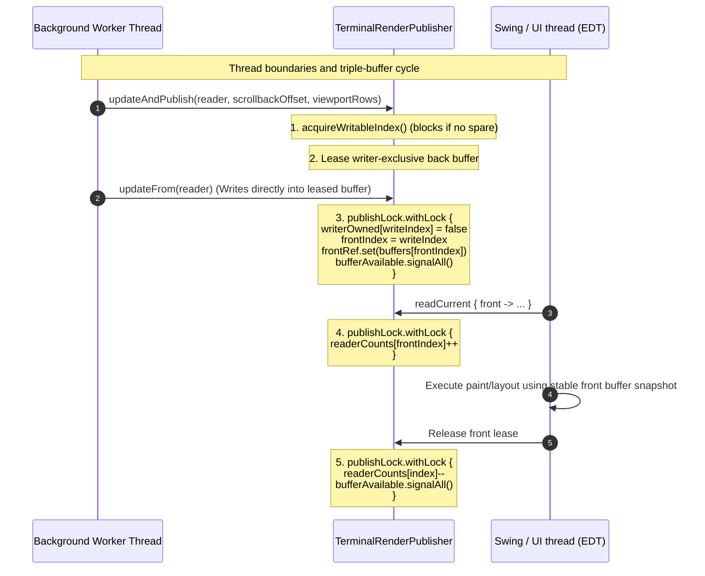

# Terminal Render Cache (`:terminal-render-cache`)

**terminal-render-cache** is the high-performance, renderer-side double and triple-buffering publication module for Lattice Terminal. It consumes short-lived render frames exposed by `:terminal-render-api` and stores flat, primitive-packed, allocation-free snapshotted layouts. These cached layouts allow asynchronous UI paint loop threads (such as the Swing Event Dispatch Thread) to perform font resolution, selection calculations, and pixel drawing without directly accessing core terminal storage or blocking the backend PTY session threads.

---

## Architectural Boundaries & Separation of Concerns

To guarantee safety, memory locality, and absolute performance, **terminal-render-cache** operates under strict boundaries:

### What the Module Owns
- **Primitive Array Retention**: Deep copying of active buffer, lines, cursor, and text generation metrics from [TerminalRenderFrameReader](../terminal-render-api/src/main/kotlin/com/gagik/terminal/render/api/TerminalRenderFrameReader.kt) into flat, reusable primitive arrays.
- **Double-Buffered Row Synchronization**: Comparing generation numbers on a per-row basis to skip copying rows whose visual contents have not changed since the previous frame.
- **Ping-Pong Grapheme Cluster Storage**: Double-buffering complex multi-codepoint grapheme clusters and preserving active references for unchanged rows with zero allocations.
- **Triple-Buffered Thread Isolation**: Standardizing a thread-safe publication pipeline via a triple-buffered publisher ([TerminalRenderPublisher](./src/main/kotlin/com/gagik/terminal/render/cache/TerminalRenderPublisher.kt)) that separates the background render worker from the UI paint reader.
- **Zero-Allocation Callbacks**: Reusing static sink fields rather than allocating anonymous lambda closures during hot loop traversals.

### What the Module Does NOT Own
- **Terminal output parsing**: The render cache has no dependencies on protocols or ANSI/DEC byte parsers.
- **Font selection & painting strategies**: It is agnostic to fonts, glyph metrics, rendering hints, color mappings, selections, or whether painting is driven by Swing, Compose, Java2D, or OpenGL.
- **State mutation**: It is read-only from the perspective of the UI and write-only from the perspective of the render frame acceptor; it never mutates live cursor indices, screen scrollbacks, or terminal modes.

```text
  ┌────────────────────────┐
  │ TerminalSession Thread │ (Background write & mutate)
  └───────────┬────────────┘
              │
              ▼ [TerminalRenderFrameReader]
  ┌────────────────────────┐
  │  Render Worker Thread  │ (Copies raw frame into BACK buffer)
  └───────────┬────────────┘
              │
              ▼ updateAndPublish()
  ┌────────────────────────┐
  │ TerminalRenderPublisher│ (Triple-buffered rotation & lock-free read leases)
  └───────────┬────────────┘
              │
              ▼ readCurrent { front -> ... }
  ┌────────────────────────┐
  │  UI/EDT Paint Thread   │ (Paints from stable, snapshotted FRONT buffer)
  └────────────────────────┘
```

---

## Threading & Triple-Buffered Synchronization Flow

To ensure the UI thread never suffers from rendering glitches (such as "tearing" or displaying a half-applied state change), a custom triple-buffering protocol is implemented in [TerminalRenderPublisher](./src/main/kotlin/com/gagik/terminal/render/cache/TerminalRenderPublisher.kt):

1. **Back Buffer (Writer-Owned)**: Leased exclusively by the background render worker to copy current state via `accept()`.
2. **Front Buffer (UI-Readable)**: Pinned by the UI during paint traversals via `readCurrent` to prevent recycling.
3. **Spare Buffer (Recycling Target)**: Serves as a transitional buffer. If a new frame is produced while the UI is currently painting the front buffer, the worker uses the spare buffer for the write, then swaps it to front. The old front buffer is marked as recycled once the UI releases its read lease.

This architecture ensures that **the background worker and the UI thread never touch the same buffer simultaneously**, ensuring glitch-free, extremely low-latency UI updates.



---

## Key Classes and Abstractions

### 1. TerminalRenderCache
[TerminalRenderCache](./src/main/kotlin/com/gagik/terminal/render/cache/TerminalRenderCache.kt) represents a fully cached primitive snapshot of the terminal screen.

* **Flat Row-Major Storage**: Rather than allocating an object per cell, all cell features are stored as primitive arrays of size `columns * rows` indexed in row-major order (`row * columns + column`):
  - `codeWords: IntArray` — Printable Unicode codepoints or grapheme markers.
  - `attrWords: LongArray` — Packed primary cell styling attributes (colors, text weights).
  - `flags: IntArray` — Packed cell metadata flags (such as whether the cell contains an ASCII character, a surrogate, or a complex cluster from [TerminalRenderCellFlags](../terminal-render-api/src/main/kotlin/com/gagik/terminal/render/api/TerminalRenderCellFlags.kt)).
  - `extraAttrWords: LongArray` — Secondary styling attributes (such as underline shapes and colors).
  - `hyperlinkIds: IntArray` — Active hyperlink indicators.
  - `clusterRefs: LongArray` — Grapheme cluster references packing `offset` (high 32 bits) and `length` (low 32 bits).
* **Ping-Pong Grapheme Cluster Double-Buffering**:
  To avoid allocating separate `String` objects for complex Unicode sequences (such as ZWJ emojis or combining diacritics), clusters are packed into a single, contiguous array `clusterCodepoints: IntArray`.
  During an update:
  1. `nextClusterCodepoints` starts empty.
  2. For modified rows, new graphemes are written via `appendNextCluster`.
  3. For unmodified rows (skipped based on `lineGenerations`), `preserveClusterRow` copies active cluster codepoints from the previous frame into `nextClusterCodepoints` in a single bulk array-copy operation.
  4. On completion, `finishClusterCopy` performs a quick swap of the array references.

### 2. TerminalRenderPublisher
[TerminalRenderPublisher](./src/main/kotlin/com/gagik/terminal/render/cache/TerminalRenderPublisher.kt) is the lock-free and triple-buffered pipeline manager.

* **Reentrant Lock Synchronization**: Coordinates buffer leases under a `ReentrantLock` called `publishLock`.
* **Lock-Free Read Path**: Exposes `current()` using an `AtomicReference` for quick poll checks and diagnostic lookups without acquiring locks.
* **Stable Lease-Pinned Painting**: `readCurrent` safely increments a lease count (`readerCounts`) inside `publishLock` to protect the active front buffer from being recycled. The block receives a stable snapshot, and the lease is automatically decremented upon block exit.

---

## High-Performance and Allocation-Minimal Design

Rendering pipelines on the JVM must minimize garbage collection to avoid stuttering. **terminal-render-cache** achieves near-zero allocations in hot loops through the following techniques:

* **Static Reusable Sinks**:
  Capturing lambda references inside hot loops can create significant garbage collector pressure. `TerminalRenderCache` eliminates this by pre-allocating dedicated reusable sinks as class properties:
  - `reusableClusterDataSink` ([TerminalRenderClusterDataSink](../terminal-render-api/src/main/kotlin/com/gagik/terminal/render/api/TerminalRenderClusterSink.kt)): Captures row data during lines copies and appends them to the cluster storage.
  - `reusableCursorSink` ([TerminalRenderCursorSink](../terminal-render-api/src/main/kotlin/com/gagik/terminal/render/api/TerminalRenderCursorSink.kt)): Receives primitive cursor metrics without creating temporary [TerminalRenderCursor](../terminal-render-api/src/main/kotlin/com/gagik/terminal/render/api/TerminalRenderCursor.kt) instances.
* **Row-Level Structural Skip**:
  During frame ingestion, the parser and core update row-level generation numbers (`lineGeneration`). The cache compares the cached generations against the incoming frame; unchanged rows are bypassed entirely, eliminating array copy overheads.
* **Bounded Array Capacity Guard**:
  To protect against memory exhaustion or malicious buffer attacks, grapheme cluster lengths are strictly clamped (e.g. capped at `256` codepoints) before physical allocation.

---

## Testing Boundaries & Verification

The `:terminal-render-cache` test suite guarantees absolute safety and correctness under high-load, asynchronous multi-threading. Tests run deterministically without spawning a full PTY session by utilizing light mock frames:

* **[TerminalRenderCacheTest](./src/test/kotlin/com/gagik/terminal/render/cache/TerminalRenderCacheTest.kt)**:
  - Verifies that initial frame updates copy all row, color, and cell properties.
  - Validates row skips based on `lineGenerations` and that a structure change recopies all rows.
  - Asserts proper sizing changes and that ridiculous/absurd grapheme cluster lengths are safely truncated.
  - Confirms cursor mutations occur without triggering row recopies.
* **[TerminalRenderPublisherTest](./src/test/kotlin/com/gagik/terminal/render/cache/TerminalRenderPublisherTest.kt)**:
  - Asserts that the triple-buffering logic rotates through buffers correctly.
  - Simulates multiple threads to verify that reader leases protect the active buffer from being recycled during a concurrent paint pass.
  - Tests scrollback offsets and overscan row clamping request forwarding.
