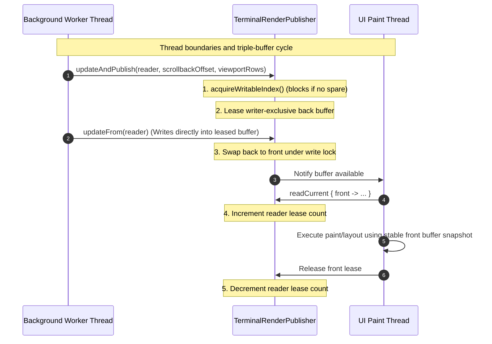

# JvTerm Render Cache (`:jvterm-render-cache`)

The `jvterm-render-cache` module provides a high-performance, renderer-side double and triple-buffering publication system for JvTerm Terminal. It consumes short-lived render frames exposed by `:jvterm-render-api` and stores flat, primitive-packed, allocation-free snapshotted layouts.

These cached layouts allow asynchronous UI paint loop threads to perform font resolution, selection calculations, and pixel drawing without directly accessing the stateful terminal core or blocking backend execution threads.

---

## Upstream Dependencies
* **`:jvterm-render-api`** (for rendering interfaces, attributes, and cell flags).

---

## Architectural Boundaries & Synchronization Flow

To guarantee safety, memory locality, and absolute performance, `jvterm-render-cache` operates under strict boundaries:

### What the Module Owns
- **Primitive Array Retention**: Deep copying of active buffer, lines, cursor, and text generation metrics from [`TerminalRenderFrameReader`](../jvterm-render-api/src/main/kotlin/com/gagik/terminal/render/api/TerminalRenderFrameReader.kt) into flat, reusable primitive arrays.
- **Double-Buffered Row Synchronization**: Comparing generation numbers on a per-row basis to skip copying rows whose visual contents have not changed since the previous frame.
- **Ping-Pong Grapheme Cluster Storage**: Double-buffering complex multi-codepoint grapheme clusters and preserving active references for unchanged rows with zero allocations.
- **Triple-Buffered Thread Isolation**: Standardizing a thread-safe publication pipeline via a triple-buffered publisher ([`TerminalRenderPublisher`](./src/main/kotlin/com/gagik/terminal/render/cache/TerminalRenderPublisher.kt)) that separates the background render worker from the UI paint reader.
- **Zero-Allocation Callbacks**: Reusing static sink fields rather than allocating anonymous lambda closures during hot loop traversals.

### What the Module Does NOT Own
- **Terminal Output Parsing**: The render cache has no dependencies on protocols or ANSI/DEC byte parsers.
- **Font Selection & Painting**: It is agnostic to fonts, glyph metrics, rendering hints, color mappings, selections, or whether painting is driven by AWT, Swing, Compose, Java2D, or OpenGL.
- **State Mutation**: It is read-only from the perspective of the UI and write-only from the perspective of the render frame acceptor.

```text
  ┌────────────────────────┐
  │ State Provider Thread  │ (Background write & mutate)
  └───────────┬────────────┘
              │
              ▼ [TerminalRenderFrameReader]
  ┌────────────────────────┐
  │  Render Worker Thread  │ (Copies raw frame into BACK buffer)
  └───────────┬────────────┘
              │
              ▼ updateAndPublish()
  ┌────────────────────────┐
  │ TerminalRenderPublisher│ (Triple-buffered rotation & lock-free read leases)
  └───────────┬────────────┘
              │
              ▼ readCurrent { front -> ... }
  ┌────────────────────────┐
  │    UI Paint Thread     │ (Paints from stable, snapshotted FRONT buffer)
  └────────────────────────┘
```

---

## Threading & Triple-Buffered Synchronization Flow

To ensure the UI thread never suffers from rendering glitches (such as "tearing" or displaying a half-applied state change), a custom triple-buffering protocol is implemented in [`TerminalRenderPublisher`](./src/main/kotlin/com/gagik/terminal/render/cache/TerminalRenderPublisher.kt):

1. **Back Buffer (Writer-Owned)**: Leased exclusively by the background render worker to copy current state via `accept()`.
2. **Front Buffer (UI-Readable)**: Pinned by the UI during paint traversals via `readCurrent` to prevent recycling.
3. **Spare Buffer (Recycling Target)**: Serves as a transitional buffer. If a new frame is produced while the UI is currently painting the front buffer, the worker uses the spare buffer for the write, then swaps it to front. The old front buffer is marked as recycled once the UI releases its read lease.

This architecture ensures that **the background worker and the UI thread never touch the same buffer simultaneously**, ensuring glitch-free, extremely low-latency UI updates.



---

## Key Classes and Abstractions

### 1. [`TerminalRenderCache`](./src/main/kotlin/com/gagik/terminal/render/cache/TerminalRenderCache.kt)
Represents a fully cached primitive snapshot of the terminal screen.

* **Flat Row-Major Storage**: Rather than allocating an object per cell, all cell features are stored as primitive arrays of size `columns * rows` indexed in row-major order:
  - `codeWords: IntArray` — Printable Unicode codepoints or grapheme markers.
  - `attrWords: LongArray` — Packed primary cell styling attributes.
  - `flags: IntArray` — Packed cell metadata flags (such as whether the cell contains an ASCII character, a surrogate, or a complex cluster from [`TerminalRenderCellFlags`](../jvterm-render-api/src/main/kotlin/com/gagik/terminal/render/api/TerminalRenderCellFlags.kt)).
  - `extraAttrWords: LongArray` — Secondary styling attributes.
  - `hyperlinkIds: IntArray` — Active hyperlink indicators.
  - `clusterRefs: LongArray` — Grapheme cluster references packing `offset` (high 32 bits) and `length` (low 32 bits).
* **Ping-Pong Grapheme Cluster Double-Buffering**:
  To avoid allocating separate `String` objects for complex Unicode sequences (such as ZWJ emojis or combining diacritics), clusters are packed into a single, contiguous array `clusterCodepoints: IntArray`.
  During an update, new graphemes are written via `appendNextCluster`. For unmodified rows, active cluster codepoints from the previous frame are copied in a single bulk array-copy operation. On completion, references are swapped.

### 2. [`TerminalRenderPublisher`](./src/main/kotlin/com/gagik/terminal/render/cache/TerminalRenderPublisher.kt)
Is the lock-free and triple-buffered pipeline manager.

* **Reentrant Lock Synchronization**: Coordinates buffer leases under a `ReentrantLock` called `publishLock`.
* **Lock-Free Read Path**: Exposes `current()` using an `AtomicReference` for quick poll checks and diagnostic lookups without acquiring locks.
* **Stable Lease-Pinned Painting**: `readCurrent` safely increments a lease count inside `publishLock` to protect the active front buffer from being recycled. The block receives a stable snapshot, and the lease is automatically decremented upon block exit.

---

## 🔗 How to Use

The following example shows how a UI component initializes a publisher and draws using the double/triple-buffered cache:

```kotlin
import io.github.jvterm.render.api.TerminalRenderFrameReader
import io.github.jvterm.render.cache.TerminalRenderPublisher
import io.github.jvterm.render.cache.TerminalRenderCache

class ComponentPainter(reader: TerminalRenderFrameReader) {
    // 1. Initialize publisher with three cache buffers
    private val publisher = TerminalRenderPublisher(
        buffers = Array(3) { TerminalRenderCache() }
    )
    
    // 2. Background worker pulls from reader and writes to back buffer
    fun onStateChange() {
        publisher.updateAndPublish(reader)
    }

    // 3. UI thread reads from front buffer lease-safely
    fun paintScreen() {
        publisher.readCurrent { frameCache ->
            val cols = frameCache.columns
            val rows = frameCache.rows
            
            // Loop through columns and rows in frameCache
            val charCode = frameCache.codeWords[0] // Reaches directly into flat cache arrays
            // Draw charCode to screen
        }
    }
}
```

---

## Performance & Engineering Discipline

To satisfy the high-performance targets of the JvTerm Terminal stack:
* **Static Reusable Sinks**:
  Capturing lambda references inside hot loops can create significant garbage collector pressure. `TerminalRenderCache` eliminates this by pre-allocating dedicated reusable sinks as class properties:
  - `reusableClusterDataSink` ([`TerminalRenderClusterDataSink`](../jvterm-render-api/src/main/kotlin/com/gagik/terminal/render/api/TerminalRenderClusterSink.kt)).
  - `reusableCursorSink` ([`TerminalRenderCursorSink`](../jvterm-render-api/src/main/kotlin/com/gagik/terminal/render/api/TerminalRenderCursorSink.kt)).
* **Row-Level Structural Skip**:
  During frame ingestion, the state provider updates row-level generation numbers (`lineGeneration`). The cache compares the cached generations against the incoming frame; unchanged rows are bypassed entirely, eliminating array copy overheads.
* **Bounded Array Capacity Guard**:
  To protect against memory exhaustion, grapheme cluster lengths are strictly clamped (e.g. capped at `256` codepoints) before physical allocation.

---

## Testing & Verification

The `:jvterm-render-cache` test suite guarantees safety and correctness under high-load, asynchronous multi-threading. Tests run deterministically without spawning a full backend process by utilizing light mock frames:
* **`TerminalRenderCacheTest`**: Validates row skips based on `lineGenerations`, structural changes, resizing, and cluster clamping.
* **`TerminalRenderPublisherTest`**: Asserts triple-buffering rotation, lease-safes, and concurrency protection.

To run the checks for this module:
```bash
./gradlew :jvterm-render-cache:test
```
