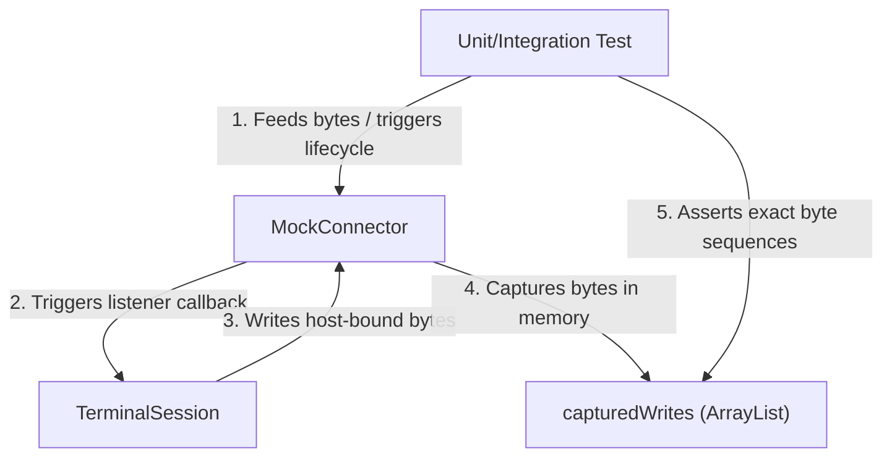

# Terminal Testkit

**terminal-testkit** is the dedicated, dependency-free test double and mock harness module for Lattice Terminal. It provides in-memory connectors and lifecycle simulation tools for testing terminal session synchronization, transport layers, and host-bound input/output loops without spinning up physical shells, PTYs, or socket connections.

By decoupling testing from physical operating system interfaces (like OS-level pseudo-terminals or SSH processes), **terminal-testkit** enables ultra-fast, deterministic, and platform-agnostic testing of the core terminal state machine, the input encoder, and the session synchronization layer.

---

## Architectural Scope and Boundaries

To preserve strict layer boundaries and maintain a lightweight testing footprint, **terminal-testkit** operates under a set of design constraints:

### What the Module Owns
- **[MockConnector](./src/main/kotlin/testkit/MockConnector.kt)**: An in-memory, highly configurable implementation of the `TerminalConnector` interface from [terminal-transport-api](../terminal-transport-api/src/main/kotlin/transport/TerminalConnector.kt).
- **Outbound Byte Capture**: Capturing host-bound bytes written by the terminal session (`capturedWrites`) and exposing them cleanly as a read-only `ByteArray` snapshot.
- **Remote Lifecycle Simulation**: Mechanics to trigger remote host events (`feedFromHost`, `simulateClosed`, `simulateCrash`) on the registered [TerminalConnectorListener](../terminal-transport-api/src/main/kotlin/transport/TerminalConnectorListener.kt).
- **Interaction Auditing**: Auditing mechanisms for verifying session behaviors, such as counting start/close requests and logging screen resize sequences in chronological order.

### What the Module Does NOT Own
- **Physical I/O Threads**: It does not start OS threads, read from file descriptors, or handle real host inputs.
- **Terminal Protocol Parsing**: It maintains absolutely zero dependencies on `terminal-parser`, `terminal-core`, or `terminal-integration`.
- **Thread-Safety Guarantees**: It is designed for single-threaded or externally synchronized test harnesses to minimize scheduling overhead and avoid lock-contention noise in assertions.
- **UI Event Mappings**: It does not convert platform events (like AWT or Swing events) into terminal events.

---

## High-Fidelity Test Harness Architecture

The following diagram illustrates how the `MockConnector` serves as a bidirectional bridge, allowing tests to feed simulated host responses down to the `TerminalSession` while capturing and asserting on the exact bytes written back by the application:



---

## Public API Surface

The module's public surface area is deliberately concise, containing a single class designed for maximum clarity:

### [MockConnector](./src/main/kotlin/testkit/MockConnector.kt)

#### Lifecycle Tracking Properties
* `startCount: Int`: The number of times `start` was called. Tests can assert this is exactly `1` to verify the connector is not restarted incorrectly.
* `closeCount: Int`: The number of times `close()` was called locally. Excellent for verifying that the local terminal cleanly initiates teardown.
* `isClosed: Boolean`: Indicates whether local close has been requested. Any subsequent calls to `write` or `resize` are ignored after `isClosed` becomes `true`.
* `resizeCalls: MutableList<Pair<Int, Int>>`: An ordered log of columns-to-rows pairs sent via the `resize` function, verifying that the session propagates terminal window resizing to the host.
* `writtenBytes: ByteArray`: A zero-copy array representation of all bytes written by the terminal session to the host during the test run.

#### Remote Event Simulation APIs
* `feedFromHost(bytes: ByteArray, offset: Int, length: Int)`: Feeds incoming host bytes to the session (triggers `onBytes` on the registered `TerminalConnectorListener`). This mimics raw stdout output from a shell or TUI application.
* `simulateClosed(exitCode: Int? = null)`: Signals to the session listener that the remote process exited with the given exit code.
* `simulateCrash(error: Throwable)`: Signals to the session listener that the transport crashed or failed with an exception.

---

## Key Usage Paradigms

Here are typical testing workflows showing how `MockConnector` facilitates clean, self-contained, and exact-match assertions.

### 1. Verifying Host Output Responses (Terminal Queries)
When the terminal TUI or shell queries terminal state (such as asking for cursor position or device status), the terminal session must parse this query and immediately reply with the appropriate ANSI/DEC control sequence.

```kotlin
@Test
fun `DSR CSI 5 n replies OK status`() {
    val connector = MockConnector()
    val session = createStartedSession(connector)

    // Simulating host writing "\u001B[5n" (Device Status Report query)
    connector.feedFromHost("\u001B[5n".toByteArray(Charsets.US_ASCII))

    // Verify the terminal session immediately replies with "\u001B[0n" (Status OK)
    val reply = connector.writtenBytes.toString(Charsets.US_ASCII)
    assertEquals("\u001B[0n", reply)

    session.close()
}
```

### 2. Testing Keyboard and Event Input Encoding
When user events (like typing or pasting) occur in the UI, they are dispatched to the [TerminalSession](../terminal-session/src/main/kotlin/session/TerminalSession.kt), which encodes them into host-bound bytes. `MockConnector` captures these bytes for verification.

```kotlin
@Test
fun `input key writes through connector`() {
    val connector = MockConnector()
    val session = createStartedSession(connector)

    // Trigger key event on the session
    session.encodeKey(TerminalKeyEvent.codepoint('a'.code))

    // Assert that the exact byte 'a' was written to the host stream
    assertEquals("a", connector.writtenBytes.toString(Charsets.US_ASCII))
    session.close()
}
```

### 3. Simulating Host Terminations (Normal & Crash Paths)
A terminal must react cleanly when a remote process exits or fails, without spinning in an infinite loop or faking the local close sequence.

```kotlin
@Test
fun `remote close records exit code`() {
    val connector = MockConnector()
    val session = createStartedSession(connector)

    // Simulate remote shell exiting with code 7
    connector.simulateClosed(7)

    // Assert that the session reacted and captured the code
    assertEquals(7, session.exitCode)
    // Check that we didn't redundantly call local close count
    assertEquals(0, connector.closeCount)
}

@Test
fun `remote error records failure`() {
    val connector = MockConnector()
    val session = createStartedSession(connector)
    val failure = IllegalStateException("PTY read failure")

    // Simulate connection crash
    connector.simulateCrash(failure)

    // Assert the session caught the exception
    assertEquals(failure, session.failure)
    assertNull(session.exitCode)
}
```

### 4. Tracking Resize Actions
When the terminal screen is resized, it must notify both the internal text grids and the remote host.

```kotlin
@Test
fun `resize mutates core and calls connector resize`() {
    val connector = MockConnector()
    val session = createStartedSession(connector, columns = 10, rows = 3)

    // Perform resize operation
    session.resize(columns = 20, rows = 5)

    // Verify resize sequence propagates to both core grids and the connector
    assertEquals(20, session.terminal.width)
    assertEquals(5, session.terminal.height)
    assertEquals(listOf(10 to 3, 20 to 5), connector.resizeCalls)
    session.close()
}
```

---

## Alignment with Project Testing Doctrines

The **terminal-testkit** module is built to embody the core principles outlined in the [Terminal Test Suite Guide](../.agents/skills/terminal-test-suite/SKILL.md):

1. **Assert Real Semantics**: In-memory mocks do not fake intermediate or half-finished behaviors. They provide raw, byte-level capture so that tests assert *real* wire protocols rather than mock method signals.
2. **Explicit Captured Bytes**: The mock connector does not convert or interpret bytes itself. It acts as a passive sink and leaves the interpretation of bytes to assertions, ensuring tests remain explicit and readable.
3. **Remote Events Must Be Explicit**: As noted in the [Terminal Testkit Agent Guide](./AGENTS.md), local `close()` only records that the local application requested a shutdown. Remote exit/crashes must always be triggered via explicit simulation functions (`simulateClosed` / `simulateCrash`) rather than assuming remote side-effects.
