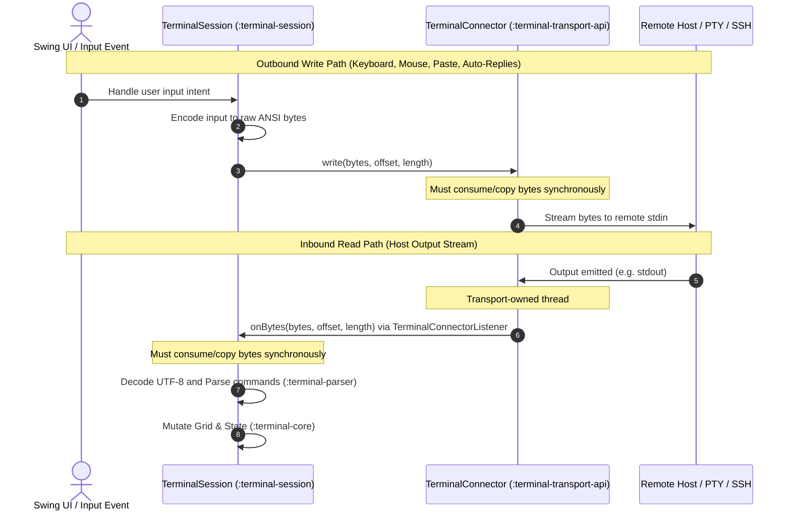
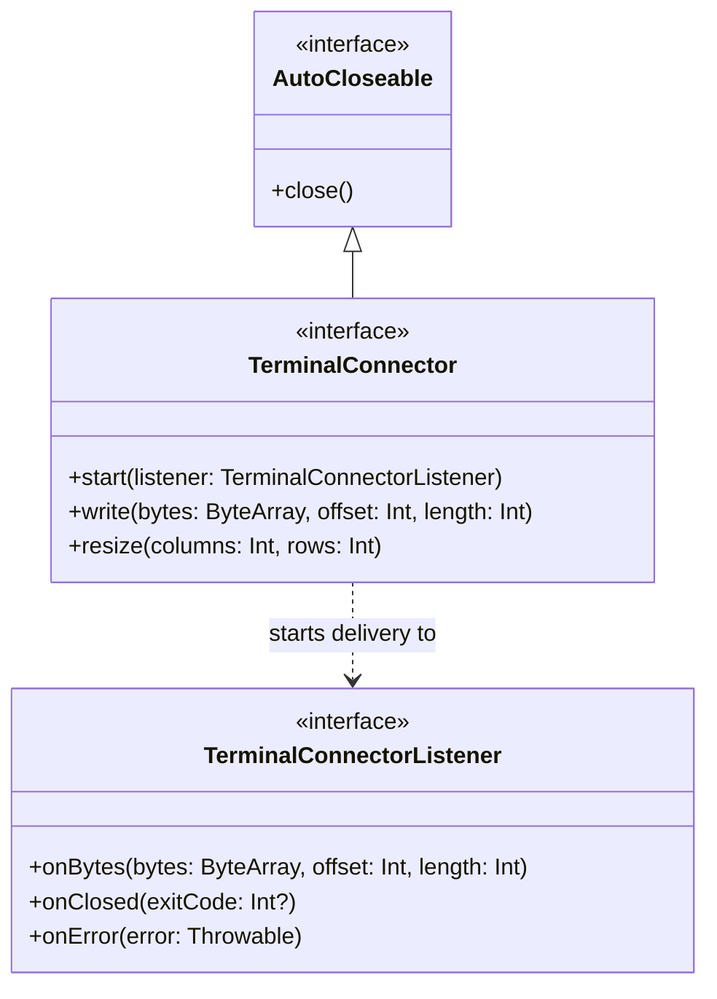

# Terminal Transport API (`:terminal-transport-api`)

The `terminal-transport-api` module defines the transport-neutral, highly performant connection contracts between terminal synchronized runtimes (e.g., `:terminal-session`) and host byte-streams. 

It is designed with strict **Single Responsibility Principles (SRP)** and serves as a **pure vocabulary module**. It has **no** knowledge of byte-stream parsing, escape-sequence interpretation, grid physics, input event encoding, rendering caches, or platform-specific PTY mechanisms. This separation keeps the core abstraction lightweight, decoupled, and easily mockable for deterministic unit testing.

---

## Architectural Overview & Data Flow

The transport layer acts as a decoupled bridge between host I/O and the terminal session event loop. The connector implementations own their transport threads (such as local PTY reader/watcher threads or network socket threads), while the terminal session manages the synchronization, UTF-8 parsing, and host-bound input serialization.

---

## API Boundary & Design Constraints

To maintain clean architecture and prevent coupling, the following rules apply to `:terminal-transport-api`:

* **No Sub-Module Dependencies:** The module does not depend on `:terminal-parser`, `:terminal-core`, `:terminal-integration`, `:terminal-input`, `:terminal-pty`, or `:terminal-ui-swing`. It depends only on standard Kotlin/JVM 21 library features.
* **No Threading Policy Enforcement:** The interfaces do not dictate how implementations should manage their internal threads. Connectors are free to use dedicated thread pools, daemon threads (like `terminal-pty-reader`), or coroutine dispatchers.
* **No Parsing or State Management:** It does not inspect the contents of the bytes flowing through its streams. It treats input and output data as raw opaque byte blocks.

---

## Core Interfaces

The module consists of two main, dependency-free interfaces under the `com.gagik.terminal.transport` package:

### 1. [TerminalConnector](./src/main/kotlin/transport/TerminalConnector.kt)

[TerminalConnector](./src/main/kotlin/transport/TerminalConnector.kt) represents a transport-neutral, duplex communication channel to a terminal host.

> [!NOTE]
> Any reader, writer, or process watcher threads required for the transport must be owned and managed entirely by the implementing class.

Key methods include:
* **`start(listener)`**: Connects the transport events to the specified [TerminalConnectorListener](./src/main/kotlin/transport/TerminalConnectorListener.kt). The connector may begin invoking listener callbacks immediately on transport-owned background threads.
* **`write(bytes, offset, length)`**: Writes a contiguous range of bytes to the remote host.
  > [!IMPORTANT]
  > **Synchronous Consumption Invariant:** Callers may reuse or modify the `bytes` array immediately after `write` returns. Therefore, the connector implementation **must** synchronously copy or fully consume the byte range before returning to prevent race conditions or data corruption.
* **`resize(columns, rows)`**: Propagates terminal grid dimension changes (columns and rows) to the remote host. This is crucial for interactive shells and TUIs (like `vim`, `htop`, or `less`) to properly adjust their terminal rendering zones.
* **`close()`**: Extends JVM `AutoCloseable` to request safe, idempotent local transport shutdown and resources cleanup.

### 2. [TerminalConnectorListener](./src/main/kotlin/transport/TerminalConnectorListener.kt)

[TerminalConnectorListener](./src/main/kotlin/transport/TerminalConnectorListener.kt) acts as the callback event sink where transport events and incoming raw byte streams are delivered.

Key methods include:
* **`onBytes(bytes, offset, length)`**: Delivers raw byte packets emitted by the remote host.
  > [!WARNING]
  > **Memory & Ordering Invariants:**
  > 1. The listener must consume or copy the byte range **synchronously** before returning; the connector may reuse the underlying buffer afterwards.
  > 2. Connectors **must** invoke this callback serially and in strict stream order to preserve terminal protocol semantics.
* **`onClosed(exitCode)`**: Reports remote transport closure. If the transport represents a native process (like in `:terminal-pty`), the process exit code is supplied; otherwise, it passes `null`.
* **`onError(error)`**: Reports remote transport failures (e.g., read timeouts, socket disconnects, or native process crashes).

---

## Concurrency & Memory Best Practices

Since the transport-api operates on hot data paths, implementations should adhere to these critical performance guidelines:

1. **Allocation-Free Hot Paths:** Raw bytes should be handled using primitive `ByteArray` segments. Avoid allocating intermediary `String` objects or boxed primitive arrays during I/O transfer.
2. **Buffer Recycling:** Connectors should reuse a pre-allocated reader buffer when reading from the host input stream. The synchronous contract of `onBytes` guarantees that the listener will finish processing the chunk before the next read operation overwrites the buffer.
3. **Write Serialization:** Since multiple threads may trigger writes (e.g., user typing from the UI thread and automated responses from the terminal event loop), connectors must serialize access to the host's standard input stream (e.g., using a lock) to prevent packet interleaving.

---

## Testing and Implementations

* **Production PTY Transport:** Spawning and managing local OS processes (using Pty4J) is implemented inside the [:terminal-pty](../terminal-pty/README.md) module via the PTY connector.
* **Fakes and Fixtures:** Mock connectors, simulated streams, and deterministic verification tools are provided in [:terminal-testkit](../terminal-testkit/README.md) for testing core and session behaviors without needing an active PTY process.

For details regarding workspace-wide terminal constraints, refer to [AGENTS.md](./AGENTS.md).
