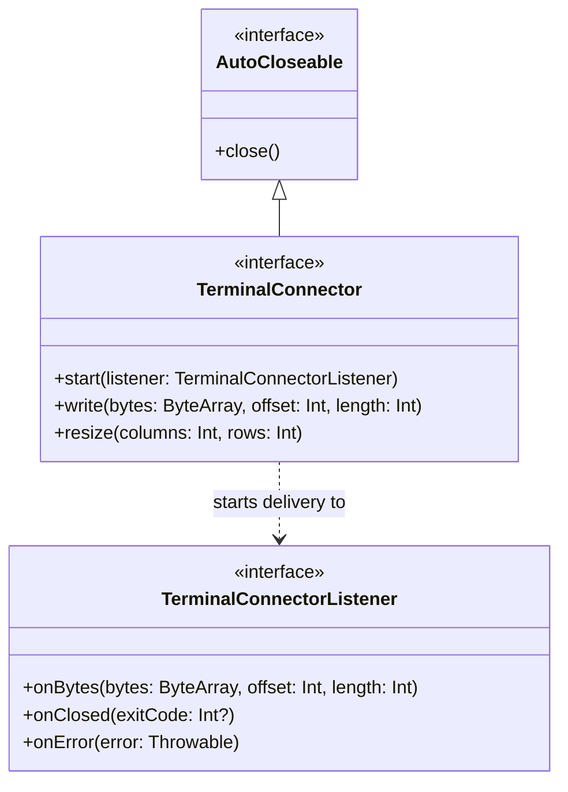

# JvTerm Transport API (`:jvterm-transport-api`)

The `jvterm-transport-api` module defines the transport-neutral, highly performant connection contracts between terminal runtimes and host byte-streams.

It is designed with strict **Single Responsibility Principles (SRP)** and serves as a **pure vocabulary module**. It has no knowledge of byte-stream parsing, escape-sequence interpretation, grid physics, input event encoding, rendering caches, or platform-specific pseudo-terminal (PTY) mechanisms. This separation keeps the core abstraction lightweight, decoupled, and easily mockable for deterministic unit testing.

---

## Upstream Dependencies
* **None**. This is a standalone, zero-dependency module compiling against the bare-metal Kotlin Standard Library.

---

## Architectural Role & Core Interfaces

The transport API provides a duplex, byte-stream abstraction to isolate the terminal engine from physical I/O streams (e.g., network sockets, local processes, files, or test mocks).



### 1. [`TerminalConnector`](./src/main/kotlin/transport/TerminalConnector.kt)
Represents a transport-neutral, duplex communication channel to a terminal host.
* **`start(listener)`**: Connects the transport events to the specified listener. The connector may begin invoking listener callbacks immediately on transport-owned background threads.
* **`write(bytes, offset, length)`**: Writes a contiguous range of bytes to the remote host.
  > [!IMPORTANT]
  > **Synchronous Consumption Invariant:** Callers may reuse or modify the `bytes` array immediately after `write` returns. Therefore, the connector implementation **must** synchronously copy or fully consume the byte range before returning.
* **`resize(columns, rows)`**: Propagates terminal grid dimension changes to the remote host (crucial for interactive CLI applications like editors or system monitors).
* **`close()`**: Extends JVM `AutoCloseable` to request safe, idempotent local transport shutdown and resources cleanup.

### 2. [`TerminalConnectorListener`](./src/main/kotlin/transport/TerminalConnectorListener.kt)
Acts as the callback event sink where incoming raw bytes and transport lifecycle updates are delivered.
* **`onBytes(bytes, offset, length)`**: Delivers raw byte packets emitted by the remote host.
  > [!WARNING]
  > **Memory & Ordering Invariants:**
  > 1. The listener must consume or copy the byte range **synchronously** before returning; the connector may reuse the underlying buffer afterwards.
  > 2. Connectors **must** invoke this callback serially and in strict stream order to preserve terminal protocol semantics.
* **`onClosed(exitCode)`**: Reports remote transport closure.
* **`onError(error)`**: Reports remote transport failures.

---

## 🔗 How to Use

The following example shows how a generic terminal engine can consume a `TerminalConnector` to write user input and listen for incoming host bytes:

```kotlin
import io.github.jvterm.transport.TerminalConnector
import io.github.jvterm.transport.TerminalConnectorListener

class SimpleTerminalEngine(private val connector: TerminalConnector) {

    fun init() {
        connector.start(object : TerminalConnectorListener {
            override fun onBytes(bytes: ByteArray, offset: Int, length: Int) {
                // Synchronously process raw bytes from the host
                val text = String(bytes, offset, length, Charsets.UTF_8)
                print(text)
            }

            override fun onClosed(exitCode: Int?) {
                println("\n[Connection closed with exit code: $exitCode]")
            }

            override fun onError(error: Throwable) {
                System.err.println("\n[Connection error: ${error.message}]")
            }
        })
    }

    fun sendKeys(input: String) {
        val bytes = input.toByteArray(Charsets.UTF_8)
        // write() will copy or write the bytes synchronously before returning
        connector.write(bytes, 0, bytes.size)
    }
}
```

---

## 🔗 How to Implement: Custom Transport Connector

To implement a custom transport connector (e.g., a TCP socket transport), extend `TerminalConnector` and coordinate the background reading threads:

```kotlin
import io.github.jvterm.transport.TerminalConnector
import io.github.jvterm.transport.TerminalConnectorListener
import java.io.InputStream
import java.io.OutputStream
import java.net.Socket
import java.util.concurrent.atomic.AtomicBoolean

class SocketTerminalConnector(private val socket: Socket) : TerminalConnector {
    private val outputStream: OutputStream = socket.getOutputStream()
    private val inputStream: InputStream = socket.getInputStream()
    private val started = AtomicBoolean(false)
    @Volatile private var readerThread: Thread? = null

    override fun start(listener: TerminalConnectorListener) {
        if (!started.compareAndSet(false, true)) return

        readerThread = Thread {
            val buffer = ByteArray(4096)
            try {
                while (!Thread.currentThread().isInterrupted) {
                    val read = inputStream.read(buffer)
                    if (read == -1) {
                        listener.onClosed(null)
                        break
                    }
                    if (read > 0) {
                        // Deliver bytes. listener must process synchronously.
                        listener.onBytes(buffer, 0, read)
                    }
                }
            } catch (e: Exception) {
                listener.onError(e)
            }
        }.apply {
            isDaemon = true
            name = "socket-transport-reader"
            start()
        }
    }

    override fun write(bytes: ByteArray, offset: Int, length: Int) {
        synchronized(outputStream) {
            // Write bytes synchronously before returning
            outputStream.write(bytes, offset, length)
            outputStream.flush()
        }
    }

    override fun resize(columns: Int, rows: Int) {
        // Resizing might not be supported on raw TCP sockets.
        // Ignore or handle custom size control packet.
    }

    override fun close() {
        readerThread?.interrupt()
        socket.close()
    }
}
```

---

## Concurrency & Memory Best Practices

Since the transport-api operates on performance-sensitive hot paths, implementations should adhere to these guidelines:
1. **Allocation-Free Hot Paths:** Raw bytes should be handled using primitive `ByteArray` segments. Avoid allocating intermediary `String` objects or boxed primitive arrays during I/O transfer.
2. **Buffer Recycling:** Connectors should reuse a pre-allocated reader buffer when reading from the host input stream. The synchronous contract of `onBytes` guarantees that the listener will finish processing the chunk before the next read operation overwrites the buffer.
3. **Write Serialization:** Since multiple threads may trigger writes (e.g., user typing from the UI thread and automated responses from the terminal event loop), connectors must serialize access to the host's standard input stream (e.g., using a lock) to prevent packet interleaving.

---

## Testing & Verification

The transport API is verified through focused tests checking that custom connectors copy input arrays synchronously and handle reader thread termination gracefully.

To run the checks for this module:
```bash
./gradlew :jvterm-transport-api:test
```
