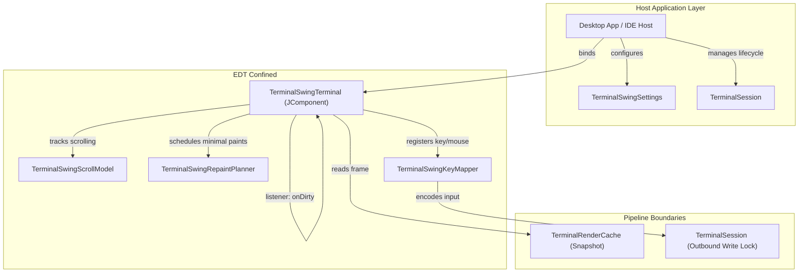
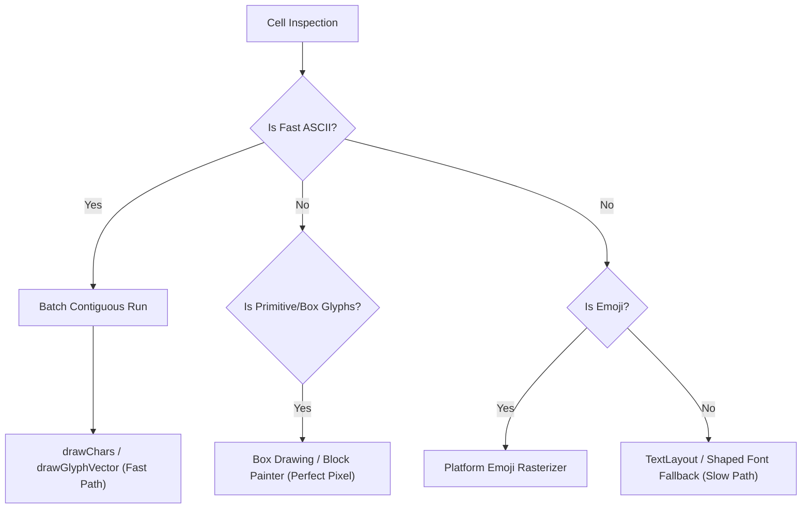

# terminal-ui-swing

A reusable, premium-tier Swing terminal component built in Kotlin/JVM 21. 

`terminal-ui-swing` translates terminal render frames and keyboard/mouse events into a desktop component (`JComponent`) without knowing which transport (PTY, SSH, WebSocket, etc.) produced the raw stream. It serves as the visual and interactive foundation for standalone desktop terminal apps, IDE tool windows, and custom Swing hosts.

---

## Architecture & System Design

The module is strictly built on three core design philosophies:
1. **Complete Protocol Ignorance:** The UI has zero knowledge of ANSI, VT, ESC, OSC, or DCS bytes. It never parses stream protocols or executes grid mutation rules.
2. **Data-Driven Decoupling:** The UI consumes **immutable snapshots** of render frames published from `terminal-render-cache` and updates state through the `TerminalSession` boundary.
3. **EDT Isolation & Swing Safety:** The Swing component state belongs strictly to the Event Dispatch Thread (EDT). Background rendering and I/O processes interact only through thread-safe snapshot mechanisms.



---

## Typography & The Text Rendering Pipeline

In terminal emulators, rendering text is the primary CPU hotspot. `terminal-ui-swing` implements a **bifurcated text rendering pipeline** to isolate performance-sensitive runs from complex Unicode processing.



### 1. The ASCII/Simple Fast Path
* Contiguous cells containing ASCII characters (`0x00`–`0x7F`) with identical formatting attributes (colors, styles, decorations) are batched into a single `TerminalTextRunBuffer`.
* The run is painted in one operation using `Graphics2D.drawChars` or `drawGlyphVector`, completely bypassing shaping and layout engines.
* Uses local caches like `TerminalAsciiDrawCharsCache` and `TerminalAsciiGlyphVectorCache` to reuse underlying vector arrays.

### 2. The Complex Unicode Fallback Path
* **Glyph Fallback Chain:** Resolves missing glyphs through a prioritized font chain:
  1. Primary configured terminal font.
  2. Configured host fallback fonts (prioritizing native color emojis like Segoe UI Emoji, Apple Color Emoji, or Noto Color Emoji to avoid monochrome symbol degradation).
  3. System-wide installed fonts (polled asynchronously off the EDT to keep component startup responsive).
* **Text Layout Cache:** Renders multi-code-unit grapheme clusters and complex script symbols using shaped Java2D `TextLayout` objects. The shaped layouts are cached statefully on the EDT.
* **Pixel-Perfect Primitives:** Custom renderers (`TerminalBoxDrawingPainter` and `TerminalBlockElementPainter`) draw box-drawing characters and block elements programmatically instead of relying on font fonts, ensuring zero gaps or visual alignment issues across different scale factors.

---

## Zero-Allocation Hot-Path Caching

To sustain 60+ FPS during intense stdout output without generating garbage collector overhead, the rendering pipeline employs highly optimized, primitive-keyed caches.

### Monomorphized LRU Caches
Under JVM Type Erasure, generic types (e.g., `<K, V>`) force primitive numbers (like 32-bit codepoints or 64-bit coordinate keys) to undergo heap boxing. To avoid this, the layout and font layers employ **manually monomorphized primitive LRU caches**:
* **`IntFontLru`:** Connects 32-bit Unicode codepoints directly to `java.awt.Font` fallback objects. Uses parallel, contiguous primitive arrays (`IntArray`) and a custom hash multiplier to resolve matches.
* **`LongTextLayoutLru`:** Maps packed `Long` keys (containing the 32-bit codepoint in the low half and the 32-bit style mask in the high half) to pre-shaped `TextLayout` instances.
* **`ClusterTextLayoutLru`:** Identifies complex multi-character grapheme clusters by taking direct slices of primitive `IntArray` segments from the render cache and comparing them using array-content hashing.
* **`AwtColorCache`:** Resolves packed 32-bit ARGB values to `java.awt.Color` instances, eliminating the need to allocate temporary color objects on every grid-cell paint.
* **Batch Eviction:** Caches are capped (`DEFAULT_CODE_POINT_CAPACITY = 4096`, `DEFAULT_CLUSTER_CAPACITY = 1024`). When limits are reached, the oldest elements are evicted in amortized batches (`evictOldestBatch`) to spread cleanup costs across frames.

---

## Sizing, Smooth Scrolling & Repaint Orchestration

### Coalesced Event Handlers
During high-frequency stdout updates, the terminal session can notify the UI of dirty updates thousands of times per second. To prevent flooding the Swing Event Queue and freezing the application:
1. `TerminalSwingTerminal` uses an `AtomicBoolean` flag (`renderPending`) to coalesce incoming frame signals.
2. Only one event pass is scheduled on the Event Queue at a time. The flag is atomically cleared just as execution begins.

### `TerminalSwingScrollModel` (Smooth Scrollback)
* Supports fractional line scroll offsets generated by smooth mouse wheels and precision trackpads.
* Maintains separate offsets for the logical viewport position, the committed whole row, and the sub-row pixel translation.
* **Overscan Rows:** If a scroll operation places the viewport between lines, the model requests one additional overscan row (`visibleRows + 1`) from the session render cache and performs a sub-row vertical coordinate translation on paint.
* **Host Scrollbar Bridge:** `TerminalSwingTerminal.viewportState()` exposes terminal-native scrollback coordinates for external scrollbar adapters. `scrollToScrollbackOffset`, `scrollToLiveViewport`, and `scrollViewportBy` let standalone or IDE hosts drive the same internal scroll model without owning render-cache policy.

### `TerminalSwingRepaintPlanner` (Selective Redraws)
Rather than repainting the entire terminal component, `TerminalSwingRepaintPlanner` compares the active frame with the last-known painted state to identify the minimal bounding boxes that require updates:
* **Row Generation Matching:** Compares atomic generation numbers (`cache.lineGenerations[row]`) and wrapped markers (`cache.lineWrapped[row]`) of each row. Only modified rows generate a `requestRegionRepaint` call.
* **Cursor Tracking:** Caches the coordinates, blinking phase, shape, and generation of the terminal cursor. If only the cursor moved, it repaints only the bounds of the old cursor position and the new cursor position.

---

## Interactive Features

### 1. Smart Double-Click Selection
`TerminalSelectionTextExtractor` identifies logical word boundaries during mouse interactions:
* **Path & URL Detection:** When double-clicking, the selection scanner expands left and right, matching valid URI characters (`/`, `\`, `.`, `:`, etc.). If a path indicator is found, it automatically highlights the entire filesystem path or web URL.
* **Word & Punctuation Classification:** Falls back to grouping standard character classes (letters/digits/underscores vs. whitespace vs. contiguous punctuation).
* **Rectangular Block Selections:** Holding `Alt` during drag enables block selection modes, clamping highlighted rectangular regions.

### 2. Decoupled Host Services
* **`TerminalClipboardShortcuts`:** Maps standard operating system defaults (Command-C/V on macOS, Control-C/V on Windows, Control-Shift-C/V on Linux/Unix).
* **`TerminalSwingHostServices`:** Supplies non-render host services such as UI dispatch, clipboard access, explicit hyperlink activation, and viewport-change notifications. Rendering still consumes immutable settings and packed ARGB palettes, while IntelliJ or standalone hosts provide their own platform adapters outside the paint loop.

---

## How to Integrate

### Basic Setup
To place a functional, interactive terminal component in your Swing layout:

```kotlin
import io.github.jvterm.ui.swing.api.TerminalSwingTerminal
import io.github.jvterm.ui.swing.settings.TerminalSwingSettings
import io.github.jvterm.ui.swing.settings.TerminalTheme
import java.awt.BorderLayout
import javax.swing.JFrame
import javax.swing.JPanel

fun createTerminalComponent(session: TerminalSession): JComponent {
    // 1. Define custom, immutable settings (optional theme preset)
    val settings = TerminalSwingSettings(
        palette = TerminalTheme.ONE_DARK.createPalette(),
        columns = 100,
        rows = 30
    )
    
    // 2. Instantiate JComponent
    val terminalComponent = TerminalSwingTerminal(
        settingsProvider = { settings }
    )
    
    // 3. Bind to your active session
    terminalComponent.bind(session)
    
    return terminalComponent
}
```

---

## Testing Doctrine

Tests in `terminal-ui-swing` run **deterministically** without requiring a live shell process, PTY transport, or IDE platform runtime.

Key test areas under `src/test` include:
1. **Viewport & Scroll Math:** Asserts sub-row pixel calculations and bounds clamping under fractional wheel inputs.
2. **Selective Redraws:** Validates that `TerminalSwingRepaintPlanner` isolates dirty rows and avoids full component repaints.
3. **Selection Ranges:** Covers forward/backward cursor selection sweeps, rectangular blocks, and smart word/URL double-click boundary expansion.
4. **Key mapping:** Maps AWT key codes and modifier combinations against standard outbound protocol encoders.
5. **LRU Cache Hits:** Simulates adverse rendering runs (random Unicode symbols, highly repeating lines) to ensure cache metrics and JVM GC profiles remain stable.
