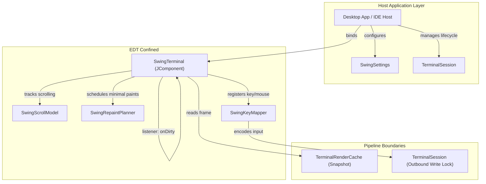
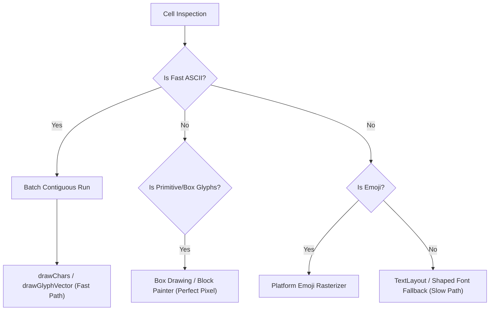

# JvTerm UI Swing (`:jvterm-ui-swing`)

A reusable, premium-tier Swing terminal component built in Kotlin/JVM 21.

`jvterm-ui-swing` translates terminal render frames and keyboard/mouse events into a desktop component (`JComponent`) without knowing which transport (PTY, SSH, WebSocket, etc.) produced the raw stream. It serves as the visual and interactive foundation for standalone desktop terminal apps, IDE tool windows, and custom Swing hosts.

---

## Upstream Dependencies
- **`:jvterm-protocol`** (vocabulary, mode IDs, enums)
- **`:jvterm-render-api`** (render frame primitives and color palettes)
- **`:jvterm-render-cache`** (triple-buffered cache reader)
- **`:jvterm-input`** (keyboard/mouse event models)
- **`:jvterm-session`** (session orchestration and lock loops)

---

## Architecture & System Design

The module is built on three core design philosophies:
1. **Complete Protocol Ignorance:** The UI has zero knowledge of ANSI, VT, ESC, OSC, or DCS bytes. It never parses stream protocols or executes grid mutation rules.
2. **Data-Driven Decoupling:** The UI consumes **immutable snapshots** of render frames published from `jvterm-render-cache` and updates state through the `TerminalSession` boundary.
3. **EDT Isolation & Swing Safety:** The Swing component state belongs strictly to the Event Dispatch Thread (EDT). Background rendering and I/O processes interact only through thread-safe snapshot mechanisms.



---

## Typography & The Text Rendering Pipeline

In terminal emulators, rendering text is the primary CPU hotspot. `jvterm-ui-swing` implements a **bifurcated text rendering pipeline** to isolate performance-sensitive runs from complex Unicode processing.



### 1. The ASCII/Simple Fast Path
* Contiguous cells containing ASCII characters (`0x00`–`0x7F`) with identical formatting attributes are batched into a single `TerminalTextRunBuffer`.
* Painted in one operation using `Graphics2D.drawChars` or `drawGlyphVector`, completely bypassing shaping and layout engines.

### 2. The Complex Unicode Fallback Path
* **Glyph Fallback Chain:** Resolves missing glyphs through a prioritized font chain, prioritizing color emoji fonts to avoid monochrome degradation.
* **Text Layout Cache:** Renders multi-code-unit grapheme clusters using shaped Java2D `TextLayout` objects.
* **Pixel-Perfect Primitives:** Custom renderers (`TerminalBoxDrawingPainter` and `TerminalBlockElementPainter`) draw box-drawing characters and block elements programmatically instead of relying on fonts, ensuring zero gaps across different scale factors.

---

## 🔗 How to Use

To place a functional, interactive terminal component in your Swing layout, instantiate `SwingTerminal` and bind it to your active `TerminalSession`:

```kotlin
import io.github.jvterm.session.TerminalSession
import io.github.jvterm.ui.swing.api.SwingTerminal
import io.github.jvterm.ui.swing.settings.SwingSettings
import io.github.jvterm.ui.swing.settings.TerminalTheme
import java.awt.BorderLayout
import javax.swing.JComponent
import javax.swing.JFrame
import javax.swing.JPanel

fun createTerminalView(session: TerminalSession): JComponent {
    val panel = JPanel(BorderLayout())

    // 1. Define custom, immutable settings (palette, fonts, etc.)
    val settings = SwingSettings(
        palette = TerminalTheme.ONE_DARK.createPalette(),
        fontFamily = "Cascadia Mono",
        fontSize = 15,
        columns = 80,
        rows = 24
    )
    
    // 2. Instantiate the SwingTerminal component
    val terminalComponent = SwingTerminal(
        settingsProvider = { settings }
    )
    
    // 3. Bind the component to the active session
    terminalComponent.bind(session)
    
    panel.add(terminalComponent, BorderLayout.CENTER)
    return panel
}
```

---

## 🔗 How to Extend: Custom Host Services

To integrate clipboard features, hyperlink clicking, or custom alert overlays into the terminal view, implement the [`SwingHostServices`](./src/main/kotlin/io/github/jvterm/ui/swing/settings/SwingHostServices.kt) interface:

```kotlin
import io.github.jvterm.ui.swing.settings.SwingHostServices
import java.awt.Toolkit
import java.awt.datatransfer.StringSelection

class MyCustomHostServices : SwingHostServices {
    override fun copyToClipboard(text: String) {
        val clipboard = Toolkit.getDefaultToolkit().systemClipboard
        clipboard.setContents(StringSelection(text), null)
    }

    override fun pasteFromClipboard(): String {
        return "Custom pasted string"
    }

    override fun openUrl(url: String) {
        println("User clicked hyperlink: $url")
        // Launch browser or trigger IDE link routing
    }
}
```

---

## Testing & Verification

Tests in `jvterm-ui-swing` run deterministically without requiring a live process or transport runtime:
* **Viewport & Scroll Math:** Asserts sub-row pixel calculations and bounds clamping under fractional wheel inputs.
* **Selective Redraws:** Validates that `SwingRepaintPlanner` isolates dirty rows and avoids full component repaints.
* **Selection Ranges:** Covers selection sweeps, rectangular blocks, and smart word/URL double-click boundary expansion.

To run checks for this module:
```bash
./gradlew :jvterm-ui-swing:test
```
