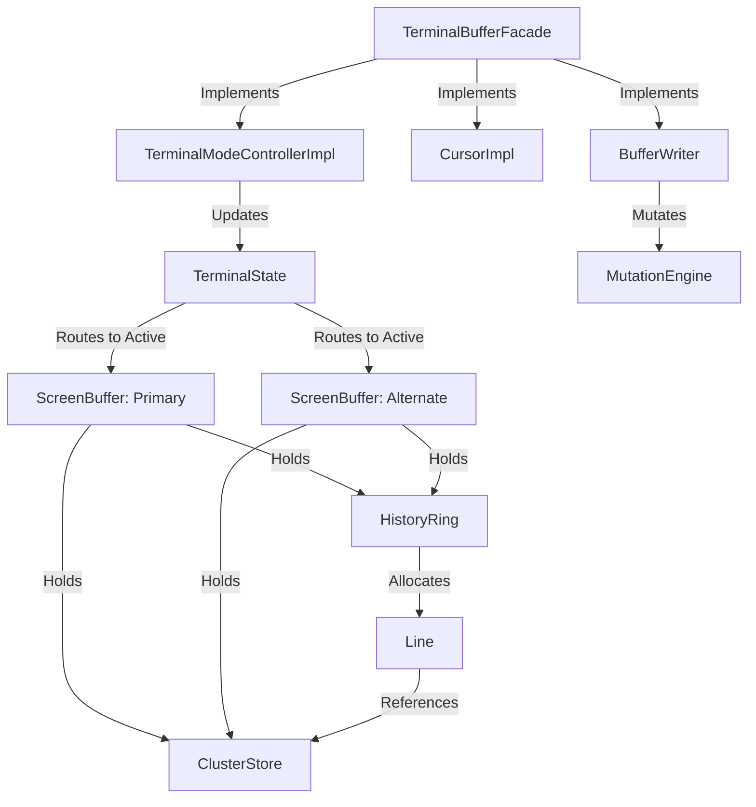

# KetraTerm Core (`:ketraterm-core`)

The `ketraterm-core` module is a high-performance, headless terminal grid engine. It implements the headless screen-state engine, coordinates all spatial grid mutations, manages cursor physics, scrollback margins, and controls alternate/primary screen switches.

Designed under strict **Single Responsibility Principles (SRP)**, this module owns coordinates, margins, cell styling attributes, tab stops, and cluster-aware storage. It possesses no awareness of escape-sequence parsing, byte stream UTF-8 decoding, input event encoding, mouse tracking, or windowing/painting lifecycles.

---

## Upstream Dependencies
* **`:ketraterm-protocol`** (for shared control codes, modes, and primitive constants).
* **`:ketraterm-render-api`** (for visual frames, color palette, and cell flags).

---

## Architectural Role & Grid Storage

The core operates as a headless coordinate and physics processor. Mutations are triggered via dedicated, role-specific public APIs, orchestrated by a thin facade, and translated into parallel primitive array mutations inside circular history rings.



---

## Sub-Documentation

For detailed behavioral specifications and internal memory layout mapping:
* [terminal-core-contract.md](docs/terminal-core-contract.md) - Headless write behaviors, erasure mechanics, tab stops, cursor save/restore, and buffer lifecycles.
* [grid-storage-layout.md](docs/grid-storage-layout.md) - Parallel primitive arrays inside `Line`, `HistoryRing` line recycling, and the `ClusterStore` arena allocator.

---

## How to Use

The following example shows how to create a `TerminalBuffer`, write text, move the cursor, and read cell content.

```kotlin
import io.github.ketraterm.core.TerminalBuffers
import io.github.ketraterm.core.api.TerminalBuffer
import io.github.ketraterm.core.codec.AttributeCodec

fun main() {
    // 1. Create a terminal buffer of size 80x24 with 1000 lines of scrollback history
    val buffer: TerminalBuffer = TerminalBuffers.create(width = 80, height = 24, maxHistory = 1000)

    // 2. Write simple text using current pen attributes
    buffer.writeText("Hello, KetraTerm Core!")

    // 3. Mutate pen attributes and write styled text
    val styledPen = AttributeCodec.pack(
        fgKind = AttributeCodec.COLOR_INDEXED, fgVal = 2, // ANSI Green
        bgKind = AttributeCodec.COLOR_DEFAULT, bgVal = 0,
        bold = true
    )
    buffer.setPenAttributes(styledPen)
    buffer.writeText("\nThis is green bold text.")

    // 4. Move the cursor relatively or absolutely
    buffer.cursorPosition(column = 10, row = 5)

    // 5. Read back cell content
    val line = buffer.getLine(row = 5)
    val codepoint = line.getCodepoint(column = 10)
    val attrs = line.getAttributes(column = 10)
    
    println("Read back codepoint: ${codepoint.toChar()} with attributes: $attrs")
}
```

---

## How to Extend: Custom Response Channel

To handle terminal queries (such as Device Status Report `DSR` or Device Attributes `DA`) generated by the parser and needing to be piped back to the host, implement the [TerminalResponseChannel](src/main/kotlin/io/github/ketraterm/core/api/TerminalResponseChannel.kt) interface:

```kotlin
import io.github.ketraterm.core.api.TerminalResponseChannel

class ConsoleResponseChannel : TerminalResponseChannel {
    override fun writeResponseBytes(bytes: ByteArray, offset: Int, length: Int) {
        // Pipe bytes directly back into PTY stdout or socket streams
        System.out.write(bytes, offset, length)
        System.out.flush()
    }

    override fun writeResponseString(response: String) {
        val bytes = response.toByteArray(Charsets.US_ASCII)
        writeResponseBytes(bytes, 0, bytes.size)
    }
}
```
