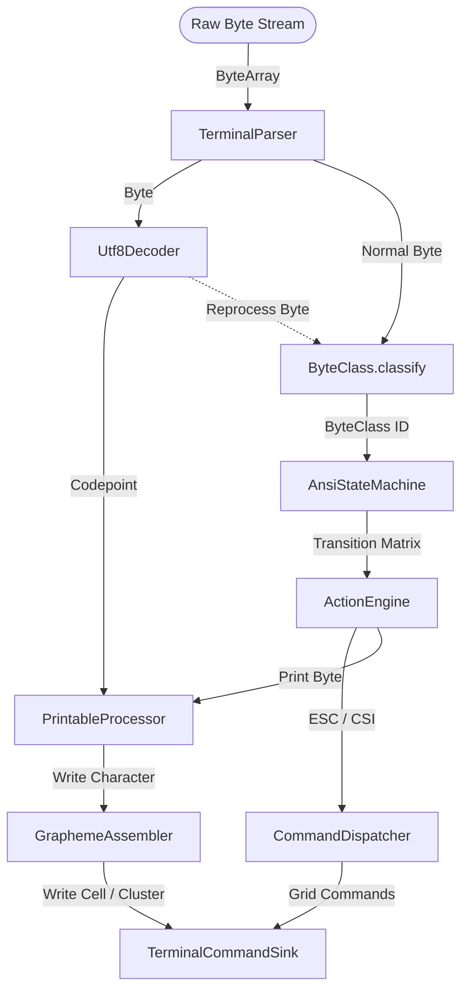

# Module ketraterm-parser

## KetraTerm Parser (`:ketraterm-parser`)

The `ketraterm-parser` module is a high-performance, strictly bounded, and allocation-conscious parser that transforms raw terminal host byte streams (from a PTY, SSH, or network socket) into semantic terminal command invocations.

It is designed with strict **Single Responsibility Principles (SRP)**: it owns byte parsing, UTF-8 streaming, ANSI finite-state transitions, string-command extraction, and Unicode grapheme cluster segmentation. It has no knowledge of grid physics, cursor clamping, terminal widths, viewport scrollbacks, or rendering fonts.

---

## Upstream Dependencies
* **`:ketraterm-protocol`** (for shared control codes, modes, and primitive constants).

---

## Architectural Role & Pipeline Flow

The parser operates as an asynchronous, chunk-safe pipeline. Raw packets of bytes of arbitrary size can be fed into the parser. The parser handles fragmented UTF-8 scalars, split control sequences, and multi-byte graphemes gracefully across boundary edges.



---

## Sub-Documentation

For deep-dive specifications on FSM state tables and Unicode grapheme handling:
* [ansi-fsm-specification.md](docs/ansi-fsm-specification.md) - Finite-state machine transition matrices, 64-bit CSI signature packing, and dispatch table binary searches.
* [grapheme-segmentation.md](docs/grapheme-segmentation.md) - Streaming UTF-8 decoding, character shift states, and Unicode UAX #29 grapheme boundaries.

---

## How to Use

The following example shows how to instantiate a `TerminalParser` and feed raw bytes to it:

```kotlin
import io.github.ketraterm.parser.TerminalParser
import io.github.ketraterm.parser.spi.TerminalCommandSink

class ParserConsumer(sink: TerminalCommandSink) {
    // 1. Instantiate the parser with a command sink
    private val parser = TerminalParser(sink)

    // 2. Feed raw byte buffers (from PTY or network sockets) as they arrive
    fun onDataReceived(buffer: ByteArray, bytesRead: Int) {
        // The parser maintains state across chunk boundaries
        parser.accept(buffer, 0, bytesRead)
    }
}
```

---

## How to Implement: Custom Command Sink

To handle the semantic commands generated by the parser (such as writing text, moving the cursor, or resetting the screen), implement the [TerminalCommandSink](src/main/kotlin/io/github/ketraterm/parser/spi/TerminalCommandSink.kt) interface:

```kotlin
import io.github.ketraterm.parser.spi.TerminalCommandSink

class PrintCommandSink : TerminalCommandSink {
    override fun writeCell(codepoint: Int, attrs: Long) {
        println("Print single codepoint: ${codepoint.toChar()} with attrs: $attrs")
    }

    override fun writeCluster(codepoints: IntArray, offset: Int, length: Int, attrs: Long) {
        val grapheme = String(codepoints, offset, length)
        println("Print complex grapheme cluster: $grapheme with attrs: $attrs")
    }

    override fun appendToPreviousCluster(codepoint: Int) {
        println("Extend previous grapheme with codepoint: ${codepoint.toChar()}")
    }
}
```
