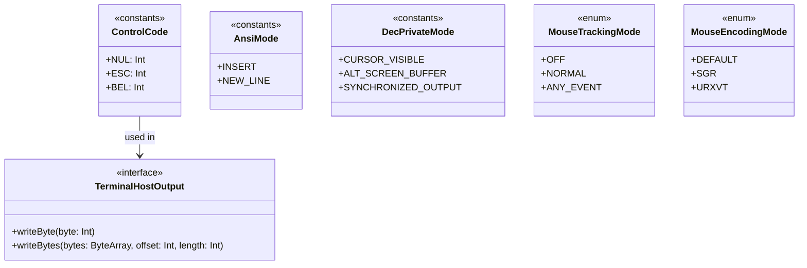

# Module ketraterm-protocol

## KetraTerm Protocol (`:ketraterm-protocol`)

The `ketraterm-protocol` module represents the zero-dependency, immutable core vocabulary of the **KetraTerm Terminal** pipeline. It defines the fundamental, standard-aligned constants, enumerations, and interfaces shared by all terminal components.

By centralizing ANSI/DEC protocol keys, mode identifiers, and low-level byte sinks, the module ensures strict consistency across the entire terminal stack while maintaining a lightweight, JIT-friendly, and allocation-conscious footprint.

---

## Upstream Dependencies
* **None**. This is a standalone, zero-dependency module compiling against the bare-metal Kotlin Standard Library.

---

## Architectural Role

To maintain a strict separation of concerns, `ketraterm-protocol` contains **no execution logic, no parser engines, and no terminal grid memory**. It acts purely as a shared typing and constant definitions layer.



### What the Module Owns
* **ANSI & ECMA-48 C0/C1 Byte Constants**: Raw numerical mappings for physical ASCII controls and 8-bit terminal state transitions.
* **Standard ANSI & DEC Private Modes**: Integer constants for CSI SM/RM (Set/Reset Mode) and DECSET/DECRST parameters.
* **State & Tracking Enums**: High-level semantic enums representing mouse tracking and encoding policies.
* **Outbound Host Communication Interface**: A clean, unified, platform-neutral byte sink ([TerminalHostOutput](src/main/kotlin/io/github/ketraterm/protocol/host/TerminalHostOutput.kt)) that acts as the target for all encoded host communication (PTY stdin, SSH buffers, etc.).

### What the Module Does NOT Own
* **No Byte-Stream Parsing**: Does not parse escape sequences, decode UTF-8 streams, or analyze CSI/OSC/DCS structures.
* **No State Mutation**: Contains no terminal grids, scrollback history, or margin clamping logic.
* **No Input Event Encoding**: Does not translate UI actions or keys into ANSI strings.

---

## Sub-Documentation

For deep-dive specifications on modes and input behaviors:
* [protocol-modes.md](docs/protocol-modes.md) - Full specification of all supported ANSI and DEC private modes.
* [input-protocols.md](docs/input-protocols.md) - Bit flags, event types, and key formats for xterm modifyOtherKeys and Kitty keyboard protocol.

---

## How to Use

Below are typical integration examples demonstrating how a client codebase would import and consume the `ketraterm-protocol` definitions.

### A. Byte Classification in a Byte Stream Parser
```kotlin
import io.github.ketraterm.protocol.ControlCode

fun processNextByte(byte: Int) {
    when (byte) {
        ControlCode.ESC -> startEscapeSequence()
        ControlCode.CAN -> cancelCurrentSequence()
        ControlCode.BEL -> triggerBell()
        else -> bufferCharacter(byte)
    }
}
```

### B. Tracking Configuration State in a Grid Component
```kotlin
import io.github.ketraterm.protocol.MouseEncodingMode
import io.github.ketraterm.protocol.MouseTrackingMode

class CustomTerminalWidget {
    var mouseTracking: MouseTrackingMode = MouseTrackingMode.OFF
    var mouseEncoding: MouseEncodingMode = MouseEncodingMode.DEFAULT
}
```

---

## How to Extend: Custom Transport Sinks

To output bytes from the emulator to a custom channel (such as a TCP Socket, SSH Session, or Mock Console), implement the [TerminalHostOutput](src/main/kotlin/io/github/ketraterm/protocol/host/TerminalHostOutput.kt) interface:

```kotlin
import io.github.ketraterm.protocol.host.TerminalHostOutput
import java.io.OutputStream

class OutputStreamHostOutput(private val out: OutputStream) : TerminalHostOutput {
    override fun writeByte(byte: Int) {
        out.write(byte)
    }

    override fun writeBytes(bytes: ByteArray, offset: Int, length: Int) {
        out.write(bytes, offset, length)
    }

    override fun writeAscii(text: String) {
        val bytes = text.toByteArray(Charsets.US_ASCII)
        out.write(bytes)
    }

    override fun writeUtf8(text: String) {
        val bytes = text.toByteArray(Charsets.UTF_8)
        out.write(bytes)
    }
}
```
