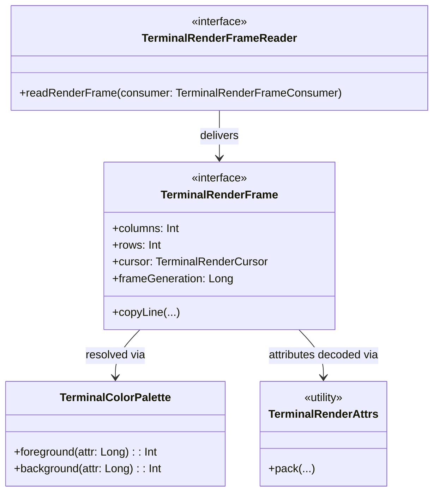

# KetraTerm Render API (`:ketraterm-render-api`)

The `ketraterm-render-api` module defines the strictly bounded, dependency-free public render contract and vocabulary shared across the terminal pipeline. It acts as the immutable, allocation-conscious bridge between stateful terminal state providers, frame caches, and UI rendering modules.

This module is designed under a rigid **Single Responsibility Principle (SRP)**: it owns the stable representation of viewport frames, cursor states, cell flags, underline styles, color palettes, and attribute packing/decoding logic. It has no knowledge of grid physics, text input encoding, font selections, or specific platform painting lifecycles.

---

## Upstream Dependencies
* **None**. This is a standalone, zero-dependency module compiling against the bare-metal Kotlin Standard Library.

---

## Architectural Role



### What the Module Owns
- **Stable Primitives & Encodings**: Value objects and interfaces representing frames, cursors, buffer kinds, and cursor shapes.
- **Bitwise Layout Specifications**: High-performance, 64-bit packed attribute formats ([TerminalRenderAttrs](src/main/kotlin/io/github/ketraterm/render/api/TerminalRenderAttrs.kt) and [TerminalRenderExtraAttrs](src/main/kotlin/io/github/ketraterm/render/api/TerminalRenderExtraAttrs.kt)) and cell-level flags ([TerminalRenderCellFlags](src/main/kotlin/io/github/ketraterm/render/api/TerminalRenderCellFlags.kt)).
- **Color Palettes**: An immutable palette model ([TerminalColorPalette](src/main/kotlin/io/github/ketraterm/render/api/TerminalColorPalette.kt)) that converts abstract ANSI/direct colors into packed ARGB integers for fast paint loops.

### What the Module Does NOT Own
- **Core Internal Storage**: It never exposes or holds references to mutable ring buffers, cell objects, cursor coordinates, or grid physics.
- **UI Platform Classes**: It does not depend on AWT, Swing, Compose, Skia, JavaFX, or any host windowing module.

---

## Sub-Documentation

For deep-dive technical details on attribute packing and thread synchronization:
* [attribute-packing.md](docs/attribute-packing.md) - Exact bit mapping layouts for 64-bit attributes.
* [render-frame-lifecycle.md](docs/render-frame-lifecycle.md) - Lifespans, monotonic generations, and synchronization boundaries.

---

## How to Use

The following example shows how a custom drawing canvas consumes a `TerminalRenderFrame` to copy cell data and draw to a screen:

```kotlin
import io.github.ketraterm.render.api.TerminalRenderFrame
import io.github.ketraterm.render.api.TerminalRenderFrameConsumer
import io.github.ketraterm.render.api.TerminalRenderFrameReader
import io.github.ketraterm.render.api.TerminalColorPalette

class CanvasPainter(
    private val reader: TerminalRenderFrameReader,
    private val palette: TerminalColorPalette
) {
    fun repaint() {
        reader.readRenderFrame(object : TerminalRenderFrameConsumer {
            override fun accept(frame: TerminalRenderFrame) {
                val cols = frame.columns
                val rows = frame.rows
                
                // Reusable buffers to avoid dynamic allocation per-frame
                val codeWords = IntArray(cols)
                val attrWords = LongArray(cols)
                val flags = IntArray(cols)
                
                for (r in 0 until rows) {
                    frame.copyLine(r, codeWords, 0, attrWords, 0, flags, 0)
                    for (c in 0 until cols) {
                        val flag = flags[c]
                        val attr = attrWords[c]
                        
                        val fgColor = palette.foreground(attr)
                        val bgColor = palette.background(attr)
                        
                        // Render cell 'c' with resolved ARGB colors
                    }
                }
            }
        })
    }
}
```

---

## How to Extend: Custom State Provider

To expose a custom data structure (such as a remote SSH buffer or custom grid implementation) for rendering, implement the `TerminalRenderFrame` and `TerminalRenderFrameReader` interfaces:

```kotlin
import io.github.ketraterm.render.api.*

class CustomFrameReader : TerminalRenderFrameReader {
    private val frame = CustomFrame()

    override fun readRenderFrame(consumer: TerminalRenderFrameConsumer) {
        synchronized(this) {
            consumer.accept(frame)
        }
    }
}
```
