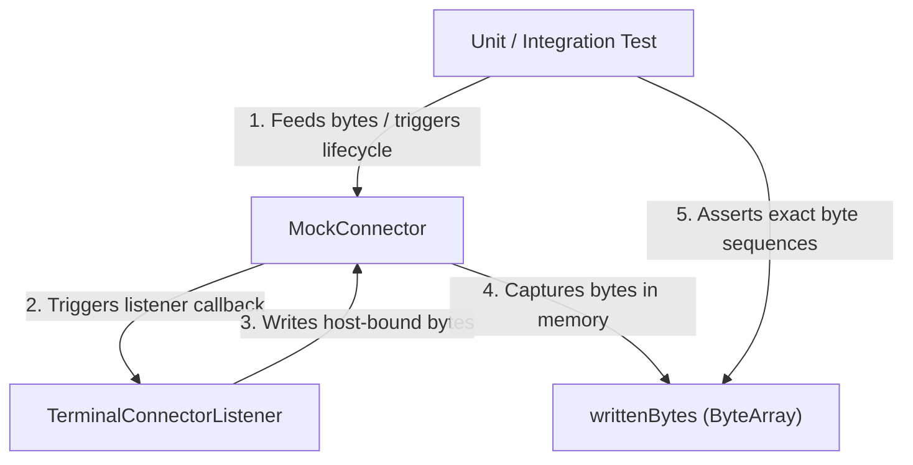

# KetraTerm Testkit (`:ketraterm-testkit`)

The `ketraterm-testkit` module is the dedicated test double and mock harness module for KetraTerm Terminal. It provides in-memory connectors and lifecycle simulation tools for testing terminal runtimes, transport layers, and host-bound input/output loops without spinning up physical shells, PTYs, or socket connections.

By decoupling testing from physical operating system interfaces (like OS-level pseudo-terminals or SSH processes), `ketraterm-testkit` enables ultra-fast, deterministic, and platform-agnostic testing of terminal components. It also provides a production-pipeline conformance harness for replaying exact host byte chunks and resize events through parser, host, core, response, and render APIs.

---

## Upstream Dependencies
* **`:ketraterm-core`** (for public terminal state and render-frame contracts).
* **`:ketraterm-host`** (for production parser-to-core mapping).
* **`:ketraterm-parser`** (for production byte-stream parsing).
* **`:ketraterm-transport-api`** (for standard connector and listener contracts).

---

## Architectural Role

The `MockConnector` serves as a bidirectional bridge in unit and integration tests. It allows tests to feed simulated host responses down to any connector listener while capturing and asserting on the exact bytes written back:



---

## Public API Surface

The module's public surface contains transport doubles and deterministic conformance replay APIs.

### [`MockConnector`](src/main/kotlin/io/github/ketraterm/testkit/MockConnector.kt)

#### Lifecycle Tracking Properties
* `startCount: Int`: The number of times `start` was called. Tests can assert this is exactly `1` to verify the connector is not restarted incorrectly.
* `closeCount: Int`: The number of times `close()` was called locally. Excellent for verifying that the local terminal cleanly initiates teardown.
* `isClosed: Boolean`: Indicates whether local close has been requested. Any subsequent calls to `write` or `resize` are ignored after `isClosed` becomes `true`.
* `resizeCalls: List<Pair<Int, Int>>`: An ordered log of columns-to-rows pairs sent via the `resize` function.
* `writtenBytes: ByteArray`: A representation of all bytes written by the system under test to the connector during the test run.

#### Remote Event Simulation APIs
* `feedFromHost(bytes: ByteArray, offset: Int, length: Int)`: Feeds incoming host bytes to the session (triggers `onBytes` on the registered `TerminalConnectorListener`). This mimics raw stdout output from a shell or TUI application.
* `simulateClosed(exitCode: Int? = null)`: Signals to the session listener that the remote process exited with the given exit code.
* `simulateCrash(error: Throwable)`: Signals to the session listener that the transport crashed or failed with an exception.

### Headless conformance replay

[`TerminalConformanceHarness`](src/main/kotlin/io/github/ketraterm/testkit/TerminalConformanceHarness.kt) wires the production parser, host adapter, core buffer, terminal response channel, and public render-frame ABI without starting a PTY or UI.

[`TerminalReplayTranscript`](src/main/kotlin/io/github/ketraterm/testkit/TerminalReplayTranscript.kt) preserves exact parser chunk boundaries, interleaved terminal resizes, and explicit end-of-input placement. [`TerminalConformanceSnapshot`](src/main/kotlin/io/github/ketraterm/testkit/TerminalConformanceSnapshot.kt) captures history plus the live grid, soft-wrap state, cells, grapheme clusters, attributes, hyperlinks, cursor, modes, titles, active hyperlink metadata, and cumulative terminal-to-host response bytes using content-based value semantics.

[`TerminalReplayChunkings`](src/main/kotlin/io/github/ketraterm/testkit/TerminalReplayChunkings.kt) generates named single-chunk, every-two-way-split, bytewise, and fixed hostile partitions for bounded protocol fixtures. [`TerminalConformanceDiffer`](src/main/kotlin/io/github/ketraterm/testkit/TerminalConformanceDiff.kt) compares snapshots field by field and reports bounded structural paths with local row or response context.

[`TerminalProcessOracle`](src/main/kotlin/io/github/ketraterm/testkit/TerminalDifferentialOracle.kt) runs one independent-emulator replay behind a bounded, versioned JSON process boundary. [`TerminalPersistentProcessOracle`](src/main/kotlin/io/github/ketraterm/testkit/TerminalDifferentialOracle.kt) keeps a JSON-lines worker resident for high-volume campaigns while preserving a fresh emulator per request. [`TerminalDifferentialComparator`](src/main/kotlin/io/github/ketraterm/testkit/TerminalDifferentialComparison.kt) compares only state explicitly exposed by both implementations; it never invents values for unavailable oracle fields. The first adapter uses the version-pinned [`@xterm/headless`](../tools/xterm-oracle/README.md) executable.

The differential corpus covers controls, cursor movement, insert/delete/erase operations, margins and scrolling, pending wrap, wide and combining text, malformed UTF-8 recovery, durable SGR styles and colors, modes, alternate screen, reset, responses, OSC titles, resize policy, and exhaustive bounded chunk partitions. Intentional disagreements must declare both a rationale and the exact structural mismatch paths; an added, removed, or changed mismatch fails the suite.

```kotlin
val snapshot = TerminalConformanceHarness(columns = 80, rows = 24).replay(
    TerminalReplayTranscript.of(
        TerminalReplayEvent.Input.utf8("\u001B[2;3Hhello"),
        TerminalReplayEvent.Resize(columns = 100, rows = 30),
        TerminalReplayEvent.Input.utf8("\u001B[6n"),
        TerminalReplayEvent.EndOfInput,
    )
)

val diff = TerminalConformanceDiffer.compare(expectedSnapshot, snapshot)
check(diff.isEmpty) { diff.format() }
```

---

## How to Use in Tests

The following example shows how to write a unit test using `MockConnector` to assert on bidirectional byte flows:

```kotlin
import io.github.ketraterm.transport.TerminalConnectorListener
import io.github.ketraterm.testkit.MockConnector
import org.junit.jupiter.api.Assertions.assertEquals
import org.junit.jupiter.api.Test

class ConnectorTest {

    @Test
    fun `test raw write and feed simulation`() {
        // 1. Create the MockConnector
        val connector = MockConnector()

        // 2. Wire up a simple listener callback to track incoming bytes
        var receivedString = ""
        connector.start(object : TerminalConnectorListener {
            override fun onBytes(bytes: ByteArray, offset: Int, length: Int) {
                receivedString = String(bytes, offset, length, Charsets.UTF_8)
            }
            override fun onClosed(exitCode: Int?) {}
            override fun onError(error: Throwable) {}
        })

        // 3. Simulate host emitting data (stdin/stdout write)
        val hostData = "Hello from Host".toByteArray(Charsets.UTF_8)
        connector.feedFromHost(hostData, 0, hostData.size)

        // 4. Assert the listener received the fed bytes
        assertEquals("Hello from Host", receivedString)

        // 5. Test client write to the connector
        val clientData = "Client Request".toByteArray(Charsets.UTF_8)
        connector.write(clientData, 0, clientData.size)

        // 6. Assert the mock connector captured the client's output
        val captured = String(connector.writtenBytes, Charsets.UTF_8)
        assertEquals("Client Request", captured)
    }
}
```

---

## Testing best practices

1. **Assert Real Semantics**: In-memory mocks do not fake intermediate or half-finished behaviors. They provide raw, byte-level capture so that tests assert *real* wire protocols rather than mock method signals.
2. **Explicit Captured Bytes**: The mock connector does not convert or interpret bytes itself. It acts as a passive sink and leaves the interpretation of bytes to assertions, ensuring tests remain explicit and readable.
3. **Remote Events Must Be Explicit**: Local `close()` only records that the local application requested a shutdown. Remote exit/crashes must always be triggered via explicit simulation functions (`simulateClosed` / `simulateCrash`) rather than assuming remote side-effects.

---

## Running Testkit Tests

To run the checks for this module:
```bash
./gradlew :ketraterm-testkit:test

# Install, unit-test, and compare against the pinned xterm.js oracle
./gradlew :ketraterm-testkit:xtermDifferentialTest

# Fast CI and larger scheduled campaigns
./gradlew :ketraterm-testkit:xtermDifferentialSmokeTest
./gradlew :ketraterm-testkit:xtermDifferentialNightlyTest
./gradlew :ketraterm-testkit:xtermDifferentialReleaseAudit
```

The default generated campaign has 2,000 deterministic scenarios. Override any
profile with `-PxtermDifferentialCases=N`. A mismatch is reduced by a
delta-debugging shrinker and recorded with its seed, dimensions, chunk seed,
original operations, minimized operations, and structural differences under
`build/reports/xterm-differential/failures`.
