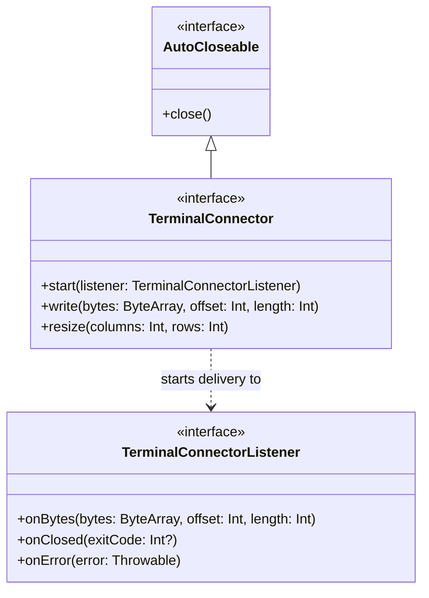

# JvTerm Transport API (`:jvterm-transport-api`)

The `jvterm-transport-api` module defines the transport-neutral, highly performant connection contracts between terminal runtimes and host byte-streams.

It is designed with strict **Single Responsibility Principles (SRP)** and serves as a **pure vocabulary module**. It has no knowledge of byte-stream parsing, escape-sequence interpretation, grid physics, input event encoding, rendering caches, or platform-specific pseudo-terminal (PTY) mechanisms. This separation keeps the core abstraction lightweight, decoupled, and easily mockable for deterministic unit testing.

---

## Upstream Dependencies
* **None**. This is a standalone, zero-dependency module compiling against the bare-metal Kotlin Standard Library.

---

## Architectural Role & Core Interfaces

The transport API provides a duplex, byte-stream abstraction to isolate the terminal engine from physical I/O streams (e.g., network sockets, local processes, files, or test mocks).



### Key Components:
* [TerminalConnector](file:///c:/Users/gagik/IdeaProjects/terminal-buffer/jvterm-transport-api/src/main/kotlin/io/github/jvterm/transport/TerminalConnector.kt): Represents a transport-neutral, duplex communication channel to a terminal host.
* [TerminalConnectorListener](file:///c:/Users/gagik/IdeaProjects/terminal-buffer/jvterm-transport-api/src/main/kotlin/io/github/jvterm/transport/TerminalConnectorListener.kt): Callback event sink for incoming raw bytes and transport lifecycle updates.

---

## Sub-Documentation

For deep-dive technical details on threading invariants and lifecycle states:
* [connector-lifecycle.md](file:///c:/Users/gagik/IdeaProjects/terminal-buffer/jvterm-transport-api/docs/connector-lifecycle.md) - Startup/shutdown transitions, concurrent writes, and synchronous consumption invariants.

---

## How to Use

The following example shows how a generic terminal engine can consume a `TerminalConnector` to write user input and listen for incoming host bytes:

```kotlin
import io.github.ketraterm.transport.TerminalConnector
import io.github.ketraterm.transport.TerminalConnectorListener

class SimpleTerminalEngine(private val connector: TerminalConnector) {

    fun init() {
        connector.start(object : TerminalConnectorListener {
            override fun onBytes(bytes: ByteArray, offset: Int, length: Int) {
                // Synchronously process raw bytes from the host
                val text = String(bytes, offset, length, Charsets.UTF_8)
                print(text)
            }

            override fun onClosed(exitCode: Int?) {
                println("\n[Connection closed with exit code: $exitCode]")
            }

            override fun onError(error: Throwable) {
                System.err.println("\n[Connection error: ${error.message}]")
            }
        })
    }

    fun sendKeys(input: String) {
        val bytes = input.toByteArray(Charsets.UTF_8)
        // write() will copy or write the bytes synchronously before returning
        connector.write(bytes, 0, bytes.size)
    }
}
```

---

## How to Implement: Custom Transport Connector

To implement a custom transport connector (e.g., a TCP socket transport), extend `TerminalConnector` and coordinate the background reading threads:

```kotlin
import io.github.ketraterm.transport.TerminalConnector
import io.github.ketraterm.transport.TerminalConnectorListener
import java.io.InputStream
import java.io.OutputStream
import java.net.Socket
import java.util.concurrent.atomic.AtomicBoolean

class SocketTerminalConnector(private val socket: Socket) : TerminalConnector {
    private val outputStream: OutputStream = socket.getOutputStream()
    private val inputStream: InputStream = socket.getInputStream()
    private val started = AtomicBoolean(false)
    @Volatile private var readerThread: Thread? = null

    override fun start(listener: TerminalConnectorListener) {
        if (!started.compareAndSet(false, true)) return

        readerThread = Thread {
            val buffer = ByteArray(4096)
            try {
                while (!Thread.currentThread().isInterrupted) {
                    val read = inputStream.read(buffer)
                    if (read == -1) {
                        listener.onClosed(null)
                        break
                    }
                    if (read > 0) {
                        listener.onBytes(buffer, 0, read)
                    }
                }
            } catch (e: Exception) {
                listener.onError(e)
            }
        }.apply {
            isDaemon = true
            name = "socket-transport-reader"
            start()
        }
    }

    override fun write(bytes: ByteArray, offset: Int, length: Int) {
        synchronized(outputStream) {
            outputStream.write(bytes, offset, length)
            outputStream.flush()
        }
    }

    override fun resize(columns: Int, rows: Int) {}

    override fun close() {
        readerThread?.interrupt()
        socket.close()
    }
}
```
