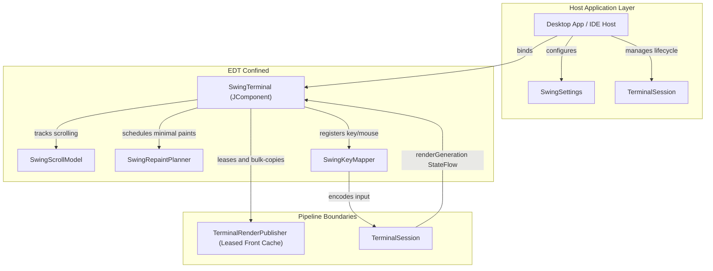

# Module ketraterm-ui-swing

## KetraTerm UI Swing (`:ketraterm-ui-swing`)

A reusable, premium-tier Swing terminal component built in Kotlin/JVM 21.

`ketraterm-ui-swing` translates terminal render frames and keyboard/mouse events into a desktop component (`JComponent`) without knowing which transport (PTY, SSH, WebSocket, etc.) produced the raw stream. It serves as the visual and interactive foundation for standalone desktop terminal apps, IDE tool windows, and custom Swing hosts.

---

## Upstream Dependencies
- **`:ketraterm-protocol`** (vocabulary, mode IDs, enums)
- **`:ketraterm-render-api`** (render frame primitives and color palettes)
- **`:ketraterm-render-cache`** (triple-buffered cache reader)
- **`:ketraterm-input`** (keyboard/mouse event models)
- **`:ketraterm-session`** (session orchestration and lock loops)

---

## Architecture & System Design

The module is built on three core design philosophies:
1. **Complete Protocol Ignorance:** The UI has zero knowledge of ANSI, VT, ESC, OSC, or DCS bytes. It never parses stream protocols or executes grid mutation rules.
2. **Data-Driven Decoupling:** The UI collects `TerminalSession.renderGeneration`, leases the published front cache, and bulk-copies primitive state into its EDT-owned cache.
3. **EDT Isolation & Swing Safety:** The Swing component state belongs strictly to the Event Dispatch Thread (EDT). Background rendering and I/O processes interact only through thread-safe snapshot mechanisms.



Routine painting never calls `TerminalSession.readRenderFrame`; it reads only the EDT-owned cache. Absolute-range operations such as selection and search may still use synchronous session frame reads. One session has one active render viewport, so independently scrolling components must use separate sessions.

---

## Sub-Documentation

For detailed specifications on Swing painting and text pipelines:
* [swing-repaint-optimization.md](docs/swing-repaint-optimization.md) - Repaint planner bounds calculations, drag selection matrices, and smart path double-click detection.
* [bifurcated-text-rendering.md](docs/bifurcated-text-rendering.md) - ASCII fast paths, shaped TextLayout caches, prioritized JBR color emoji fallback chains, and pixel-perfect primitive grid painters.

---

## How to Use

To place a functional, interactive terminal component in your Swing layout, instantiate `SwingTerminal` and bind it to your active `TerminalSession`:

```kotlin
import io.github.ketraterm.session.TerminalSession
import io.github.ketraterm.ui.swing.api.SwingTerminal
import io.github.ketraterm.ui.swing.settings.SwingSettings
import io.github.ketraterm.ui.swing.settings.TerminalTheme
import java.awt.BorderLayout
import javax.swing.JComponent
import javax.swing.JPanel

fun createTerminalView(session: TerminalSession): JComponent {
    val panel = JPanel(BorderLayout())

    // 1. Define custom, immutable settings (palette, fonts, etc.)
    val settings = SwingSettings(
        palette = TerminalTheme.ONE_DARK.createPalette(),
        fontFamily = "Cascadia Mono",
        fontSize = 15,
        columns = 80,
        rows = 24
    )
    
    // 2. Instantiate the SwingTerminal component
    val terminalComponent = SwingTerminal(
        settingsProvider = { settings }
    )
    
    // 3. Bind the component to the active session
    terminalComponent.bind(session)
    
    panel.add(terminalComponent, BorderLayout.CENTER)
    return panel
}
```

---

## How to Extend: Custom Host Services

To integrate clipboard features, hyperlink clicking, or custom threading/dispatchers into the terminal view, construct a custom [SwingHostServices](src/main/kotlin/io/github/ketraterm/ui/swing/api/SwingHostServices.kt) instance and pass it to [SwingTerminal](src/main/kotlin/io/github/ketraterm/ui/swing/api/SwingTerminal.kt):

```kotlin
import io.github.ketraterm.ui.swing.api.SwingHostServices
import io.github.ketraterm.ui.swing.settings.TerminalClipboardHandler
import io.github.ketraterm.ui.swing.settings.TerminalHyperlinkHandler

val customServices = SwingHostServices(
    clipboardHandler = object : TerminalClipboardHandler {
        override fun copyText(text: String) {
            println("Copying to custom clipboard: $text")
        }

        override fun readText(): String? {
            return "Pasted text"
        }
    },
    hyperlinkHandler = TerminalHyperlinkHandler { uri ->
        println("User clicked hyperlink: $uri")
        true
    }
)
```
