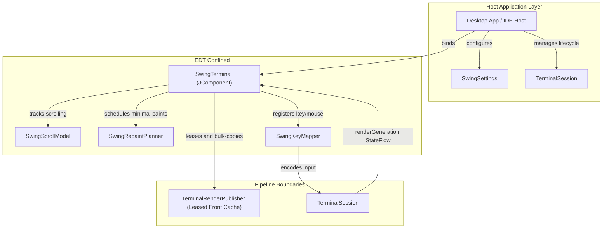

# KetraTerm UI Swing (`:ketraterm-ui-swing`)

A reusable, premium-tier Swing terminal component built in Kotlin/JVM 25.

`ketraterm-ui-swing` translates terminal render frames and keyboard/mouse events into a desktop component (`JComponent`) without knowing which transport (PTY, SSH, WebSocket, etc.) produced the raw stream. It serves as the visual and interactive foundation for standalone desktop terminal apps, IDE tool windows, and custom Swing hosts.

---

## Upstream Dependencies
- **`:ketraterm-protocol`** (vocabulary, mode IDs, enums)
- **`:ketraterm-render-api`** (render frame primitives and color palettes)
- **`:ketraterm-render-cache`** (triple-buffered cache reader)
- **`:ketraterm-input`** (keyboard/mouse event models)
- **`:ketraterm-session`** (session orchestration and lock loops)

---

## Architecture & System Design

The module is built on three core design philosophies:
1. **Complete Protocol Ignorance:** The UI has zero knowledge of ANSI, VT, ESC, OSC, or DCS bytes. It never parses stream protocols or executes grid mutation rules.
2. **Data-Driven Decoupling:** The UI collects `TerminalSession.renderGeneration`, leases the published front cache, and bulk-copies primitive state into its EDT-owned cache.
3. **EDT Isolation & Swing Safety:** The Swing component state belongs strictly to the Event Dispatch Thread (EDT). Background rendering and I/O processes interact only through thread-safe snapshot mechanisms.



Routine painting never calls `TerminalSession.readRenderFrame`; it reads only the EDT-owned cache. Absolute-range operations such as selection and search may still use synchronous session frame reads. Each session publishes one active viewport; independent scrolling views of the same session are unsupported. Separate sessions are separate terminal pipelines, not additional views of one process.

### Binding and configuration ownership

`SwingTerminal` requires a `TerminalSession`. Binding applies the component's ambiguous-width policy, palette, cursor shape, and paste policy to the session. When the component has positive bounds, it resizes both the terminal grid and connector to the visible cell dimensions. Component and font/geometry changes can resize them again. `reloadSettings()` reapplies only changed settings; unchanged palette and cursor settings preserve application-controlled values.

The host owns session creation and lifetime. Binding starts render observation and selects the live viewport; rebinding cancels the old view work and clears view state. `unbind()` and `dispose()` cancel rendering and suggestion requests without closing the session or restoring its previous settings or dimensions. Dispose the view when its host closes, and close the session separately when its process or connection should end. Stop session-specific host observers, including a `SwingLiveCompletionBinding`, before rebinding the view or disposing it.

Create and access the component on the EDT. `bind`, `unbind`, `dispose`, and `reloadSettings` also accept calls from other threads, which enqueue their work on the EDT; calls already on the EDT execute immediately.

Shell metadata comes from the integration selected when the session is created. A host can supply `TerminalShellIntegrationFactory.host(...)` without depending on the optional OSC integration module. The binding observes model revisions and refreshes decorations against its copied frame even when no new terminal output arrives. This observation ends on session closure, unbinding, rebinding, or disposal; it never owns the host's model or producer.

### Suggestion request ownership

`requestActiveShellSuggestions()` uses the bound session's selected command source, including a host-owned source. It defaults to an explicit request; automatic observers pass `SwingShellSuggestionTrigger.AUTOMATIC`. Pending results and acceptance are checked against that session and command context, and context observation stops when the request and popup end.

For context kept outside the session, call `requestShellSuggestions(commandText, cursorOffset, anchorColumn, anchorRow, trigger = SwingShellSuggestionTrigger.EXPLICIT)`. The default trigger remains automatic. Both methods use the same cancellable provider pipeline and require the master suggestion setting; explicit requests remain available when automatic popups are disabled. With directly supplied context, the host must replace the request or call `hideShellSuggestions()` when its editor state changes. `showShellSuggestions()` remains available when the host owns provider collection itself.

---

## Sub-Documentation

For detailed specifications on Swing painting and text pipelines:
* [swing-repaint-optimization.md](docs/swing-repaint-optimization.md) - Repaint planner bounds calculations, drag selection matrices, and smart path double-click detection.
* [bifurcated-text-rendering.md](docs/bifurcated-text-rendering.md) - ASCII fast paths, shaped TextLayout caches, prioritized JBR color emoji fallback chains, and pixel-perfect primitive grid painters.

---

## How to Use

To place a functional, interactive terminal component in your Swing layout, instantiate `SwingTerminal` and bind it to your active `TerminalSession`:

```kotlin
import io.github.ketraterm.session.TerminalSession
import io.github.ketraterm.ui.swing.api.SwingTerminal
import io.github.ketraterm.ui.swing.settings.SwingSettings
import io.github.ketraterm.ui.swing.settings.TerminalTheme
import java.awt.BorderLayout
import javax.swing.JComponent
import javax.swing.JPanel

fun createTerminalView(session: TerminalSession): JComponent {
    val panel = JPanel(BorderLayout())

    // 1. Define custom, immutable settings (palette, fonts, etc.)
    val settings = SwingSettings(
        palette = TerminalTheme.ONE_DARK.createPalette(),
        fontFamily = "Cascadia Mono",
        fontSize = 15,
        columns = 80,
        rows = 24
    )
    
    // 2. Instantiate the SwingTerminal component
    val terminalComponent = SwingTerminal(
        settingsProvider = { settings }
    )
    
    // 3. Bind the component to the active session
    terminalComponent.bind(session)
    
    panel.add(terminalComponent, BorderLayout.CENTER)
    return panel
}
```

---

## How to Extend: Custom Host Services

To integrate clipboard features, hyperlink clicking, or custom threading/dispatchers into the terminal view, construct a custom [SwingHostServices](src/main/kotlin/io/github/ketraterm/ui/swing/api/SwingHostServices.kt) instance and pass it to [SwingTerminal](src/main/kotlin/io/github/ketraterm/ui/swing/api/SwingTerminal.kt):

```kotlin
import io.github.ketraterm.ui.swing.api.SwingHostServices
import io.github.ketraterm.ui.swing.settings.TerminalClipboardHandler
import io.github.ketraterm.ui.swing.settings.TerminalHyperlinkHandler

val customServices = SwingHostServices(
    clipboardHandler = object : TerminalClipboardHandler {
        override fun copyText(text: String) {
            println("Copying to custom clipboard: $text")
        }

        override fun readText(): String? {
            return "Pasted text"
        }
    },
    hyperlinkHandler = TerminalHyperlinkHandler { uri ->
        println("User clicked hyperlink: $uri")
        true
    }
)
```

## Hyperlink detector contract and migration

`SwingHyperlinkDetector.detect` is suspending. The discovery owner serializes
invocations, owns cancellation and rejects results from obsolete binding,
source or provider epochs. Providers must propagate cancellation and discard
tainted ordered state; the request-confined sink cannot escape into detached
work. Returning normally is successful analysis, including an empty result.
Throwing means failure or cancellation, not an empty result.

The current IntelliJ batch uses coroutine `readActionBlocking`: stateful filters
and sink writes cannot safely be retried automatically by `readAction`. This
still blocks IDE write actions while the batch runs. Short read actions and safe
ordered-state replay remain part of Stage 5 in the repair map.

Choose `INDEPENDENT_LINE` for text-derived links whose logical lines can be
analyzed independently, or `ORDERED_CONTENT` for console filters that consume
source order and may highlight earlier lines. `configurationGeneration` is an
equality-only invalidation counter for changed provider configuration.

Requests own their strings and row arrays. Each logical line includes one
trailing newline; soft wrapping joins physical rows while omitting wrap padding
and wide trailing cells. Coordinates use the first absolute physical row of the
logical line and a UTF-16 offset in its extracted text, rather than viewport rows
or terminal columns. Cumulative offsets remain local to the supplied batch for
console-filter interoperability. Search and detection share cell extraction
rules while retaining their own mapping and trimming policies.

Report a `SwingHyperlink` containing the source range, dependency range, action,
optional complete copyable URI, prepared presentation and activation policy.
Dependencies include every character affecting detection/navigation, including
token delimiters. Ordered results record the `consumedThrough` position that
produced them. A result can refer to earlier source lines; coordinates outside
the owner's captured source are ignored. Styles contain resolved colors and
underline metadata; resolve theme/framework data outside painting.

For a single-line result, the request builds absolute coordinates:

```kotlin
sink.addHyperlink(
    request.hyperlink(
        lineIndex, startOffset, endOffset, action,
        validationStartOffset = tokenStart,
        validationEndOffset = tokenEndIncludingDelimiter,
        uri = completeDestination,
    )
)
```

Migration is atomic: replace `LOGICAL_LINE` with `INDEPENDENT_LINE`, `VIEWPORT`
with `ORDERED_CONTENT`, make detector overrides suspending, and replace the
positional sink overload with `addHyperlink(SwingHyperlink)` or the request
factory above. There is no compatibility detector pipeline.

Discovery now uses one retained logical-line index for the binding, with separate
primary/alternate state validated against each buffer's history-content generation.
Stable occurrence IDs own actions independently of viewport projection. Successful
empty results are retained too. Incremental source scans use bounded absolute-range
copies under session synchronization and assemble full logical text outside the lock,
including soft-wrapped lines that cross copy or viewport boundaries. Newly admitted
history is reconciled even if it was edited before its admission was published.

Scrolling prepared content projects existing results synchronously into reusable
primitive buffers; hit testing and action lookup do not allocate or run detectors.
Projection clips the UTF-16 mapping before visiting cells, so a long wrapped link
does not incur whole-destination traversal on each frame. Eviction retires affected
records/actions without changing surviving occurrence IDs; partially retained
wrapped occurrences keep their complete prepared destination until their final
source row leaves retention. Reset/reflow invalidates the affected buffer's state.

Unprocessed content remains asynchronous. Lifecycle recovery, ordered provider
continuation/replay, native styles/gestures and semantic OSC 8 hover groups follow
their separate gates in the [repair map](../docs/terminal-feature-gap-map.md#uri-highlighting-staged-repair).
The current ordered detector receives bounded preceding context with pending text
(up to 64 preceding and 64 pending logical lines per request). Preserving provider
execution state and reconstructing full contextual replay are
Stage 5 work. Changelogs consolidate the completed user-facing repair.
