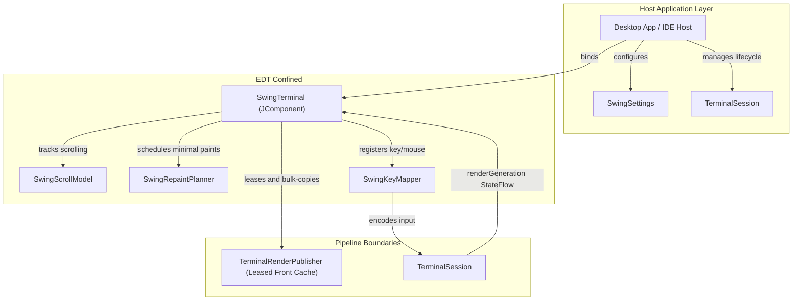

# KetraTerm UI Swing (`:ketraterm-ui-swing`)

A reusable, premium-tier Swing terminal component built in Kotlin/JVM 25.

`ketraterm-ui-swing` translates terminal render frames and keyboard/mouse events into a desktop component (`JComponent`) without knowing which transport (PTY, SSH, WebSocket, etc.) produced the raw stream. It serves as the visual and interactive foundation for standalone desktop terminal apps, IDE tool windows, and custom Swing hosts.

---

## Upstream Dependencies
- **`:ketraterm-protocol`** (vocabulary, mode IDs, enums)
- **`:ketraterm-render-api`** (render frame primitives and color palettes)
- **`:ketraterm-render-cache`** (triple-buffered cache reader)
- **`:ketraterm-input`** (keyboard/mouse event models)
- **`:ketraterm-session`** (session orchestration and lock loops)

---

## Architecture & System Design

The module is built on three core design philosophies:
1. **Complete Protocol Ignorance:** The UI has zero knowledge of ANSI, VT, ESC, OSC, or DCS bytes. It never parses stream protocols or executes grid mutation rules.
2. **Data-Driven Decoupling:** The UI collects `TerminalSession.renderGeneration`, leases the published front cache, and bulk-copies primitive state into its EDT-owned cache.
3. **EDT Isolation & Swing Safety:** The Swing component state belongs strictly to the Event Dispatch Thread (EDT). Background rendering and I/O processes interact only through thread-safe snapshot mechanisms.



Routine painting never calls `TerminalSession.readRenderFrame`; it reads only the EDT-owned cache. Absolute-range operations such as selection and search may still use synchronous session frame reads. Each session publishes one active viewport; independent scrolling views of the same session are unsupported. Separate sessions are separate terminal pipelines, not additional views of one process.

### Binding and configuration ownership

`SwingTerminal` requires a `TerminalSession`. Binding applies the component's ambiguous-width policy, palette, cursor shape, and paste policy to the session. When the component has positive bounds, it resizes both the terminal grid and connector to the visible cell dimensions. Component and font/geometry changes can resize them again. `reloadSettings()` reapplies only changed settings; unchanged palette and cursor settings preserve application-controlled values.

The host owns session creation and lifetime. Binding starts render observation and selects the live viewport; rebinding cancels the old view work and clears view state. `unbind()` and `dispose()` cancel rendering and suggestion requests without closing the session or restoring its previous settings or dimensions. Dispose the view when its host closes, and close the session separately when its process or connection should end. Stop session-specific host observers, including a `SwingLiveCompletionBinding`, before rebinding the view or disposing it.

Create and access the component on the EDT. `bind`, `unbind`, `dispose`, and `reloadSettings` also accept calls from other threads, which enqueue their work on the EDT; calls already on the EDT execute immediately.

Shell metadata comes from the integration selected when the session is created. A host can supply `TerminalShellIntegrationFactory.host(...)` without depending on the optional OSC integration module. The binding observes model revisions and refreshes decorations against its copied frame even when no new terminal output arrives. This observation ends on session closure, unbinding, rebinding, or disposal; it never owns the host's model or producer.

### Cursor presentation

The terminal with keyboard focus displays the application's block, bar, or underline cursor using the configured blink interval. When unfocused, block cursors become thin hollow outlines; bars and underlines retain their shape without blinking. All shapes use the resolved cursor color and preserve the underlying text, backgrounds, and selection. Outlines use Java2D's normalized stroke rendering. Filled beams and underlines align to device pixels, with thickness rounded independently of pane position at fractional display scales. All shapes follow the same wide-cell ownership and bidi geometry as focused cursors and stay within their visual cell bounds.

Application-hidden cursors remain hidden. Cursors outside the displayed viewport remain clipped, and focus changes do not scroll the view. Applications can move, hide, or change their cursor while unfocused; regaining focus immediately restores the latest shape and starts a visible blink phase. Focus reporting through DEC 1004 remains independent of this local presentation.

The cursor uses the existing shared cursor/text blink timer. Inactive cursors ignore its phase and receive no cursor-only blink damage; SGR blinking text retains its existing timing and repaint behavior.

### Suggestion request ownership

`requestActiveShellSuggestions()` uses the bound session's selected command source, including a host-owned source. It defaults to an explicit request; automatic observers pass `SwingShellSuggestionTrigger.AUTOMATIC`. Pending results and acceptance are checked against that session and command context, and context observation stops when the request and popup end.

For context kept outside the session, call `requestShellSuggestions(commandText, cursorOffset, anchorColumn, anchorRow, trigger = SwingShellSuggestionTrigger.EXPLICIT)`. The default trigger remains automatic. Both methods use the same cancellable provider pipeline and require the master suggestion setting; explicit requests remain available when automatic popups are disabled. With directly supplied context, the host must replace the request or call `hideShellSuggestions()` when its editor state changes. `showShellSuggestions()` remains available when the host owns provider collection itself.

Choose controller and presentation ownership independently:

| Controller | Presentation | Automatic coordination |
| --- | --- | --- |
| Reusable Swing controller | Embedded `SwingShellSuggestionView` | Optional `SwingLiveCompletionBinding.attach(terminal)` |
| Host controller | Host-owned native popup | Optional `attach(terminal, SwingShellSuggestionTarget)` |
| Host controller | Host-owned results UI | Host orchestration using `SwingCompletionSuggestionProvider` or the completion engine directly |

The coordinator lives in optional `ketraterm-ui-swing-host`. Its request/hide port
leaves provider collection, selection, acceptance and popup lifetime with the host;
it supplies focus, eligibility, debounce and invalidation. Close the binding before
rebinding or disposing the terminal, then release host popup resources separately.
Detach stops observation while leaving explicit presentation to the host.

On the EDT, `copyCellBounds(column, row, destination)` copies the current frame's
zero-based logical cell into a caller-owned `Rectangle`, using component-local
pixels, active padding/gutter, bidi mapping and fractional scrolling. Bounds are
clipped to visible content; unavailable or invalid cells clear the rectangle and
return false. Hosts perform the component-to-screen conversion for native popups.
Wide leading and trailing cells each describe one physical grid cell.

Install view-owned diagnostics with `setShellSuggestionFailureHandler` on the
EDT. Current provider failures are reported once after cleanup; cancellation and
obsolete requests are excluded. Null restores logging, rebinding retains the
handler, and disposal releases it. Completion context suppliers execute in the
caller's context, normally off the EDT; publish immutable host metadata to
thread-safe storage instead of reading UI state from those suppliers.

---

## Sub-Documentation

For detailed specifications on Swing painting and text pipelines:
* [swing-repaint-optimization.md](docs/swing-repaint-optimization.md) - Repaint planner bounds calculations, drag selection matrices, and smart path double-click detection.
* [bifurcated-text-rendering.md](docs/bifurcated-text-rendering.md) - ASCII fast paths, shaped TextLayout caches, prioritized JBR color emoji fallback chains, and pixel-perfect primitive grid painters.

---

## How to Use

To place a functional, interactive terminal component in your Swing layout, instantiate `SwingTerminal` and bind it to your active `TerminalSession`:

```kotlin
import io.github.ketraterm.session.TerminalSession
import io.github.ketraterm.ui.swing.api.SwingTerminal
import io.github.ketraterm.ui.swing.settings.SwingSettings
import io.github.ketraterm.ui.swing.settings.TerminalTheme
import java.awt.BorderLayout
import javax.swing.JComponent
import javax.swing.JPanel

fun createTerminalView(session: TerminalSession): JComponent {
    val panel = JPanel(BorderLayout())

    // 1. Define custom, immutable settings (palette, fonts, etc.)
    val settings = SwingSettings(
        palette = TerminalTheme.ONE_DARK.createPalette(),
        fontFamily = "Cascadia Mono",
        fontSize = 15,
        columns = 80,
        rows = 24
    )
    
    // 2. Instantiate the SwingTerminal component
    val terminalComponent = SwingTerminal(
        settingsProvider = { settings }
    )
    
    // 3. Bind the component to the active session
    terminalComponent.bind(session)
    
    panel.add(terminalComponent, BorderLayout.CENTER)
    return panel
}
```

---

## How to Extend: Custom Host Services

To integrate clipboard features, hyperlink clicking, or custom threading/dispatchers into the terminal view, construct a custom [SwingHostServices](src/main/kotlin/io/github/ketraterm/ui/swing/api/SwingHostServices.kt) instance and pass it to [SwingTerminal](src/main/kotlin/io/github/ketraterm/ui/swing/api/SwingTerminal.kt):

```kotlin
import io.github.ketraterm.ui.swing.api.SwingHostServices
import io.github.ketraterm.ui.swing.settings.TerminalClipboardHandler
import io.github.ketraterm.ui.swing.settings.TerminalHyperlinkHandler

val customServices = SwingHostServices(
    clipboardHandler = object : TerminalClipboardHandler {
        override fun copyText(text: String) {
            println("Copying to custom clipboard: $text")
        }

        override fun readText(): String? {
            return "Pasted text"
        }
    },
    hyperlinkHandler = TerminalHyperlinkHandler { uri ->
        println("User clicked hyperlink: $uri")
        true
    }
)
```

## Hyperlink detector contract and migration

`SwingHyperlinkDetector.detect` is suspending. The discovery owner serializes
invocations within each context, owns cancellation and rejects results from obsolete binding,
source, provider or analysis epochs. Providers must propagate cancellation and discard
tainted ordered state. Return a completed `List<SwingHyperlink>` and do not mutate
it afterwards. An empty list is successful analysis without links; throwing means
failure or cancellation. Discovery may allocate ordinary Kotlin results and collections.

The IntelliJ adapter uses a cancellable `readAction` per line/provider. If a write
interrupts an invocation, its mutated filter state is discarded and reconstructed
through ordered replay. A read-action retry never invokes that same mutated filter
again. Completed results are published outside the read action.

Choose `INDEPENDENT_LINE` for text-derived links whose logical lines can be
analyzed independently, or `ORDERED_CONTENT` for console filters that consume
source order and may highlight earlier lines. `INDEPENDENT_AND_ORDERED` enables both
lanes; such detectors must allow the two contexts to run concurrently. Each request
selects one context. Slow console filters cannot hold up independent URLs/paths.
`configurationGeneration` is an equality-only invalidation counter. Publish the
changed configuration and a distinct generation before emitting `configurationChanges`
so it reconciles without new terminal output. A signal with an unchanged generation
does not invalidate results; a generation change without a signal is observed at the
next reconciliation. The binding owns the flow's subscription and cancellation.
A configuration refresh keeps prepared links until replacement batches arrive,
including successful empty replacements. Replacing the detector instance retires old actions immediately.
Implement `discardOrderedState` when a detector retains ordered source/provider
state. The owner invokes it at binding/provider teardown only after the ordered
call has exited, so cleanup cannot race a running filter.

Requests own their strings and row arrays. Each logical line includes one
trailing newline; soft wrapping joins physical rows while omitting wrap padding
and wide trailing cells. Coordinates use the first absolute physical row of the
logical line and a UTF-16 offset in its extracted text, rather than viewport rows
or terminal columns. Platform-specific cumulative console offsets belong to the
plugin's ordered filter state. Search and detection share cell extraction rules
while retaining their own mapping and trimming policies.

Report a `SwingHyperlink` containing the source range, dependency range, action,
optional complete copyable URI, prepared presentation and activation policy.
Dependencies include every character affecting detection/navigation, including
token delimiters. Ordered results record the `consumedThrough` position that
produced them. A result can refer to earlier source lines; coordinates outside
the owner's captured source are ignored. Styles contain resolved colors and
underline metadata; resolve theme/framework data outside painting.

For a single-line result, the request builds absolute coordinates:

```kotlin
return listOf(
    request.hyperlink(
        lineIndex, startOffset, endOffset, action,
        validationStartOffset = tokenStart,
        validationEndOffset = tokenEndIncludingDelimiter,
        uri = completeDestination,
    )
)
```

Migration is atomic: replace `LOGICAL_LINE` with `INDEPENDENT_LINE`, `VIEWPORT`
with `ORDERED_CONTENT` and make detector overrides suspending. The current signature
is `suspend fun detect(request: SwingHyperlinkDetectionRequest): List<SwingHyperlink>`.
Replace sink publication with a returned list, using the request factory above for
single-line ranges. The sink interface and batch cumulative-offset accessors were
removed; use logical-line anchors and UTF-16 offsets. There is no compatibility
detector pipeline.

Hover shares one primitive row/start/end projection between interaction, painting
and repainting. OSC 8 runs join adjacent overlapping spans and terminal soft wraps;
disconnected captions or runs hover separately even when the application reuses
one ID/destination. Detected links keep their semantic occurrence across visible
fragments. Moving within the selected region does not reconstruct it or request
additional painting. Reflow and frame changes reproject current geometry.
Hover callbacks are paired per detected occurrence, even when two results share
one action instance. OSC 8 activation validates the pressed source row as well as
its protocol ID, so scrolling or row replacement cannot retarget a held click.

Context menus capture the resolved action and optional complete URI when opened.
They retain their target across output changes, eviction and rebinding. Detectors
should provide `SwingHyperlink.uri` when their target can be copied; the existing
host menu then exposes Copy Link. The captured `providerAction` and original popup
`triggerEvent` allow the plugin to preserve native provider menu actions.

Discovery now uses one retained logical-line index for the binding, with separate
primary/alternate state validated against each buffer's history-content generation.
Stable occurrence IDs own actions independently of viewport projection. Successful
empty results are retained too. Incremental source scans use bounded absolute-range
copies under session synchronization and assemble full logical text outside the lock,
including soft-wrapped lines that cross copy or viewport boundaries. Newly admitted
history is reconciled even if it was edited before its admission was published.
Every discovery request uses this source-backed path, including fixtures; an
unbound terminal has no discovery source. The index alone validates result ranges
and splits them into line segments. Independent-line readiness is separate from
ordered progress: replaying an ordered dependency does not reanalyze unchanged URLs.

Core frames expose `outputEndAbsoluteRow`, an exclusive absolute boundary that
includes authored blank lines and excludes the unused live tail. It is independent
of the viewport and follows content through scrolling and reflow. Discovery does
not feed unused rows to ordered filters, so later output in those rows extends the
existing chain. Cursor movement alone does not supply output. External render
readers may leave the boundary unknown (`Long.MAX_VALUE`); discovery then includes
all available rows conservatively. Editing an already-consumed logical line,
including appending text to its unfinished tail, can still require ordered replay.

Scrolling prepared content projects existing results synchronously into reusable
ID and presentation-reference buffers without running detectors. The strict
allocation constraint applies to recurring frame and paint work. Discovery,
publication, hit testing and interaction may use ordinary Kotlin objects and
collections; their retained lifetime and work must remain bounded.
Projection clips the UTF-16 mapping before visiting cells, so a long wrapped link
does not incur whole-destination traversal on each frame. Eviction retires affected
records/actions without changing surviving occurrence IDs; partially retained
wrapped occurrences keep their complete prepared destination until their final
source row leaves retention. Reset/reflow invalidates the affected buffer's state.

Discovery belongs to the session binding. Temporary hiding/removal preserves its
index and running work; showing, reattachment, component focus and ancestor-window
focus reconcile prepared links and the current stationary pointer. Unbind/dispose
cancel work and release retained results. A provider that ignores cancellation
keeps the serialization slot until it returns, and cannot publish obsolete results.

Content demand is conflated independently of viewport/cursor frames. Missing visible
content is copied first; independent results publish in batches of up to 64 logical
lines. Worker validation rechecks current source rows after detection, preserving
valid independent results when unrelated lines changed. Changed visible targets,
including wrapped targets with an edited off-screen live tail, lose activation
before rediscovery. Only the latter case needs bounded primitive row-stamp reads on
the EDT; complete text extraction and provider execution stay on the worker.

Failures and interrupted provider reads retain unprocessed work and allow three
delayed retries (100 ms, 500 ms, 2 s). Successful empty analysis is retained.
Scroll/cursor frames cannot restart exhausted recovery. New content, provider/source
invalidation or an explicit bind/show/focus reconciliation starts a fresh attempt.
Unprocessed content remains asynchronous. Ordered requests continue in source order
in batches of up to 64 logical lines. On `analysisEpoch` changes, rebuild provider
state from the retained beginning; ordinary eviction only advances `firstRetainedRow`.
Results can highlight earlier retained lines and must identify the producer through
`consumedThrough`. Replaying a producer to an empty result retires its old spans.
Unchanged occurrences before an edit preserve their identities/actions during replay.
The request's `lineFirstId` associates output with historical host directory metadata.

Prepared normal, hovered, active and followed styles remain immutable Kotlin
objects. Painting reads projected references using a renderer-internal extension
that selects the existing style; the public presentation model only describes data.
Painting performs no action-map or framework lookup. Terminal-authored underlines and
concealment retain precedence. Native
visible links activate directly; implicit links require Ctrl (Cmd on macOS). Both
activate on release only while the pressed occurrence remains unchanged and no drag
occurred. Modifier clicks preserve existing selection; direct links still permit
selection dragging. Application mouse reporting retains precedence, with the existing
Shift override. OSC 8 wins overlaps, then visible links, narrower ranges and stable
provider order. Actions remain attached to retained occurrences independently of
the viewport. Activation and hover callbacks run on the EDT; hover callbacks run
at semantic transitions, outside painting.

Hosts may set `SwingSettings.osc8HyperlinkPresentation` to a resolved
`SwingHyperlinkPresentation`. OSC 8 and detected links use the same style-selection
path, including backgrounds and visibility metadata. The default preserves the
standalone dotted resting underline and solid hover underline; the IntelliJ host
supplies the same resting/hover underlines with IDE theme styling on activation. The hand cursor appears only when activation is eligible; OSC 8 defaults to Ctrl/Cmd.
Settings reload prepares styles and reconciles stationary-pointer feedback outside
painting.

Hyperlink configuration uses the existing immutable DTOs:

```kotlin
val settings = SwingSettings(
    osc8HyperlinkPresentation = myPresentation, // null retains the built-in styles
    osc8HyperlinkActivation = SwingHyperlinkActivation.DIRECT,
)
val terminal = SwingTerminal(settingsProvider = { settings })
```

`SwingHyperlinkPresentation` supplies normal, hovered, active and followed styles;
each `SwingHyperlinkStyle` contains resolved colors and underline decoration.
OSC 8 activation accepts `DIRECT` (ordinary primary click) or `MODIFIER` (Ctrl/Cmd,
the default). Detected links provide the same presentation and activation DTOs per
`SwingHyperlink` result. The host's `SwingHostServices.hyperlinkHandler` handles OSC 8
destinations; detected results carry their own actions. To change component settings,
return a new immutable snapshot from `settingsProvider` and call `reloadSettings()`.
The stationary cursor and active styling reconcile immediately. Cursor eligibility,
release/drag rules, authored-underline precedence and mouse-reporting precedence are
shared interaction rules, not separate configuration switches.

## Consumer and ABI verification

The [published consumer fixtures](../ketraterm-testkit/src/consumerTest/README.md)
compile Kotlin and Java with one direct dependency on this module. They exercise
public host services, a suspending hyperlink detector and binding/disposal on the
EDT with both Gradle module metadata and POM-only dependency resolution:

```text
./gradlew :ketraterm-testkit:publishedConsumerTest
```

Kotlin's built-in ABI validation tracks the complete published Swing surface in
[the signature baseline](api/ketraterm-ui-swing.api), including settings, host
services, suggestions and compiler-generated default/data-class members.
Other published libraries have their own baselines. Internal rendering and
discovery helpers remain implementation details; `@PublishedApi` inline linkage
is included where it forms part of the JVM contract.

```text
./gradlew :ketraterm-ui-swing:checkKotlinAbi
./gradlew :ketraterm-ui-swing:updateKotlinAbi
```

`checkKotlinAbi` runs with this module's `check` task and across all published
libraries in test CI. Retained Kotlin/Java consumer binaries also run against
current artifacts without recompilation. Run `updateKotlinAbi` only for an
intentional, reviewed signature change; updating a snapshot does not make a
breaking change compatible. See the [library compatibility contract](../docs/library-compatibility.md)
for supported versions, ownership, evolution rules and baseline review.
