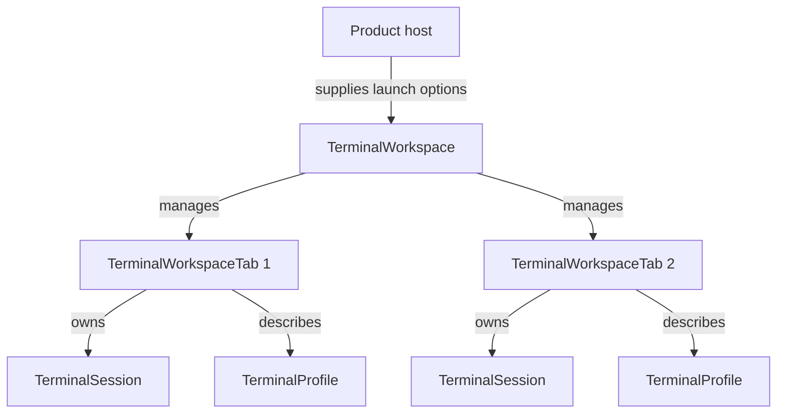

# Module ketraterm-workspace

## KetraTerm Workspace (`:ketraterm-workspace`)

The `ketraterm-workspace` module provides host-neutral session and tab management. It coordinates local sessions under a workspace lifecycle and launches host-supplied profiles and immutable options. Products own preference schemas and persistence.

This module is designed to be completely decoupled from any specific UI toolkit, serving as the headless state controller for tabbed desktop terminal interfaces or IDE tool windows.

---

## Upstream Dependencies
- **`:ketraterm-protocol`** (vocabulary, mode IDs, enums)
- **`:ketraterm-render-api`** (render frame primitives and color palettes)
- **`:ketraterm-transport-api`** (duplex connector contracts)
- **`:ketraterm-session`** (session orchestration, lifecycle state, and render publication)
- **`:ketraterm-shell-integration`** (explicit OSC producer selection for local workspace sessions)
- **`:ketraterm-pty`** (local PTY process management and options)

---

## Architectural Role

`TerminalWorkspace` manages a collection of tabs. Each tab wraps an active, running `TerminalSession` tied to a specific `TerminalProfile` launch configuration.

The workspace owns a supervisor scope and one lifecycle job per tab. Optional process-title and startup notifications are supervised separately: a failed observer is reported without stopping session-close observation. Removing a tab cancels its jobs; closing the workspace cancels the scope. Local tab closure remains distinct from unexpected remote closure, and host callbacks run outside the workspace state lock. Reentrant selection or closure supersedes an older pending selection notification.



### Clipboard read routing

`TerminalWorkspaceListener.readClipboard(tab, request)` runs asynchronously for the owning tab, independently of selection. The workspace publishes the tab and returns from `tabOpened` before starting session output delivery, so startup clipboard writes cannot be lost before a following read. Failed publication or startup closes the prepared session and removes the tab; removed tabs cannot receive reads. Product providers must still await asynchronously posted pane creation and earlier clipboard writes before native access. No clipboard implementation means an explicit unavailable result.

### Key Components
* [TerminalWorkspace](src/main/kotlin/io/github/ketraterm/workspace/TerminalWorkspace.kt): The main lifecycle manager. Handles opening, selecting, closing, and applying settings updates to all open terminal tabs.
* [TerminalProfile](src/main/kotlin/io/github/ketraterm/workspace/TerminalProfile.kt): Describes a launch configuration (command, display name, working directory, environment variables).
* `TerminalWorkspaceOpenOptions`: Validated immutable launch options, built and updated through named configuration callbacks or Java builders.

---

## Sub-Documentation

See [configuration ownership and construction](../docs/library-configuration.md). Standalone persistence is documented in the [application TOML guide](../ketraterm-app/docs/profile-config-toml.md).

---

## Shell metadata ownership

The local workspace selects `OscShellIntegration` and prepares supported shell
hooks according to launch options. Session and PTY APIs remain independent of
that implementation. Synchronous selected-model notifications update workspace
directories/titles before transport closure, and
`TerminalWorkspaceListener.commandFinished(tab, metadata)` reports
each completed command without looking up whichever record is latest later.
Listener registrations end when the tab is removed; the metadata producer owns
its model.

## How to Use

Hosts own persisted preferences. Workspace accepts immutable launch options and does not choose a configuration path or schema. The following example registers a workspace listener and opens a terminal tab:

```kotlin
import io.github.ketraterm.workspace.TerminalWorkspace
import io.github.ketraterm.workspace.TerminalWorkspaceListener
import io.github.ketraterm.workspace.TerminalWorkspaceTab
import io.github.ketraterm.workspace.TerminalWorkspaceOpenOptions
import io.github.ketraterm.workspace.TerminalProfile
import java.nio.file.Path

fun main() {
    // 2. Define a workspace listener to respond to tab lifecycle events
    val listener = object : TerminalWorkspaceListener {
        override fun tabOpened(tab: TerminalWorkspaceTab) {
            println("Tab opened: ${tab.id} - ${tab.title}")
        }
        override fun tabClosed(tabId: String) {
            println("Tab closed: $tabId")
        }
        override fun tabSelected(tabId: String) {
            println("Active tab switched to: $tabId")
        }
        override fun titleChanged(tab: TerminalWorkspaceTab, title: String) {}
        override fun colorChanged(tab: TerminalWorkspaceTab, color: String?) {}
        override fun bell(tab: TerminalWorkspaceTab) {}
    }

    // 3. Create the workspace manager
    val workspace = TerminalWorkspace(listener)

    // 4. Declare a launch profile (e.g. Git Shell)
    val gitProfile = TerminalProfile(
        id = "git-shell",
        displayName = "Git Repo Shell",
        command = listOf("bash"),
        environment = mapOf("GIT_PS1" to "true"),
        workingDirectory = Path.of("/my/repo")
    )

    // 5. Open a tab using the profile
    val openOptions = TerminalWorkspaceOpenOptions.create {
        it.columns = 80
        it.rows = 24
        it.maxHistory = 1000
        it.treatAmbiguousAsWide = false
    }
    val tab = workspace.openTab(gitProfile, openOptions)
}
```

---

## How to Extend: Custom Tab Listeners

UI components (such as Swing tabbed panels or custom IDE interfaces) implement `TerminalWorkspaceListener` to map workspace actions directly onto window views:

```kotlin
import io.github.ketraterm.workspace.TerminalWorkspaceListener
import io.github.ketraterm.workspace.TerminalWorkspaceTab
import javax.swing.JTabbedPane

class SwingTabAdapter(private val tabbedPane: JTabbedPane) : TerminalWorkspaceListener {
    override fun tabOpened(tab: TerminalWorkspaceTab) {
        // Create Swing component and add tab
    }
    override fun tabClosed(tabId: String) {}
    override fun tabSelected(tabId: String) {}
    override fun titleChanged(tab: TerminalWorkspaceTab, title: String) {}
    override fun colorChanged(tab: TerminalWorkspaceTab, color: String?) {}
    override fun bell(tab: TerminalWorkspaceTab) {}
}
```
