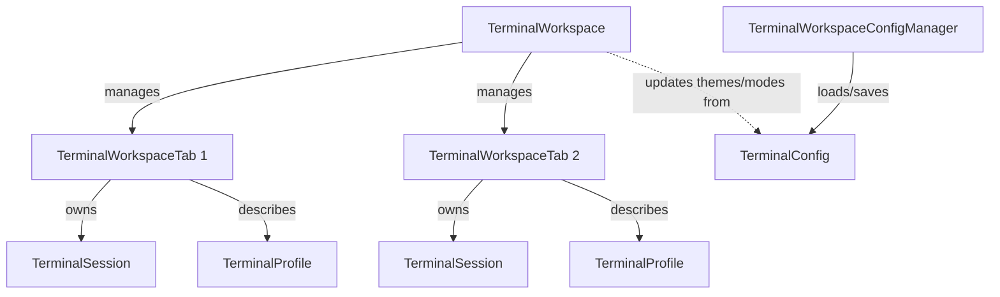

# KetraTerm Workspace (`:ketraterm-workspace`)

The `ketraterm-workspace` module provides a host-neutral session and tab manager for **KetraTerm Terminal**. It coordinates multiple active terminal sessions (tabs) under a unified workspace lifecycle, maps configurations onto file-based profiles, and implements standard TOML-backed settings persistence.

This module is designed to be completely decoupled from any specific UI toolkit, serving as the headless state controller for tabbed desktop terminal interfaces or IDE tool windows.

---

## Upstream Dependencies
- **`:ketraterm-protocol`** (vocabulary, mode IDs, enums)
- **`:ketraterm-render-api`** (render frame primitives and color palettes)
- **`:ketraterm-transport-api`** (duplex connector contracts)
- **`:ketraterm-session`** (session orchestration and lock loops)
- **`:ketraterm-pty`** (local PTY process management and options)

---

## Architectural Role

`TerminalWorkspace` manages a collection of tabs. Each tab wraps an active, running `TerminalSession` tied to a specific `TerminalProfile` launch configuration.



### Key Components
* [TerminalWorkspace](src/main/kotlin/io/github/ketraterm/workspace/TerminalWorkspace.kt): The main lifecycle manager. Handles opening, selecting, closing, and applying settings updates to all open terminal tabs.
* [TerminalProfile](src/main/kotlin/io/github/ketraterm/workspace/TerminalProfile.kt): Describes a launch configuration (command, display name, working directory, environment variables).
* [TerminalWorkspaceConfigManager](src/main/kotlin/io/github/ketraterm/workspace/config/TerminalWorkspaceConfigManager.kt): Handles loading and saving TOML-based configurations from OS-specific directories, with automatic parsing backups and value clamping.

---

## Sub-Documentation

For detailed specifications on the persistency configuration format and resolution:
* [profile-config-toml.md](docs/profile-config-toml.md) - TOML config blocks syntax, configuration properties list, and directory resolution hierarchies per OS.

---

## How to Use

The following example shows how to load workspace configurations, register a workspace listener, and open multiple terminal tabs:

```kotlin
import io.github.ketraterm.workspace.TerminalWorkspace
import io.github.ketraterm.workspace.TerminalWorkspaceListener
import io.github.ketraterm.workspace.TerminalWorkspaceTab
import io.github.ketraterm.workspace.TerminalWorkspaceOpenOptions
import io.github.ketraterm.workspace.TerminalProfile
import io.github.ketraterm.workspace.config.TerminalWorkspaceConfigManager
import java.nio.file.Path

fun main() {
    // 1. Resolve configuration and load settings
    val configManager = TerminalWorkspaceConfigManager.getDefault()
    val config = configManager.load()

    // 2. Define a workspace listener to respond to tab lifecycle events
    val listener = object : TerminalWorkspaceListener {
        override fun tabOpened(tab: TerminalWorkspaceTab) {
            println("Tab opened: ${tab.id} - ${tab.title}")
        }
        override fun tabClosed(id: String) {
            println("Tab closed: $id")
        }
        override fun tabSelected(id: String) {
            println("Active tab switched to: $id")
        }
        override fun titleChanged(tab: TerminalWorkspaceTab, title: String) {}
        override fun colorChanged(tab: TerminalWorkspaceTab, color: Int) {}
        override fun bell(tab: TerminalWorkspaceTab) {}
    }

    // 3. Create the workspace manager
    val workspace = TerminalWorkspace(listener)

    // 4. Declare a launch profile (e.g. Git Shell)
    val gitProfile = TerminalProfile(
        name = "git-shell",
        displayName = "Git Repo Shell",
        command = listOf("bash"),
        environment = mapOf("GIT_PS1" to "true"),
        workingDirectory = Path.of("/my/repo")
    )

    // 5. Open a tab using the profile
    val openOptions = TerminalWorkspaceOpenOptions(
        columns = 80,
        rows = 24,
        maxHistory = config.scrollbackLines,
        treatAmbiguousAsWide = config.treatAmbiguousAsWide
    )
    val tab = workspace.openTab(gitProfile, openOptions)
}
```

---

## How to Extend: Custom Tab Listeners

UI components (such as Swing tabbed panels or custom IDE interfaces) implement `TerminalWorkspaceListener` to map workspace actions directly onto window views:

```kotlin
import io.github.ketraterm.workspace.TerminalWorkspaceListener
import io.github.ketraterm.workspace.TerminalWorkspaceTab
import javax.swing.JTabbedPane

class SwingTabAdapter(private val tabbedPane: JTabbedPane) : TerminalWorkspaceListener {
    override fun tabOpened(tab: TerminalWorkspaceTab) {
        // Create Swing component and add tab
    }
    override fun tabClosed(id: String) {}
    override fun tabSelected(id: String) {}
    override fun titleChanged(tab: TerminalWorkspaceTab, title: String) {}
    override fun colorChanged(tab: TerminalWorkspaceTab, color: Int) {}
    override fun bell(tab: TerminalWorkspaceTab) {}
}
```
